# Recommendation 도메인 - 포트폴리오 상세 설명

## 1. 개요

Recommendation 도메인은 사용자의 최근 반려생활 입력을 분석해 주변서비스 탭에서 자연스럽게 추천 진입점을 제공하는 도메인입니다.

현재 구현은 "새로운 장소 조회 시스템"을 만드는 방식이 아니라, 기존 Location 도메인의 주변서비스 검색에 사용자 의도 기반 추천 카드를 연결하는 방식입니다. 사용자가 커뮤니티 글, 케어 요청, 주변서비스 검색어를 남기면 Spring이 비동기 이벤트로 Python NLP 서버를 호출하고, 분석 결과를 `user_pet_intent_signal`에 저장합니다. 주변서비스 탭은 이 signal을 조회해 추천 카드를 보여주고, 카드 클릭 시 기존 `/api/location-services/search`를 `category` 필터로 실행합니다.

**주요 기능**:

- 커뮤니티 글, 케어 요청, 주변서비스 검색어 기반 의도 signal 수집
- Python NLP 서버를 통한 반려생활 의도 분석
- 원문 텍스트를 저장하지 않는 signal 저장 구조
- 주변서비스 탭 추천 카드 표시
- 추천 카드 클릭 시 Location 도메인의 카테고리 검색으로 연결
- Python 서버 장애 시 원래 사용자 액션에 영향을 주지 않는 비동기 처리

---

## 2. 추천 서비스 동작 흐름

### 2.1 전체 흐름

```mermaid
flowchart LR
    A["커뮤니티 글 / 케어 요청 / 주변서비스 검색어"] --> B["Spring Event 발행"]
    B --> C["@Async EventListener"]
    C --> D["Python NLP 서버"]
    D --> E["intentDomain / intent / category / tags"]
    E --> F["user_pet_intent_signal 저장"]
    F --> G["주변서비스 탭 /signals 조회"]
    G --> H["추천 카드 표시"]
    H --> I["카드 클릭"]
    I --> J["/api/location-services/search category 필터"]
    J --> K["지도와 목록에 장소 표시"]
```



### 2.2 사용자 관점 시나리오

1. 사용자가 주변서비스 검색창에 `강아지가 귀를 자꾸 긁어요`를 입력합니다.
2. 기존 주변서비스 검색은 그대로 실행됩니다.
3. 동시에 Spring이 `LocationSearchPerformedEvent`를 발행합니다.
4. 비동기 listener가 Python NLP 서버에 텍스트 분석을 요청합니다.
5. Python 서버가 `MEDICAL`, `동물병원` 같은 분석 결과를 반환합니다.
6. confidence가 기준 이상이면 `user_pet_intent_signal`에 저장됩니다.
7. 주변서비스 탭이 `/api/pet-recommend/signals`를 조회합니다.
8. 화면에 `최근 건강 관련 고민이 있어 보여요. / 근처 동물병원 보기` 카드가 표시됩니다.
9. 카드를 누르면 주변서비스 검색 카테고리가 `동물병원`으로 세팅되고, 기존 Location 검색 API가 실행됩니다.

---

## 3. 입력 수집 지점

### 3.1 커뮤니티 게시글

커뮤니티 게시글 작성 시 게시글 제목과 내용을 기반으로 `CommunityPostCreatedEvent`를 발행합니다.

**의도**:

- 사용자가 질문이나 고민을 글로 남겼을 때 추천 signal 후보로 활용
- 예: `고양이가 밥을 잘 안 먹어요`, `강아지가 귀를 자꾸 긁어요`

**처리 특징**:

- 게시글 저장 응답을 막지 않도록 이벤트 기반으로 처리
- Python 분석 실패 시 게시글 작성은 성공 상태로 유지

### 3.2 케어 요청

케어 요청 작성 시 요청 내용 기반으로 `CareRequestCreatedEvent`를 발행합니다.

**의도**:

- 돌봄, 미용, 위탁관리, 산책 등 실제 케어 요구에서 추천 signal 후보 추출
- 예: `털이 많이 엉켰어요`, `며칠 맡길 곳이 필요해요`

### 3.3 주변서비스 검색어

주변서비스 검색창에 사용자가 키워드를 입력하면 `LocationSearchPerformedEvent`를 발행합니다.

**구현 위치**: `LocationServiceService.publishSearchEvent`

**의도**:

- 가장 자연스럽게 추천이 체감되는 진입점
- 검색어 자체가 반려생활 상황이면 이후 주변서비스 탭에서 추천 카드로 연결

**주의**:

- 로그인 사용자의 검색어만 signal 후보로 저장합니다.
- 익명 사용자는 signal 저장 대상이 아닙니다.

**NLP 호출 조건 (이벤트 리스너 내 2단계 필터)**:

카테고리/정렬/반경 변경만으로도 같은 keyword로 Python이 반복 호출되는 문제를 차단합니다.

```text
LocationSearchPerformedEvent 수신
  → [필터 1] 자연어 판단: length >= 7 AND 공백 포함 → 통과 시 계속
  → [필터 2] Redis TTL dedup: 같은 user + keyword가 10분 내 분석됐으면 skip
  → 통과한 경우만 Python 호출
```

| 검색어 예시 | 자연어 판단 | 결과 |
|------------|------------|------|
| `"동물병원"` | false (공백 없음) | Python 호출 안 함 |
| `"귀 치료"` | false (4자, 너무 짧음) | Python 호출 안 함 |
| `"강아지 귀 긁어요"` | true | Python 분석 후보 |

**MVP 휴리스틱 한계**: 공백 없이 붙여 쓴 자연어(`"강아지가귀를긁어요"`)는 필터를 통과하지 못합니다.  
과호출 방지를 우선하는 MVP 설계 결정입니다.

---

## 4. Python NLP 서버

### 4.1 Endpoint

```http
POST /api/pet-intent/analyze
```

### 4.2 요청 예시

```json
{
  "text": "강아지가 귀를 자꾸 긁어요",
  "petType": null
}
```

### 4.3 응답 예시

```json
{
  "intentDomain": "MEDICAL",
  "intent": "HEALTH_SYMPTOM",
  "recommendedCategories": ["동물병원"],
  "confidence": 0.88,
  "urgency": "NORMAL",
  "intentTags": ["medical", "ear", "itching"]
}
```

### 4.4 분석 방식

Python 서버는 규칙 기반 키워드 매칭과 임베딩 기반 분류를 함께 사용합니다.

- 명확한 키워드가 있으면 rule 우선 적용
- rule로 판단하기 어려운 입력은 intent example과의 유사도 기반 분류
- `sentence-transformers`가 설치되지 않은 환경에서도 테스트 가능한 fallback embedding 사용
- `recommendedCategories`는 Location 도메인의 `category1`, `category2`, `category3` 값과 맞도록 반환
- 서버 시작 시 embedding 모델을 pre-load합니다 (`lifespan` startup hook). 첫 요청 timeout 방지.

### 4.5 NLP 호출 비동기 처리

Spring의 `@Async` NLP 분석 작업은 전용 `petIntentExecutor`로 격리됩니다.

```text
petIntentExecutor 설정
  corePoolSize  = 2    (평시 worker 수)
  maxPoolSize   = 6    (queue 포화 후 최대)
  queueCapacity = 500  (약 125초 분량 backlog 흡수)
  reject 정책   = DiscardWithWarnPolicy (warn 로그 후 폐기)

동작 순서: core(2) → queue(500) → max(6) → reject
```

게시글/케어 작성과 알림·채팅방 생성 등 다른 `@Async` 작업이 서로 영향을 주지 않습니다.

큐 포화 시 일부 signal 생성이 생략됩니다. 추천 signal은 부가 기능이므로 허용된 trade-off입니다.

### 4.5 대표 intentDomain

| intentDomain | 추천 카테고리 예시 | 입력 예시 |
| --- | --- | --- |
| `MEDICAL` | `동물병원`, `동물약국` | 귀를 긁어요, 토해요, 밥을 안 먹어요 |
| `GROOMING` | `미용` | 털이 엉켰어요, 목욕이 필요해요 |
| `SUPPLIES` | `반려동물용품` | 사료가 필요해요, 모래를 사야 해요 |
| `FOOD_SNACK` | `반려동물용품` | 간식 추천, 사료 구매 |
| `CAFE_DINING` | `카페`, `식당` | 같이 갈 카페, 반려동물 동반 식당 |
| `LODGING_TRAVEL` | `펜션`, `호텔`, `여행지` | 같이 여행, 숙소, 나들이 |
| `CARE_SERVICE` | `위탁관리` | 맡길 곳, 돌봄, 펫시터 |

---

## 5. Signal 저장

### 5.1 저장 테이블

```sql
user_pet_intent_signal
```

### 5.2 저장 데이터

| 컬럼 | 설명 |
| --- | --- |
| `user_idx` | signal 대상 사용자 |
| `source_type` | `COMMUNITY`, `CARE`, `LOCATION_SEARCH` |
| `source_id` | 원천 데이터 ID. 검색어 signal은 `null` |
| `intent_domain` | Python 분석 domain |
| `intent` | Python 분석 intent |
| `recommended_categories` | 추천 Location 카테고리 JSON |
| `confidence` | 분석 신뢰도 |
| `intent_tags` | 분석 태그 JSON |
| `created_at` | 생성 시각 |
| `expires_at` | 만료 시각 |

### 5.3 개인정보 처리 기준

현재 구현은 원문 텍스트를 저장하지 않습니다. 저장되는 값은 분석 결과와 추천 카테고리, 태그입니다.

**저장하는 것**:

- intent domain
- intent
- 추천 카테고리
- confidence
- intent tags
- source type
- 만료 시각

**저장하지 않는 것**:

- 커뮤니티 글 원문
- 케어 요청 원문
- 주변서비스 검색어 원문

### 5.4 저장 조건

`UserPetIntentSignalService.saveIfConfident`에서 다음 조건을 모두 만족해야 저장됩니다.

1. confidence ≥ 0.6 (Python의 1차 필터 0.45보다 높은 Spring 2차 필터)
2. 같은 `(userIdx, intentDomain)` 조합의 유효 signal이 없을 것 (도메인별 중복 방지)

TTL은 7일입니다.

**confidence 이중 필터 설계**:

- Python 1차: 0.45 미만 → UNKNOWN 반환
- Spring 2차: 0.60 미만 → 저장 거부
- 0.45~0.59 구간은 Python이 결과를 반환하지만 Spring이 저장을 거부합니다.

### 5.5 조회 제한

`GET /api/pet-recommend/signals`는 만료되지 않은 signal 중 최근 10건만 반환합니다.

---

## 6. 추천 카드 API

### 6.1 Endpoint

```http
GET /api/pet-recommend/signals
```

### 6.2 응답 예시

```json
[
  {
    "intentDomain": "SUPPLIES",
    "intent": "SUPPLIES_NEED",
    "recommendedCategories": ["반려동물용품"],
    "confidence": 0.88,
    "intentTags": ["supplies", "food"],
    "cardMessage": "반려동물 용품이 필요해 보여요.",
    "actionLabel": "근처 반려동물용품 보기",
    "targetTab": "location",
    "targetCategory": "반려동물용품"
  }
]
```

### 6.3 응답 필드 의미

| 필드 | 의미 |
| --- | --- |
| `cardMessage` | 사용자에게 보여줄 추천 이유 문장 |
| `actionLabel` | 카드 안 CTA 문구 |
| `targetTab` | 이동 대상 탭. 현재는 `location` |
| `targetCategory` | Location 검색에 넘길 카테고리 |
| `recommendedCategories` | NLP가 추천한 카테고리 목록 |
| `intentTags` | 점수 계산이나 향후 태그 매칭에 사용할 태그 |

`cardMessage`는 클릭 동작을 설명하는 문구가 아니라 순수 안내 문장입니다. 실제 액션은 `targetTab`, `targetCategory`, `actionLabel`로 표현합니다.

---

## 7. 프론트 동작

### 7.1 signal 조회

주변서비스 탭이 활성화되면 프론트는 `/api/pet-recommend/signals`를 호출합니다.

로그인 토큰이 없으면 호출하지 않고 빈 배열로 처리합니다.

### 7.2 카드 표시

`LocationControls`는 signal이 있으면 중분류/소분류 영역 아래에 추천 카드를 표시합니다.

카드는 다음 두 부분으로 나뉩니다.

- `cardMessage`: 추천 이유
- `actionLabel`: 실제 클릭 CTA

### 7.3 카드 클릭

카드를 클릭하면 `targetCategory`를 `locationCategory`로 설정하고, 기존 주변서비스 검색을 다시 실행합니다.

예를 들어 `targetCategory = "반려동물용품"`이면 기존 Location API가 아래 의미로 호출됩니다.

```http
GET /api/location-services/search?latitude={lat}&longitude={lng}&radius={radius}&category=반려동물용품
```

추천 서비스가 장소 목록을 직접 내려주지 않는 이유는 현재 지도 중심 좌표, 반경, 정렬 옵션이 프론트 상태에 있기 때문입니다. 추천 API는 "무엇을 보여줄지"를 알려주고, 실제 장소 조회는 Location 도메인이 담당합니다.

---

## 8. 장애 처리

### 8.1 Python 서버 장애

Python 서버 호출은 비동기 이벤트 listener에서 수행됩니다. Python 서버가 꺼져 있거나 응답이 늦어도 커뮤니티 글 작성, 케어 요청 작성, 주변서비스 검색 자체는 실패하지 않습니다.

`PetIntentClient`는 3초 timeout을 사용하며, 호출 실패 시 `Optional.empty()`를 반환합니다.

### 8.2 Redis 장애 (Location 검색 fail-closed)

Location 검색 이벤트의 Redis TTL dedup 체크 중 장애가 발생하면 **Python 호출을 생략**합니다 (fail-closed).

```text
Redis setIfAbsent 예외 → warn 로그 → return (Python 호출 안 함)
```

이유: 추천 signal은 부가 기능이므로 Redis 장애 시 Python까지 같이 호출해 부하를 늘리는 것보다 분석 생략이 더 안전합니다.

게시글/케어 이벤트는 Redis를 사용하지 않으므로 이 정책의 영향을 받지 않습니다.

### 8.3 signal 없음

저장된 signal이 없거나 confidence가 낮으면 추천 카드는 표시되지 않습니다. 이 경우 주변서비스 탭의 기본 검색 기능은 그대로 동작합니다.

### 8.4 비로그인 사용자

비로그인 사용자는 signal 저장 및 추천 카드 조회 대상이 아닙니다. `/signals` 응답은 빈 배열로 처리됩니다.

### 8.5 executor 큐 포화

`petIntentExecutor` 큐(500)가 포화되면 NLP 분석 작업이 폐기됩니다. 추천 signal이 생성되지 않지만 게시글/케어 저장 등 핵심 기능에는 영향이 없습니다.

---

## 9. 점수 기반 장소 추천과의 관계

현재 주변서비스 탭 추천 카드는 "카테고리 진입점 추천"입니다. 즉, 사용자의 최근 입력을 보고 `동물병원`, `미용`, `반려동물용품` 같은 카테고리를 추천한 뒤 기존 Location 검색으로 연결합니다.

별도로 `/api/pet-recommend`는 텍스트와 좌표를 받아 주변 장소를 점수화하는 API입니다.

```http
GET /api/pet-recommend?lat={lat}&lng={lng}&text={text}&radius={radius}
```

점수 계산은 `PetRecommendScoreCalculator`에서 처리하며, 현재는 거리, 평점, 리뷰 수, place score, tag match score를 조합합니다.

단, `place_score`와 `tag_match_score`는 장소 태그와 score 데이터가 충분히 채워진 뒤 효과가 커집니다. 초기 단계에서는 거리, 평점, 리뷰 수 기반 검증이 중심입니다.

---

## 10. 구현 파일

### 10.1 Backend

- `backend/main/java/com/linkup/Petory/global/config/PetIntentAsyncConfig.java` ← `petIntentExecutor` 전용 풀
- `backend/main/java/com/linkup/Petory/domain/petRecommendation/controller/PetRecommendationController.java`
- `backend/main/java/com/linkup/Petory/domain/petRecommendation/client/PetIntentClient.java`
- `backend/main/java/com/linkup/Petory/domain/petRecommendation/service/PetIntentSignalEventListener.java` ← 자연어 필터, Redis dedup, fail-closed
- `backend/main/java/com/linkup/Petory/domain/petRecommendation/service/UserPetIntentSignalService.java`
- `backend/main/java/com/linkup/Petory/domain/petRecommendation/service/PetRecommendationService.java`
- `backend/main/java/com/linkup/Petory/domain/petRecommendation/scoring/PetRecommendScoreCalculator.java`
- `backend/main/java/com/linkup/Petory/domain/petRecommendation/entity/UserPetIntentSignal.java`
- `backend/main/java/com/linkup/Petory/domain/petRecommendation/repository/UserPetIntentSignalRepository.java`
- `backend/main/java/com/linkup/Petory/domain/petRecommendation/repository/LocationInteractionCount.java` ← 타입 안전 프로젝션
- `backend/main/java/com/linkup/Petory/domain/location/service/LocationServiceService.java`
- `backend/main/resources/sql/migration/user-pet-intent-signal-table.sql`

### 10.2 Frontend

- `frontend/src/api/petRecommendationApi.js`
- `frontend/src/components/UnifiedMap/UnifiedPetMapPage.js`
- `frontend/src/components/UnifiedMap/controls/LocationControls.js`
- `frontend/src/constants/locationCategoryTree.js`

### 10.3 Python NLP Server

- `petory-nlp-server/app/main.py`
- `petory-nlp-server/app/api/pet_intent_router.py`
- `petory-nlp-server/app/nlp/intent_classifier.py`
- `petory-nlp-server/app/nlp/tag_extractor.py`
- `petory-nlp-server/app/rules/category_rules.py`
- `petory-nlp-server/app/rules/urgency_rules.py`
- `petory-nlp-server/app/data/intent_examples.yml`
- `petory-nlp-server/app/data/intent_tags.yml`

---

## 11. 로컬 실행 체크

### 11.1 필요한 서버

- Spring Boot: `localhost:8080`
- React: `localhost:3000`
- Python NLP: `localhost:8000`
- MySQL
- Redis

### 11.2 Python 서버 실행

```bash
cd petory-nlp-server
PYTHONPATH=. uvicorn app.main:app --reload --host 127.0.0.1 --port 8000
```

### 11.3 DB migration

추천 카드가 표시되려면 `user_pet_intent_signal` 테이블이 필요합니다.

```sql
-- backend/main/resources/sql/migration/user-pet-intent-signal-table.sql
```

### 11.4 동작 확인 절차

1. Spring, React, Python 서버를 모두 실행합니다.
2. 로그인합니다.
3. 주변서비스 탭으로 이동합니다.
4. 검색창에 `강아지가 귀를 자꾸 긁어요` 같은 문장을 입력합니다.
5. 1-2초 뒤 추천 카드가 표시되는지 확인합니다.
6. 추천 카드를 클릭합니다.
7. 주변서비스 목록이 추천 카테고리 기준으로 필터링되는지 확인합니다.
