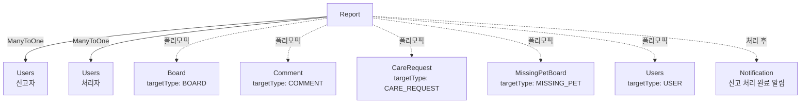

# Report 도메인

## 개요

신고 접수 및 제재 시스템으로, 부적절한 콘텐츠나 사용자를 신고하고 관리자가 처리하는 도메인입니다.

## Entity 구조

### Report (신고)

```java
@Entity
@Table(name = "report", 
       uniqueConstraints = @UniqueConstraint(
           columnNames = {"target_type", "target_idx", "reporter_idx"}
       ))
public class Report {
    Long idx;                    // PK
    ReportTargetType targetType; // 신고 대상 타입
    Long targetIdx;              // 신고 대상 ID
    Users reporter;              // 신고자 (ManyToOne)
    String reason;               // 신고 사유 (TEXT)
    ReportStatus status;         // 처리 상태
    Users handledBy;             // 처리자 (ManyToOne, 관리자)
    LocalDateTime handledAt;     // 처리 일시
    ReportActionType actionTaken; // 조치 유형
    String adminNote;            // 관리자 메모 (TEXT)
    LocalDateTime createdAt;
    LocalDateTime updatedAt;
}
```

**연관관계:**
- `ManyToOne` → Users (신고자)
- `ManyToOne` → Users (처리자)
- `폴리모픽 관계` → Board, Comment, CareRequest, MissingPetBoard, Users 등

## Enum 정의

### ReportTargetType
```java
public enum ReportTargetType {
    BOARD,          // 게시글
    COMMENT,        // 댓글
    CARE_REQUEST,   // 펫케어 요청
    MISSING_PET,    // 실종 동물 게시글
    USER,           // 사용자
    LOCATION_SERVICE // 위치 서비스
}
```

### ReportStatus
```java
public enum ReportStatus {
    PENDING,      // 대기 중
    REVIEWING,    // 검토 중
    RESOLVED,     // 처리 완료
    REJECTED      // 기각
}
```

### ReportActionType
```java
public enum ReportActionType {
    NONE,         // 조치 없음
    WARNING,      // 경고
    CONTENT_HIDE, // 콘텐츠 숨김
    CONTENT_DELETE, // 콘텐츠 삭제
    USER_SUSPEND, // 사용자 정지
    USER_BAN      // 사용자 차단
}
```

## Service 주요 기능

### ReportService

#### 1. 신고 관리
```java
// 신고 접수
ReportDTO createReport(ReportDTO dto)

// 신고 목록 조회 (관리자, 페이징, 필터)
Page<ReportDTO> getAllReports(ReportStatus status, ReportTargetType targetType, int page, int size)

// 신고 상세 조회
ReportDTO getReport(long id)

// 내가 신고한 목록
List<ReportDTO> getMyReports(long userId)
```

#### 2. 신고 처리 (관리자)
```java
// 신고 처리 시작 (검토 중으로 상태 변경)
void startReview(long reportId, long adminId)

// 신고 처리 완료
void resolveReport(long reportId, long adminId, ReportActionType action, String adminNote)

// 신고 기각
void rejectReport(long reportId, long adminId, String adminNote)

// 자동 제재 처리
void applyAutoSanction(Report report)
```

## 다른 도메인과의 연관관계

### Report와 다른 도메인



### 주요 상호작용

#### 1. User 도메인
- **Users → Report (OneToMany: 신고자)**
  - Users가 다양한 콘텐츠를 신고
  - 사용자별 신고 이력 조회
  - 중복 신고 방지 (Unique 제약)

**예시:**
```java
// 사용자가 작성한 신고 목록
List<Report> myReports = reportRepository.findByReporter(user);
```

- **Users → Report (OneToMany: 처리자)**
  - 관리자 Users가 신고 처리
  - 처리자별 처리 이력 조회

**예시:**
```java
// 관리자가 처리한 신고 목록
List<Report> handledReports = reportRepository.findByHandledBy(admin);
```

- **Report → Users (폴리모픽: 신고 대상)**
  - 사용자 신고 시 targetType: USER, targetIdx: user.idx
  - 신고 처리 시 UserSanction 생성

**예시:**
```java
// 사용자 신고 접수
Report report = Report.builder()
    .targetType(ReportTargetType.USER)
    .targetIdx(targetUser.getIdx())
    .reporter(reporter)
    .reason("부적절한 행동")
    .build();
```

#### 2. Board 도메인
- **Report → Board (폴리모픽)**
  - 게시글 신고 시 targetType: BOARD, targetIdx: board.idx
  - 신고 처리 시 게시글 상태 변경 (HIDDEN, DELETED)

**예시:**
```java
// 게시글 신고 처리
@Transactional
public void resolveReport(long reportId, long adminId, ReportActionType action, String note) {
    Report report = reportRepository.findById(reportId).orElseThrow();
    
    if (report.getTargetType() == ReportTargetType.BOARD) {
        Board board = boardRepository.findById(report.getTargetIdx()).orElseThrow();
        
        switch (action) {
            case CONTENT_HIDE:
                board.setStatus(ContentStatus.HIDDEN);
                break;
            case CONTENT_DELETE:
                board.setStatus(ContentStatus.DELETED);
                board.setIsDeleted(true);
                break;
        }
        boardRepository.save(board);
    }
    
    report.setStatus(ReportStatus.RESOLVED);
    report.setHandledBy(admin);
    report.setActionTaken(action);
    report.setAdminNote(note);
    reportRepository.save(report);
}
```

#### 3. Comment 도메인
- **Report → Comment (폴리모픽)**
  - 댓글 신고 시 targetType: COMMENT, targetIdx: comment.idx
  - 신고 처리 시 댓글 상태 변경 또는 삭제

#### 4. Care 도메인
- **Report → CareRequest (폴리모픽)**
  - 펫케어 요청 신고 시 targetType: CARE_REQUEST, targetIdx: careRequest.idx
  - 신고 처리 시 요청 상태 변경 또는 삭제

#### 5. Missing Pet 도메인
- **Report → MissingPetBoard (폴리모픽)**
  - 실종 동물 게시글 신고 시 targetType: MISSING_PET, targetIdx: missingPetBoard.idx
  - 신고 처리 시 게시글 상태 변경

#### 6. Notification 도메인
- **Report → Notification (간접)**
  - 신고 처리 완료 시 신고자에게 알림
  - NotificationType.REPORT_HANDLED

**예시:**
```java
// 신고 처리 완료 시 알림
@Async
public void notifyReportHandled(Report report) {
    Notification notification = Notification.builder()
        .user(report.getReporter())
        .type(NotificationType.REPORT_HANDLED)
        .title("신고가 처리되었습니다")
        .content("신고하신 내용이 처리되었습니다: " + report.getActionTaken())
        .relatedId(report.getIdx())
        .relatedType("REPORT")
        .build();
    notificationRepository.save(notification);
}
```

#### 7. User 도메인 (제재 연동)
- **Report → UserSanction (간접)**
  - 신고 처리 시 자동 제재 부여
  - 경고 누적 시 자동 정지/차단

**예시:**
```java
// 자동 제재 처리
@Transactional
public void applyAutoSanction(Report report) {
    if (report.getTargetType() != ReportTargetType.USER) {
        return;
    }
    
    Users targetUser = usersRepository.findById(report.getTargetIdx()).orElseThrow();
    
    // 경고 부여
    targetUser.setWarningCount(targetUser.getWarningCount() + 1);
    usersRepository.save(targetUser);
    
    // 경고 3회 누적 시 자동 7일 정지
    if (targetUser.getWarningCount() >= 3) {
        targetUser.setStatus(UserStatus.SUSPENDED);
        targetUser.setSuspendedUntil(LocalDateTime.now().plusDays(7));
        usersRepository.save(targetUser);
        
        // 제재 이력 기록
        UserSanction sanction = UserSanction.builder()
            .user(targetUser)
            .type(SanctionType.SUSPENSION)
            .reason("경고 3회 누적")
            .startedAt(LocalDateTime.now())
            .endedAt(LocalDateTime.now().plusDays(7))
            .sanctionedBy(report.getHandledBy())
            .build();
        sanctionRepository.save(sanction);
    }
}
```

## 비즈니스 로직

### 신고 접수 규칙

1. **중복 신고 방지**
   - 같은 사용자가 같은 대상에 중복 신고 불가
   - Unique 제약: (target_type, target_idx, reporter_idx)

2. **본인 신고 불가**
   - 본인이 작성한 콘텐츠는 신고 불가
   - 사용자 신고 시 본인 신고 불가

3. **신고 사유 필수**
   - 신고 사유는 반드시 입력

### 신고 처리 프로세스

```
1. PENDING (대기 중)
   - 신고 접수 시 기본 상태
   - 관리자 대기열에 표시

2. REVIEWING (검토 중)
   - 관리자가 신고 처리 시작
   - 다른 관리자는 처리 불가

3. RESOLVED (처리 완료)
   - 조치 완료
   - 신고자에게 알림 발송

4. REJECTED (기각)
   - 신고 내용이 부적절하거나 근거 부족
   - 신고자에게 알림 발송
```

### 자동 제재 규칙

1. **경고 누적**
   - 경고 1회: 경고만 부여
   - 경고 2회: 경고만 부여
   - 경고 3회: 자동 7일 정지

2. **정지 누적**
   - 정지 1회: 7일 정지
   - 정지 2회: 30일 정지
   - 정지 3회: 영구 차단

## 성능 최적화

### 1. 인덱싱

```sql
-- 신고 상태별 조회
CREATE INDEX idx_report_status_created 
ON report(status, created_at DESC);

-- 신고 대상별 조회
CREATE INDEX idx_report_target 
ON report(target_type, target_idx);

-- 신고자별 조회
CREATE INDEX idx_report_reporter 
ON report(reporter_idx, created_at DESC);

-- 처리자별 조회
CREATE INDEX idx_report_handler 
ON report(handled_by, handled_at DESC);

-- 중복 신고 방지
CREATE UNIQUE INDEX uk_report_unique 
ON report(target_type, target_idx, reporter_idx);
```

### 2. 페이징

```java
// 대량 신고 조회 시 페이징 필수
Page<Report> reports = reportRepository.findByStatusOrderByCreatedAtDesc(
    ReportStatus.PENDING, 
    PageRequest.of(page, size)
);
```

## API 엔드포인트

### 신고 (/api/reports)
- `POST /` - 신고 접수
- `GET /` - 신고 목록 (관리자, 페이징, 필터)
- `GET /{id}` - 신고 상세
- `GET /me` - 내가 신고한 목록

### 신고 처리 (/api/admin/reports)
- `PUT /{id}/review` - 검토 시작
- `PUT /{id}/resolve` - 처리 완료
- `PUT /{id}/reject` - 신고 기각

## 테스트 시나리오

### 1. 신고 접수
- 게시글 신고
- 중복 신고 방지 확인
- 본인 콘텐츠 신고 불가 확인

### 2. 신고 처리
- 관리자가 신고 처리
- 자동 제재 적용 확인
- 신고자에게 알림 발송 확인

### 3. 자동 제재
- 경고 3회 누적 → 자동 정지
- 정지 3회 누적 → 영구 차단

## 개선 아이디어

### 기능
1. **신고 카테고리 세분화**
   - 스팸, 욕설, 부적절한 내용 등

2. **신고 우선순위**
   - 긴급 신고 우선 처리
   - 사용자 신고 우선 처리

3. **신고 통계**
   - 신고 유형별 통계
   - 처리 시간 통계

### 성능
1. **신고 큐 시스템**
   - 신고를 큐에 넣어 순차 처리
   - 우선순위 큐

2. **자동 처리**
   - 명백한 스팸은 자동 처리
   - AI 기반 자동 분류

