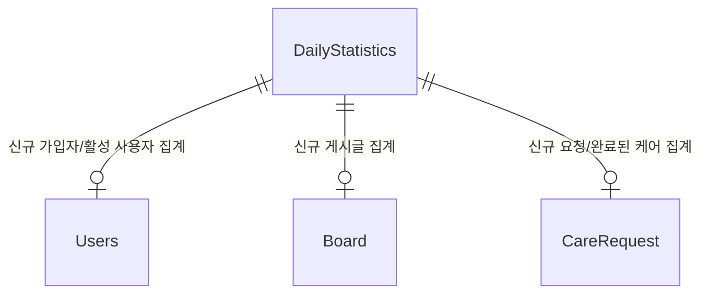

# Statistics 도메인 - 포트폴리오 상세 설명

## 1. 개요

Statistics 도메인은 일별 통계 수집 및 조회 도메인으로, 시스템의 전반적인 통계 데이터를 관리합니다. 스케줄러를 통한 자동 통계 수집, 실시간 통계 조회, 과거 데이터 초기화 등의 기능을 제공합니다.

**주요 기능**:
- 일별 통계 수집 (스케줄러)
- 활성 사용자 수, 신규 가입자 수 집계
- 게시글 수, 펫케어 요청 수 등 집계
- 기간별 통계 조회
- 실시간 통계 조회 (오늘 날짜 포함 시)
- 과거 데이터 초기화 (Backfill)

---

## 2. 기능 설명

### 2.1 일별 통계 수집 (스케줄러)

**스케줄러 실행 프로세스**:
1. 매일 오후 6시 30분(18:30:00)에 자동 실행 (`@Scheduled(cron = "0 30 18 * * ?")`)
2. 어제 날짜의 통계 집계 (`LocalDate.now().minusDays(1)`)
3. 중복 방지 확인 (이미 집계된 날짜는 건너뜀)
4. 통계 항목 집계:
   - 신규 가입자 수 (`countByCreatedAtBetween()`)
   - 신규 게시글 수 (`countByCreatedAtBetween()`)
   - 신규 펫케어 요청 수 (`countByCreatedAtBetween()`)
   - 완료된 펫케어 수 (`countByDateBetweenAndStatus(COMPLETED)`)
   - 활성 사용자 수 (DAU) (`countByLastLoginAtBetween()`)
   - 매출 (현재 0으로 고정)
5. `DailyStatistics` 저장

### 2.2 실시간 통계 조회

**실시간 집계 프로세스**:
1. 기간별 통계 조회 시 오늘 날짜 포함 여부 확인
2. 오늘이 포함되어 있고 DB에 오늘의 통계가 없으면 실시간 집계
3. `calculateTodayStatistics()`로 현재 시점까지의 통계 계산
4. 실시간 집계 결과를 조회 결과에 추가

### 2.3 과거 데이터 초기화 (Backfill)

**초기화 프로세스**:
1. 관리자가 초기화 요청 (`POST /api/admin/statistics/init?days={days}`)
2. 오늘 기준 `days`일 전부터 어제까지 순차적으로 집계
3. 각 날짜별로 `aggregateStatisticsForDate()` 호출
4. 중복 방지로 이미 집계된 날짜는 건너뜀

---

## 3. 서비스 로직 설명

### 3.1 핵심 비즈니스 로직

#### 로직 1: 일별 통계 수집 (스케줄러)
**구현 위치**: `StatisticsScheduler.aggregateDailyStatistics()`

```java
@Scheduled(cron = "0 30 18 * * ?")
@Transactional
public void aggregateDailyStatistics() {
    LocalDate yesterday = LocalDate.now().minusDays(1);
    aggregateStatisticsForDate(yesterday);
}
```

**스케줄러 설정**:
- **실행 시간**: 매일 오후 6시 30분 (18:30:00)
- **집계 대상**: 어제 날짜의 통계

#### 로직 2: 특정 날짜 통계 집계
**구현 위치**: `StatisticsScheduler.aggregateStatisticsForDate()`

```java
@Transactional
public void aggregateStatisticsForDate(LocalDate date) {
    log.info("일일 통계 집계 시작: {}", date);
    
    // 1. 중복 방지: 이미 집계된 데이터가 있는지 확인
    if (dailyStatisticsRepository.findByStatDate(date).isPresent()) {
        log.warn("이미 {}의 통계가 존재합니다. 집계를 건너뜁니다.", date);
        return;
    }
    
    LocalDateTime startOfDay = date.atStartOfDay();
    LocalDateTime endOfDay = date.atTime(LocalTime.MAX);
    
    // 2. 신규 가입자
    long newUsers = usersRepository.countByCreatedAtBetween(startOfDay, endOfDay);
    
    // 3. 새 게시글
    long newPosts = boardRepository.countByCreatedAtBetween(startOfDay, endOfDay);
    
    // 4. 케어 요청
    long newCareRequests = careRequestRepository.countByCreatedAtBetween(startOfDay, endOfDay);
    
    // 5. 완료된 케어
    long completedCares = careRequestRepository.countByDateBetweenAndStatus(startOfDay, endOfDay,
            CareRequestStatus.COMPLETED);
    
    // 6. 매출 (현재 0으로 고정)
    BigDecimal totalRevenue = BigDecimal.ZERO;
    
    // 7. DAU (활성 사용자)
    long activeUsers = usersRepository.countByLastLoginAtBetween(startOfDay, endOfDay);
    
    DailyStatistics stats = DailyStatistics.builder()
            .statDate(date)
            .newUsers((int) newUsers)
            .newPosts((int) newPosts)
            .newCareRequests((int) newCareRequests)
            .completedCares((int) completedCares)
            .totalRevenue(totalRevenue)
            .activeUsers((int) activeUsers)
            .build();
    
    dailyStatisticsRepository.save(stats);
    log.info("일일 통계 집계 완료: {}", stats);
}
```

**핵심 로직**:
- **중복 방지**: 이미 집계된 데이터가 있으면 건너뜀
- **신규 가입자**: `countByCreatedAtBetween()`로 집계
- **새 게시글**: `countByCreatedAtBetween()`로 집계
- **케어 요청**: `countByCreatedAtBetween()`로 집계
- **완료된 케어**: `countByDateBetweenAndStatus(COMPLETED)`로 집계
- **활성 사용자**: `countByLastLoginAtBetween()`로 집계 (DAU)
- **매출**: 현재 0으로 고정

#### 로직 3: 실시간 통계 조회
**구현 위치**: `StatisticsService.getDailyStatistics()`

```java
public List<DailyStatistics> getDailyStatistics(LocalDate startDate, LocalDate endDate) {
    List<DailyStatistics> stats = dailyStatisticsRepository.findByStatDateBetweenOrderByStatDateAsc(startDate,
            endDate);
    
    LocalDate today = LocalDate.now();
    // 조회 기간에 오늘이 포함되어 있고, DB에 아직 오늘의 통계가 없는 경우
    if (!startDate.isAfter(today) && !endDate.isBefore(today)) {
        boolean todayExists = stats.stream().anyMatch(s -> s.getStatDate().equals(today));
        if (!todayExists) {
            stats.add(calculateTodayStatistics());
        }
    }
    
    return stats;
}
```

**핵심 로직**:
- **오늘 날짜 포함 확인**: 조회 기간에 오늘이 포함되어 있는지 확인
- **실시간 집계**: DB에 오늘의 통계가 없으면 `calculateTodayStatistics()`로 실시간 집계 추가

#### 로직 4: 오늘 통계 실시간 계산
**구현 위치**: `StatisticsService.calculateTodayStatistics()`

```java
private DailyStatistics calculateTodayStatistics() {
    LocalDate today = LocalDate.now();
    LocalDateTime startOfDay = today.atStartOfDay();
    LocalDateTime endOfDay = LocalDateTime.now(); // 현재 시점까지
    
    long newUsers = usersRepository.countByCreatedAtBetween(startOfDay, endOfDay);
    long newPosts = boardRepository.countByCreatedAtBetween(startOfDay, endOfDay);
    long newCareRequests = careRequestRepository.countByCreatedAtBetween(startOfDay, endOfDay);
    long completedCares = careRequestRepository.countByDateBetweenAndStatus(startOfDay, endOfDay,
            CareRequestStatus.COMPLETED);
    long activeUsers = usersRepository.countByLastLoginAtBetween(startOfDay, endOfDay);
    
    return DailyStatistics.builder()
            .statDate(today)
            .newUsers((int) newUsers)
            .newPosts((int) newPosts)
            .newCareRequests((int) newCareRequests)
            .completedCares((int) completedCares)
            .totalRevenue(BigDecimal.ZERO)
            .activeUsers((int) activeUsers)
            .build();
}
```

**핵심 로직**:
- **현재 시점까지 집계**: `startOfDay`부터 `LocalDateTime.now()`까지 집계
- **실시간 통계**: 스케줄러가 실행되기 전까지의 실시간 통계 제공

#### 로직 5: 과거 데이터 초기화 (Backfill)
**구현 위치**: `StatisticsScheduler.backfillStatistics()`

```java
@Transactional
public void backfillStatistics(int days) {
    LocalDate today = LocalDate.now();
    for (int i = days; i > 0; i--) {
        LocalDate targetDate = today.minusDays(i);
        aggregateStatisticsForDate(targetDate);
    }
}
```

**핵심 로직**:
- **순차적 집계**: 오늘 기준 `days`일 전부터 어제까지 순차적으로 집계
- **중복 방지**: `aggregateStatisticsForDate()` 내부에서 중복 확인

### 3.2 서비스 메서드 구조

#### StatisticsService
| 메서드 | 설명 | 주요 로직 |
|--------|------|-----------|
| `getDailyStatistics(startDate, endDate)` | 기간별 일일 통계 조회 | DB 조회, 오늘 날짜 포함 시 실시간 집계 추가 |
| `getDailyStatistics(date)` | 특정 날짜 통계 조회 | 오늘 날짜면 실시간 집계, 아니면 DB 조회 |
| `calculateTodayStatistics()` | 오늘 통계 실시간 계산 | 현재 시점까지의 통계 계산 |
| `initStatistics(days)` | 과거 통계 초기화 | `backfillStatistics()` 호출 |

#### StatisticsScheduler
| 메서드 | 설명 | 주요 로직 |
|--------|------|-----------|
| `aggregateDailyStatistics()` | 일별 통계 수집 (스케줄러) | 매일 오후 6시 30분에 어제 통계 집계 |
| `aggregateStatisticsForDate(date)` | 특정 날짜 통계 집계 | 중복 확인, 통계 항목 집계, 저장 |
| `backfillStatistics(days)` | 과거 데이터 초기화 | 지정된 일수만큼 과거 통계 집계 |

### 3.3 트랜잭션 처리
- **트랜잭션 범위**: 
  - 통계 집계: `@Transactional` - 통계 집계와 저장을 원자적으로 처리
  - 조회 메서드: `@Transactional(readOnly = true)` - 읽기 전용 최적화 (클래스 레벨)
- **격리 수준**: 기본값 (READ_COMMITTED)
- **중복 방지**: Unique 제약조건 `statDate`로 DB 레벨에서도 중복 방지

---

## 4. 아키텍처 설명

### 4.1 엔티티 구조

#### DailyStatistics (일일 통계)
```java
@Entity
@Table(name = "dailystatistics")
public class DailyStatistics {
    @Id
    @GeneratedValue(strategy = GenerationType.IDENTITY)
    private Long id;
    
    @Column(name = "stat_date", unique = true, nullable = false)
    private LocalDate statDate; // 통계 날짜 (UNIQUE)
    
    @Builder.Default
    @Column(name = "new_users")
    private Integer newUsers = 0; // 신규 사용자 수
    
    @Builder.Default
    @Column(name = "new_posts")
    private Integer newPosts = 0; // 신규 게시글 수
    
    @Builder.Default
    @Column(name = "new_care_requests")
    private Integer newCareRequests = 0; // 신규 펫케어 요청 수
    
    @Builder.Default
    @Column(name = "completed_cares")
    private Integer completedCares = 0; // 완료된 펫케어 수
    
    @Builder.Default
    @Column(name = "total_revenue")
    private BigDecimal totalRevenue = BigDecimal.ZERO; // 총 수익
    
    @Builder.Default
    @Column(name = "active_users")
    private Integer activeUsers = 0; // 활성 사용자 수 (DAU)
    
    @Column(name = "created_at", updatable = false)
    private LocalDateTime createdAt;
    
    @Column(name = "updated_at")
    private LocalDateTime updatedAt;
    
    @PrePersist
    protected void onCreate() {
        createdAt = LocalDateTime.now();
        updatedAt = LocalDateTime.now();
    }
    
    @PreUpdate
    protected void onUpdate() {
        updatedAt = LocalDateTime.now();
    }
}
```

**특징**:
- `BaseTimeEntity`를 상속하지 않음 (`@PrePersist`, `@PreUpdate`로 직접 관리)
- Unique 제약조건: `statDate`에 Unique 제약조건으로 중복 방지
- 통계 항목: 신규 사용자, 신규 게시글, 신규 케어 요청, 완료된 케어, 매출, 활성 사용자(DAU)

### 4.2 도메인 구조
```
domain/statistics/
  ├── controller/
  │   └── StatisticsController.java
  ├── service/
  │   ├── StatisticsService.java
  │   └── StatisticsScheduler.java
  ├── entity/
  │   └── DailyStatistics.java
  └── repository/
      └── DailyStatisticsRepository.java
```

### 4.3 엔티티 관계도 (ERD)


### 4.4 API 설계

#### REST API
| 엔드포인트 | Method | 설명 |
|-----------|--------|------|
| `/api/admin/statistics/daily` | GET | 기간별 일일 통계 조회 (관리자, startDate/endDate 파라미터, 기본값: 최근 30일) |
| `/api/admin/statistics/init` | POST | 과거 통계 초기화 (MASTER, days 파라미터, 기본값: 30일) |

**기간별 통계 조회 요청 예시**:
```http
GET /api/admin/statistics/daily?startDate=2024-01-01&endDate=2024-01-31
```

**기간별 통계 조회 응답 예시**:
```json
[
  {
    "id": 1,
    "statDate": "2024-01-01",
    "newUsers": 10,
    "newPosts": 25,
    "newCareRequests": 5,
    "completedCares": 3,
    "totalRevenue": 0,
    "activeUsers": 150,
    "createdAt": "2024-01-02T18:30:00",
    "updatedAt": "2024-01-02T18:30:00"
  },
  {
    "id": 2,
    "statDate": "2024-01-02",
    "newUsers": 12,
    "newPosts": 30,
    "newCareRequests": 7,
    "completedCares": 4,
    "totalRevenue": 0,
    "activeUsers": 165,
    "createdAt": "2024-01-03T18:30:00",
    "updatedAt": "2024-01-03T18:30:00"
  }
]
```

**과거 통계 초기화 요청 예시**:
```http
POST /api/admin/statistics/init?days=30
```

**과거 통계 초기화 응답 예시**:
```json
"지난 30일간의 통계 집계가 완료되었습니다."
```

---

## 5. 트랜잭션 처리

### 5.1 트랜잭션 전략
- **통계 집계**: `@Transactional` - 통계 집계와 저장을 원자적으로 처리
- **조회 메서드**: `@Transactional(readOnly = true)` - 읽기 전용 최적화 (클래스 레벨)

### 5.2 동시성 제어
- **중복 방지**: Unique 제약조건 `statDate`로 DB 레벨에서 중복 방지
- **스케줄러 중복 실행 방지**: `findByStatDate()`로 이미 집계된 날짜 확인

---

## 6. 트러블슈팅

---

## 7. 성능 최적화

### 7.1 DB 최적화

#### 인덱스 전략
```sql
-- 날짜별 통계 조회 (Unique 제약조건)
CREATE UNIQUE INDEX uk_statistics_date 
ON dailystatistics(stat_date);

-- 기간별 통계 조회
CREATE INDEX idx_statistics_date 
ON dailystatistics(stat_date DESC);
```

**선정 이유**:
- 자주 조회되는 컬럼 (`stat_date`)
- WHERE 절에서 자주 사용되는 조건 (`stat_date BETWEEN`)
- 최신순 정렬을 위한 인덱스 (`stat_date DESC`)
- 중복 방지를 위한 Unique 제약조건

### 7.2 애플리케이션 레벨 최적화

#### 스케줄러 최적화
**구현 위치**: `StatisticsScheduler.aggregateStatisticsForDate()`

**최적화 사항**:
- **중복 방지**: 이미 집계된 날짜는 건너뜀으로 불필요한 집계 방지
- **배치 집계**: 한 번의 트랜잭션으로 모든 통계 항목 집계
- **로그 기록**: 집계 시작/완료 로그로 모니터링 가능

**효과**: 스케줄러 중복 실행 시 불필요한 집계 방지, 성능 향상

#### 실시간 통계 최적화
**구현 위치**: `StatisticsService.calculateTodayStatistics()`

**최적화 사항**:
- **필요 시에만 계산**: 오늘 날짜가 조회 기간에 포함되고 DB에 없을 때만 계산
- **현재 시점까지 집계**: `LocalDateTime.now()`까지 집계하여 실시간성 보장

**효과**: 불필요한 실시간 집계 방지, 응답 시간 단축

#### 과거 데이터 초기화 최적화
**구현 위치**: `StatisticsScheduler.backfillStatistics()`

**최적화 사항**:
- **순차적 집계**: 날짜별로 순차적으로 집계하여 메모리 사용량 최소화
- **중복 방지**: 각 날짜별로 중복 확인하여 안전하게 집계

**효과**: 대량의 과거 데이터 초기화 시 메모리 효율적 처리

---

## 8. 핵심 포인트 요약

### 8.1 스케줄러 활용
- **자동 집계**: 매일 오후 6시 30분에 어제 통계 자동 수집 (`@Scheduled`)
- **중복 방지**: 이미 집계된 날짜는 건너뜀
- **로깅**: 집계 시작/완료 로그로 모니터링 가능

### 8.2 실시간 통계 조회
- **오늘 날짜 포함 시**: 조회 기간에 오늘이 포함되어 있고 DB에 오늘의 통계가 없으면 실시간 집계 추가
- **현재 시점까지 집계**: `LocalDateTime.now()`까지 집계하여 실시간성 보장
- **필요 시에만 계산**: 불필요한 실시간 집계 방지

### 8.3 과거 데이터 초기화
- **Backfill 지원**: `backfillStatistics()`로 과거 데이터 일괄 집계 지원
- **순차적 집계**: 날짜별로 순차적으로 집계하여 메모리 효율적 처리
- **중복 방지**: 각 날짜별로 중복 확인하여 안전하게 집계

### 8.4 통계 항목
- **신규 가입자**: `countByCreatedAtBetween()`로 집계
- **신규 게시글**: `countByCreatedAtBetween()`로 집계
- **신규 케어 요청**: `countByCreatedAtBetween()`로 집계
- **완료된 케어**: `countByDateBetweenAndStatus(COMPLETED)`로 집계
- **활성 사용자 (DAU)**: `countByLastLoginAtBetween()`로 집계
- **매출**: 현재 0으로 고정 (향후 확장 가능)

### 8.5 성능 최적화
- **인덱스 전략**: 날짜별 인덱스로 조회 성능 향상
- **중복 방지**: Unique 제약조건으로 중복 집계 방지
- **필요 시에만 계산**: 실시간 통계는 필요할 때만 계산

### 8.6 엔티티 설계 특징
- **BaseTimeEntity 미사용**: `@PrePersist`, `@PreUpdate`로 직접 시간 관리
- **Unique 제약조건**: `statDate`에 Unique 제약조건으로 중복 방지
- **통계 항목**: 신규 사용자, 신규 게시글, 신규 케어 요청, 완료된 케어, 매출, 활성 사용자(DAU)
- **기본값 설정**: 모든 통계 항목에 기본값 설정 (`@Builder.Default`)
