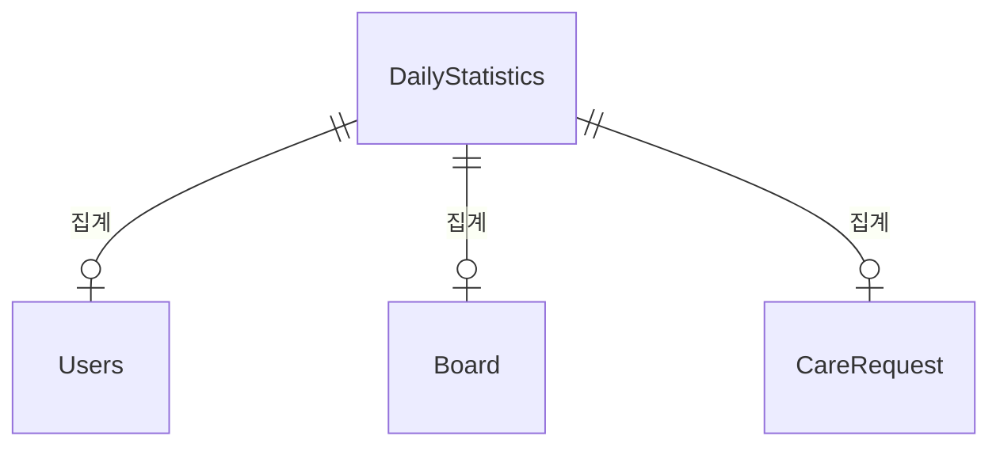

# Statistics 도메인 - 포트폴리오 상세 설명

## 1. 기능 설명

### 1.1 도메인 개요
- **역할**: 일별 통계 수집 및 조회 도메인으로, 시스템의 전반적인 통계 데이터를 관리합니다.
- **주요 기능**: 
  - 일별 통계 수집 (스케줄러)
  - 활성 사용자 수, 신규 가입자 수 집계
  - 게시글 수, 펫케어 요청 수 등 집계
  - 기간별 통계 조회

### 1.2 기능 시연
> **스크린샷/영상 링크**: [기능 작동 영상 또는 스크린샷 추가]

#### 주요 기능 1: 일별 통계 수집
- **설명**: 매일 새벽 1시에 전날 통계를 수집하여 저장합니다.
- **사용자 시나리오**: 
  1. 스케줄러 실행 (매일 새벽 1시)
  2. 전날 통계 수집 (활성 사용자, 신규 가입자, 게시글 수 등)
  3. DailyStatistics 저장
  4. 통계 조회 (일별, 기간별)
- **스크린샷/영상**: 

---

## 2. 서비스 로직 설명

### 2.1 핵심 비즈니스 로직

#### 로직 1: 일별 통계 수집
```java
// StatisticsService.java
@Scheduled(cron = "0 0 1 * * ?") // 매일 새벽 1시
@Transactional
public void collectDailyStatistics() {
    LocalDate yesterday = LocalDate.now().minusDays(1);
    
    // 활성 사용자 수 (로그인 또는 활동한 사용자)
    Long activeUsers = usersRepository.countActiveUsersByDate(yesterday);
    
    // 신규 가입자 수
    Long newUsers = usersRepository.countNewUsersByDate(yesterday);
    
    // 게시글 수
    Long boardPosts = boardRepository.countByCreatedAtBetween(
        yesterday.atStartOfDay(),
        yesterday.atTime(23, 59, 59)
    );
    
    // 펫케어 요청 수
    Long careRequests = careRequestRepository.countByCreatedAtBetween(
        yesterday.atStartOfDay(),
        yesterday.atTime(23, 59, 59)
    );
    
    DailyStatistics stats = DailyStatistics.builder()
        .date(yesterday)
        .activeUsers(activeUsers.intValue())
        .newUsers(newUsers.intValue())
        .boardPosts(boardPosts.intValue())
        .careRequests(careRequests.intValue())
        .build();
    
    statisticsRepository.save(stats);
}
```

**설명**:
- **처리 흐름**: 전날 날짜 계산 → 각 지표 집계 → DailyStatistics 저장
- **스케줄러**: 매일 새벽 1시 자동 실행

---

## 3. 아키텍처 설명

### 3.1 도메인 구조
```
domain/statistics/
  ├── controller/
  │   └── StatisticsController.java
  ├── service/
  │   └── StatisticsService.java
  ├── entity/
  │   └── DailyStatistics.java
  └── repository/
      └── DailyStatisticsRepository.java
```

### 3.2 엔티티 구조

#### DailyStatistics (일일 통계)
```java
@Entity
@Table(name = "dailystatistics")
public class DailyStatistics {
    private Long id;
    private LocalDate statDate;            // 통계 날짜 (UNIQUE)
    private Integer newUsers;              // 신규 사용자 수
    private Integer newPosts;               // 신규 게시글 수
    private Integer newCareRequests;        // 신규 펫케어 요청 수
    private Integer completedCares;         // 완료된 펫케어 수
    private BigDecimal totalRevenue;        // 총 수익
    private Integer activeUsers;            // 활성 사용자 수
    private LocalDateTime createdAt;
    private LocalDateTime updatedAt;
}
```

### 3.3 엔티티 관계도 (ERD)


---

## 4. 트러블슈팅

---

## 5. 성능 최적화

### 5.1 DB 최적화

#### 인덱스 전략
```sql
-- 날짜별 통계 조회
CREATE UNIQUE INDEX uk_statistics_date 
ON daily_statistics(date);

-- 기간별 통계 조회
CREATE INDEX idx_statistics_date 
ON daily_statistics(date DESC);
```

---

## 6. 핵심 포인트 요약

### 기술적 하이라이트
1. **스케줄러 활용**: 매일 자동 통계 수집
2. **배치 처리**: 여러 날짜 통계 한 번에 수집
3. **캐싱**: 최근 통계 캐싱

### 학습한 점
- 스케줄러 활용
- 통계 집계 방법
- 누락 데이터 복구

### 개선 가능한 부분
- 시계열 DB: InfluxDB, TimescaleDB 활용
- 실시간 통계: WebSocket으로 실시간 업데이트
- 고급 분석: 사용자 행동 분석, 트렌드 분석
