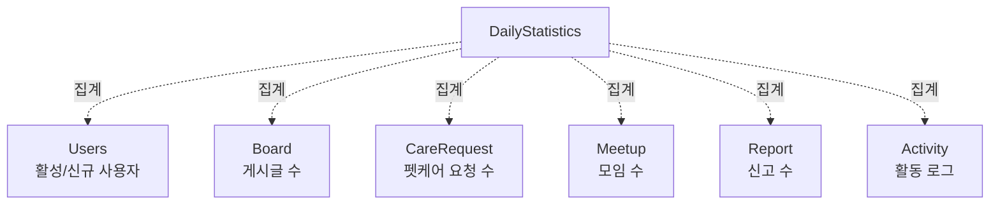

# Statistics 도메인

## 개요

일별 통계 수집 및 조회 도메인으로, 시스템의 전반적인 통계 데이터를 관리합니다.

## Entity 구조

### DailyStatistics (일별 통계)

```java
@Entity
@Table(name = "daily_statistics")
public class DailyStatistics {
    Long idx;                    // PK
    LocalDate date;              // 날짜
    Integer activeUsers;          // 활성 사용자 수
    Integer newUsers;             // 신규 가입자 수
    Integer boardPosts;           // 게시글 수
    Integer careRequests;         // 펫케어 요청 수
    Integer meetups;              // 모임 수
    Integer reports;              // 신고 수
    LocalDateTime createdAt;       // 생성 일시
}
```

**연관관계:**
- `간접 관계` → Users, Board, CareRequest, Meetup, Report 등 (집계 데이터)

## Service 주요 기능

### StatisticsService

#### 1. 통계 수집
```java
// 일별 통계 수집 (스케줄러)
@Scheduled(cron = "0 0 1 * * ?")
void collectDailyStatistics()

// 특정 날짜 통계 수집
DailyStatisticsDTO collectStatisticsForDate(LocalDate date)

// 누락된 통계 수집
void collectMissingStatistics(LocalDate from, LocalDate to)
```

#### 2. 통계 조회
```java
// 일별 통계 조회
DailyStatisticsDTO getStatisticsByDate(LocalDate date)

// 기간별 통계 조회
List<DailyStatisticsDTO> getStatisticsByPeriod(LocalDate from, LocalDate to)

// 통계 요약 (기간별 합계)
StatisticsSummaryDTO getStatisticsSummary(LocalDate from, LocalDate to)

// 차트 데이터 (일별 추이)
List<ChartDataDTO> getChartData(String metric, LocalDate from, LocalDate to)
```

## 다른 도메인과의 연관관계

### DailyStatistics와 다른 도메인



### 주요 상호작용

#### 1. User 도메인
- **Users → DailyStatistics (간접: 집계)**
  - 활성 사용자 수 집계 (로그인 또는 활동한 사용자)
  - 신규 가입자 수 집계

**예시:**
```java
// 일별 통계 수집 시 사용자 통계
@Scheduled(cron = "0 0 1 * * ?")
public void collectDailyStatistics() {
    LocalDate yesterday = LocalDate.now().minusDays(1);
    
    // 활성 사용자 수 (로그인 또는 활동한 사용자)
    Long activeUsers = usersRepository.countActiveUsersByDate(yesterday);
    
    // 신규 가입자 수
    Long newUsers = usersRepository.countNewUsersByDate(yesterday);
    
    DailyStatistics stats = DailyStatistics.builder()
        .date(yesterday)
        .activeUsers(activeUsers.intValue())
        .newUsers(newUsers.intValue())
        .build();
    
    statisticsRepository.save(stats);
}
```

#### 2. Board 도메인
- **Board → DailyStatistics (간접: 집계)**
  - 일별 게시글 작성 수 집계

**예시:**
```java
// 게시글 수 집계
Long boardPosts = boardRepository.countByCreatedAtBetween(
    yesterday.atStartOfDay(),
    yesterday.atTime(23, 59, 59)
);
```

#### 3. Care 도메인
- **CareRequest → DailyStatistics (간접: 집계)**
  - 일별 펫케어 요청 수 집계

**예시:**
```java
// 펫케어 요청 수 집계
Long careRequests = careRequestRepository.countByCreatedAtBetween(
    yesterday.atStartOfDay(),
    yesterday.atTime(23, 59, 59)
);
```

#### 4. Meetup 도메인
- **Meetup → DailyStatistics (간접: 집계)**
  - 일별 모임 생성 수 집계

**예시:**
```java
// 모임 수 집계
Long meetups = meetupRepository.countByCreatedAtBetween(
    yesterday.atStartOfDay(),
    yesterday.atTime(23, 59, 59)
);
```

#### 5. Report 도메인
- **Report → DailyStatistics (간접: 집계)**
  - 일별 신고 수 집계

**예시:**
```java
// 신고 수 집계
Long reports = reportRepository.countByCreatedAtBetween(
    yesterday.atStartOfDay(),
    yesterday.atTime(23, 59, 59)
);
```

#### 6. Activity 도메인
- **Activity → DailyStatistics (간접: 집계)**
  - 활동 로그 기반 활성 사용자 수 집계
  - 활동 유형별 통계

**예시:**
```java
// 활동 로그 기반 활성 사용자 수
Long activeUsers = activityRepository.countDistinctUsersByDate(yesterday);

// 활동 유형별 통계
Long boardPosts = activityRepository.countByActivityTypeAndDate("BOARD_CREATE", yesterday);
Long careRequests = activityRepository.countByActivityTypeAndDate("CARE_CREATE", yesterday);
```

## 비즈니스 로직

### 통계 수집 프로세스

```
1. 스케줄러 실행 (매일 새벽 1시)
   - 전날 통계 수집

2. 각 도메인별 집계
   - 활성 사용자 수
   - 신규 가입자 수
   - 게시글 수
   - 펫케어 요청 수
   - 모임 수
   - 신고 수

3. DailyStatistics 저장
   - 날짜별 통계 데이터 저장

4. 누락된 통계 수집
   - 과거 날짜 통계 수집 (필요 시)
```

### 통계 집계 쿼리

```java
// 활성 사용자 수 (로그인 또는 활동)
@Query("SELECT COUNT(DISTINCT u.idx) FROM Users u " +
       "WHERE (u.lastLoginAt BETWEEN :start AND :end " +
       "OR EXISTS (SELECT 1 FROM Activity a WHERE a.user.idx = u.idx AND a.createdAt BETWEEN :start AND :end))")
Long countActiveUsersByDate(@Param("start") LocalDateTime start, @Param("end") LocalDateTime end);

// 신규 가입자 수
@Query("SELECT COUNT(u) FROM Users u WHERE u.createdAt BETWEEN :start AND :end")
Long countNewUsersByDate(@Param("start") LocalDateTime start, @Param("end") LocalDateTime end);
```

## 성능 최적화

### 1. 인덱싱

```sql
-- 날짜별 통계 조회
CREATE UNIQUE INDEX uk_statistics_date 
ON daily_statistics(date);

-- 기간별 통계 조회
CREATE INDEX idx_statistics_date 
ON daily_statistics(date DESC);
```

### 2. 배치 처리

```java
// 여러 날짜 통계를 한 번에 수집
@Transactional
public void collectStatisticsForPeriod(LocalDate from, LocalDate to) {
    List<DailyStatistics> statistics = new ArrayList<>();
    
    LocalDate current = from;
    while (!current.isAfter(to)) {
        DailyStatistics stats = collectStatisticsForDate(current);
        statistics.add(stats);
        current = current.plusDays(1);
    }
    
    statisticsRepository.saveAll(statistics);
}
```

### 3. 캐싱

```java
// 최근 통계 캐싱
@Cacheable(value = "recentStatistics", key = "#date")
public DailyStatisticsDTO getStatisticsByDate(LocalDate date) {
    DailyStatistics stats = statisticsRepository.findByDate(date)
        .orElseThrow();
    return converter.toDTO(stats);
}
```

## API 엔드포인트

### 통계 (/api/statistics)
- `GET /daily/{date}` - 일별 통계
- `GET /period` - 기간별 통계 (from, to)
- `GET /summary` - 통계 요약
- `GET /chart` - 차트 데이터

### 관리자 (/api/admin/statistics)
- `POST /collect/{date}` - 특정 날짜 통계 수집
- `POST /collect/period` - 기간별 통계 수집

## 테스트 시나리오

### 1. 통계 수집
- 스케줄러 실행
- 전날 통계 수집 확인
- 각 지표 정확성 확인

### 2. 통계 조회
- 일별 통계 조회
- 기간별 통계 조회
- 차트 데이터 조회

## 개선 아이디어

### 기능
1. **실시간 통계**
   - 현재 시간 기준 실시간 통계
   - WebSocket으로 실시간 업데이트

2. **고급 분석**
   - 사용자 행동 분석
   - 트렌드 분석
   - 예측 분석

3. **대시보드**
   - 관리자 대시보드
   - 시각화 (차트, 그래프)

### 성능
1. **시계열 DB**
   - InfluxDB, TimescaleDB 활용
   - 대량 통계 데이터 처리

2. **데이터 웨어하우스**
   - 별도 DW 구축
   - 복잡한 분석 쿼리 처리

3. **ETL 파이프라인**
   - 정기적 데이터 추출
   - 분석 시스템 연동

