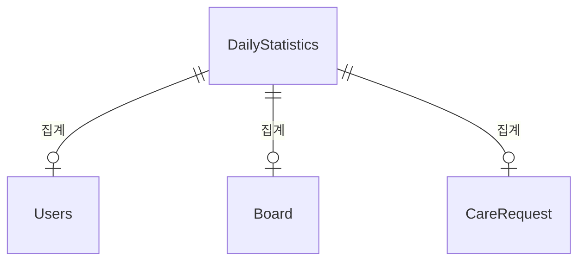

# Statistics 도메인 - 포트폴리오 상세 설명

## 1. 기능 설명

### 1.1 도메인 개요
- **역할**: 일별 통계 수집 및 조회 도메인으로, 시스템의 전반적인 통계 데이터를 관리합니다.
- **주요 기능**: 
  - 일별 통계 수집 (스케줄러)
  - 활성 사용자 수, 신규 가입자 수 집계
  - 게시글 수, 펫케어 요청 수 등 집계
  - 기간별 통계 조회

### 1.2 기능 시연
> **스크린샷/영상 링크**: [기능 작동 영상 또는 스크린샷 추가]

#### 주요 기능 1: 일별 통계 수집
- **설명**: 매일 새벽 1시에 전날 통계를 수집하여 저장합니다.
- **사용자 시나리오**: 
  1. 스케줄러 실행 (매일 새벽 1시)
  2. 전날 통계 수집 (활성 사용자, 신규 가입자, 게시글 수 등)
  3. DailyStatistics 저장
  4. 통계 조회 (일별, 기간별)
- **스크린샷/영상**: 

---

## 2. 서비스 로직 설명

### 2.1 핵심 비즈니스 로직

#### 로직 1: 일별 통계 수집
**구현 위치**: `StatisticsScheduler.aggregateDailyStatistics()` (Lines 33-38)

**스케줄러 설정**:
- **실행 시간**: 매일 오후 6시 30분 (18:30:00) - `@Scheduled(cron = "0 30 18 * * ?")`
- **집계 대상**: 어제 날짜의 통계

**핵심 로직** (`aggregateStatisticsForDate()` Lines 44-88):
- **중복 방지**: 이미 집계된 데이터가 있으면 건너뜀
- **신규 가입자**: `countByCreatedAtBetween()`로 집계
- **새 게시글**: `countByCreatedAtBetween()`로 집계
- **케어 요청**: `countByCreatedAtBetween()`로 집계
- **완료된 케어**: `countByDateBetweenAndStatus(COMPLETED)`로 집계
- **활성 사용자**: `countByLastLoginAtBetween()`로 집계 (DAU)
- **매출**: 현재 0으로 고정

#### 로직 2: 실시간 통계 조회
**구현 위치**: `StatisticsService.getDailyStatistics()` (Lines 42-56)

**핵심 로직**:
- **오늘 날짜 포함 시**: 조회 기간에 오늘이 포함되어 있고 DB에 오늘의 통계가 없으면 `calculateTodayStatistics()`로 실시간 집계 추가

---

## 3. 아키텍처 설명

### 3.1 도메인 구조
```
domain/statistics/
  ├── controller/
  │   └── StatisticsController.java
  ├── service/
  │   └── StatisticsService.java
  ├── entity/
  │   └── DailyStatistics.java
  └── repository/
      └── DailyStatisticsRepository.java
```

### 3.2 엔티티 구조

#### DailyStatistics (일일 통계)
```java
@Entity
@Table(name = "dailystatistics")
public class DailyStatistics {
    private Long id;
    @Column(unique = true, nullable = false)
    private LocalDate statDate;            // 통계 날짜 (UNIQUE)
    @Builder.Default
    private Integer newUsers = 0;          // 신규 사용자 수
    @Builder.Default
    private Integer newPosts = 0;          // 신규 게시글 수
    @Builder.Default
    private Integer newCareRequests = 0;   // 신규 펫케어 요청 수
    @Builder.Default
    private Integer completedCares = 0;    // 완료된 펫케어 수
    @Builder.Default
    private BigDecimal totalRevenue = BigDecimal.ZERO;  // 총 수익
    @Builder.Default
    private Integer activeUsers = 0;       // 활성 사용자 수 (DAU)
    private LocalDateTime createdAt;       // @PrePersist로 자동 설정
    private LocalDateTime updatedAt;       // @PreUpdate로 자동 설정
}
```

### 3.3 엔티티 관계도 (ERD)


---

## 4. 트러블슈팅

---

## 5. 성능 최적화

### 5.1 DB 최적화

#### 인덱스 전략
```sql
-- 날짜별 통계 조회
CREATE UNIQUE INDEX uk_statistics_date 
ON daily_statistics(date);

-- 기간별 통계 조회
CREATE INDEX idx_statistics_date 
ON daily_statistics(date DESC);
```

---

## 6. 핵심 포인트 요약

### 기술적 하이라이트
1. **스케줄러 활용**: 매일 오후 6시 30분에 어제 통계 자동 수집
2. **중복 방지**: 이미 집계된 날짜는 건너뜀
3. **실시간 집계**: 오늘 날짜 조회 시 실시간 집계 추가 (`calculateTodayStatistics()`)
4. **과거 데이터 초기화**: `backfillStatistics()`로 과거 데이터 일괄 집계 지원
5. **Unique 제약조건**: `statDate`에 Unique 제약조건으로 중복 방지
