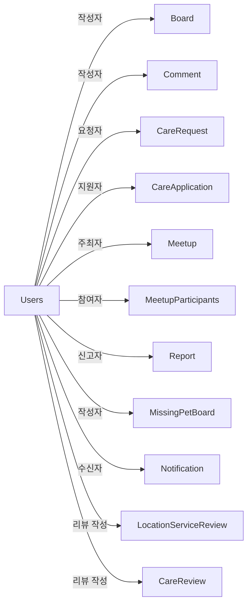

# User 도메인

## 개요

사용자 관리, 반려동물 등록, 소셜 로그인, 사용자 제재 등을 담당하는 핵심 도메인입니다.

## Entity 구조

### 1. Users (사용자)

```java
@Entity
@Table(name = "users")
public class Users {
    Long idx;              // PK
    String id;             // 로그인 ID
    String username;       // 사용자명
    String email;          // 이메일
    String phone;          // 전화번호
    String password;       // 암호화된 비밀번호
    Role role;             // 권한 (USER, ADMIN)
    String location;       // 위치
    String petInfo;        // 펫 정보
    String refreshToken;   // JWT 리프레시 토큰
    LocalDateTime lastLoginAt;      // 마지막 로그인 시간
    UserStatus status;              // 계정 상태
    Integer warningCount;           // 경고 횟수
    LocalDateTime suspendedUntil;   // 정지 종료일
    Boolean isDeleted;              // 소프트 삭제
}
```

**연관관계:**
- `OneToMany` → SocialUser (소셜 로그인 계정)
- `OneToMany` → UserSanction (제재 이력)
- `OneToMany` → Pet (등록한 반려동물)

### 2. Pet (반려동물)

```java
@Entity
@Table(name = "pet")
public class Pet {
    Long idx;              // PK
    Users user;            // 소유자 (ManyToOne)
    String name;           // 이름
    String species;        // 종 (개, 고양이 등)
    String breed;          // 품종
    Integer age;           // 나이
    String gender;         // 성별
    String imageUrl;       // 프로필 이미지
    String description;    // 설명
}
```

**연관관계:**
- `ManyToOne` → Users (소유자)
- `OneToMany` → PetVaccination (백신 접종 이력)

### 3. SocialUser (소셜 로그인)

```java
@Entity
@Table(name = "social_user")
public class SocialUser {
    Long idx;              // PK
    Users user;            // 연결된 사용자 (ManyToOne)
    String provider;       // 소셜 제공자 (KAKAO, GOOGLE, NAVER)
    String providerId;     // 제공자별 고유 ID
}
```

**연관관계:**
- `ManyToOne` → Users

### 4. UserSanction (제재 이력)

```java
@Entity
@Table(name = "user_sanction")
public class UserSanction {
    Long idx;              // PK
    Users user;            // 제재 대상 (ManyToOne)
    SanctionType type;     // 제재 유형 (WARNING, SUSPENSION, BAN)
    String reason;         // 제재 사유
    LocalDateTime startedAt;   // 시작일
    LocalDateTime endedAt;     // 종료일
    Users sanctionedBy;        // 제재 처리자 (ManyToOne)
}
```

**연관관계:**
- `ManyToOne` → Users (제재 대상)
- `ManyToOne` → Users (제재 처리자)

### 5. PetVaccination (백신 접종 이력)

```java
@Entity
@Table(name = "pet_vaccination")
public class PetVaccination {
    Long idx;              // PK
    Pet pet;               // 대상 반려동물 (ManyToOne)
    String vaccineName;    // 백신 이름
    LocalDate vaccinationDate;  // 접종일
    LocalDate nextDueDate;      // 다음 접종 예정일
}
```

**연관관계:**
- `ManyToOne` → Pet

## Service 주요 기능

### UsersService

#### 1. 사용자 관리
```java
// 회원가입
UserDTO registerUser(UserDTO userDTO)

// 로그인 (JWT 발급)
AuthResponse login(String id, String password)

// 리프레시 토큰 갱신
AuthResponse refreshToken(String refreshToken)

// 프로필 조회
UserDTO getUserProfile(Long userId)

// 프로필 수정
UserDTO updateUserProfile(Long userId, UserDTO userDTO)

// 회원 탈퇴 (소프트 삭제)
void deleteUser(Long userId)
```

#### 2. 제재 관리
```java
// 경고 부여
void issueWarning(Long userId, String reason)

// 계정 정지
void suspendUser(Long userId, int days, String reason)

// 영구 차단
void banUser(Long userId, String reason)

// 제재 이력 조회
List<UserSanctionDTO> getSanctionHistory(Long userId)

// 제재 해제
void unsanctionUser(Long userId)
```

#### 3. 통계
```java
// 활성 사용자 수
int getActiveUserCount()

// 신규 가입자 수 (기간별)
int getNewUserCount(LocalDate from, LocalDate to)
```

### PetService

#### 1. 반려동물 관리
```java
// 반려동물 등록
PetDTO registerPet(Long userId, PetDTO petDTO)

// 반려동물 조회 (사용자별)
List<PetDTO> getUserPets(Long userId)

// 반려동물 정보 수정
PetDTO updatePet(Long petId, PetDTO petDTO)

// 반려동물 삭제
void deletePet(Long petId)
```

#### 2. 백신 관리
```java
// 백신 접종 기록 추가
VaccinationDTO addVaccination(Long petId, VaccinationDTO dto)

// 백신 접종 이력 조회
List<VaccinationDTO> getVaccinationHistory(Long petId)

// 다음 접종 예정 조회
List<VaccinationDTO> getUpcomingVaccinations(Long userId)
```

### AuthService

#### 1. 인증/인가
```java
// JWT 토큰 생성
String generateAccessToken(Users user)

// JWT 토큰 검증
boolean validateToken(String token)

// 토큰에서 사용자 정보 추출
Users getUserFromToken(String token)

// 리프레시 토큰 저장
void saveRefreshToken(Long userId, String refreshToken)
```

#### 2. 소셜 로그인
```java
// 카카오 로그인
AuthResponse kakaoLogin(String code)

// 구글 로그인
AuthResponse googleLogin(String code)

// 네이버 로그인
AuthResponse naverLogin(String code)

// 소셜 계정 연결
void linkSocialAccount(Long userId, String provider, String providerId)
```

## 다른 도메인과의 연관관계

### Users와 다른 도메인



### 주요 상호작용

1. **Board 도메인**
   - Users가 게시글/댓글 작성
   - Users가 게시글에 좋아요/싫어요 반응
   - Users가 게시글 신고

2. **Care 도메인**
   - Users가 펫케어 요청 생성
   - Users가 펫케어에 지원
   - Users가 펫케어 리뷰 작성

3. **Report 도메인**
   - Users가 신고 접수
   - Admin Users가 신고 처리
   - 신고 처리 결과로 Users에 제재 부여

4. **Notification 도메인**
   - Users에게 알림 전송
   - Users가 알림 읽음 처리

## 보안 및 권한

### 권한 체계 (Role)

```java
public enum Role {
    USER,        // 일반 사용자
    ADMIN        // 관리자
}
```

### 계정 상태 (UserStatus)

```java
public enum UserStatus {
    ACTIVE,      // 정상 활성
    SUSPENDED,   // 일시 정지
    BANNED       // 영구 차단
}
```

### 제재 유형 (SanctionType)

```java
public enum SanctionType {
    WARNING,     // 경고
    SUSPENSION,  // 일시 정지
    BAN          // 영구 차단
}
```

### 보안 처리

1. **비밀번호 암호화**
   - BCryptPasswordEncoder 사용
   - Salt 자동 생성

2. **JWT 토큰**
   - Access Token: 1시간 유효
   - Refresh Token: 7일 유효
   - Refresh Token은 DB에 저장

3. **소프트 삭제**
   - `isDeleted` 플래그로 논리 삭제
   - 실제 데이터는 보관 (복구 가능)
   - 삭제된 사용자의 게시물은 "탈퇴한 사용자"로 표시

4. **제재 시스템**
   - 경고 3회 누적 시 자동 7일 정지
   - 정지 3회 시 영구 차단
   - 제재 이력은 영구 보관

## 성능 최적화

### 1. 쿼리 최적화
- **인덱스**: `id`, `email`, `username`에 UNIQUE 인덱스
- **복합 인덱스**: `(status, isDeleted)` 조회 최적화

### 2. 캐싱
- 사용자 프로필 정보 캐싱
- 권한 정보 캐싱

### 3. N+1 문제
- 소셜 계정 조회 시 Fetch Join 사용
- 펫 목록 조회 시 배치 쿼리

## 동시성 제어

### 1. 리프레시 토큰 갱신
- **문제**: 동시 갱신 시 토큰 불일치
- **해결**: 낙관적 락 또는 `@Version` 사용

### 2. 경고 횟수 증가
- **문제**: 동시 경고 부여 시 카운트 오류
- **해결**: 
  ```java
  @Query("UPDATE Users u SET u.warningCount = u.warningCount + 1 WHERE u.idx = :userId")
  void incrementWarningCount(@Param("userId") Long userId);
  ```

### 3. 계정 상태 변경
- **문제**: 동시 제재 처리
- **해결**: `@Transactional` + `REPEATABLE_READ` 격리 수준

## API 엔드포인트

### 인증 (/api/auth)
- `POST /register` - 회원가입
- `POST /login` - 로그인
- `POST /refresh` - 토큰 갱신
- `POST /logout` - 로그아웃
- `POST /social/{provider}` - 소셜 로그인

### 사용자 (/api/users)
- `GET /profile` - 내 프로필 조회
- `PUT /profile` - 프로필 수정
- `DELETE /account` - 회원 탈퇴
- `GET /me/pets` - 내 반려동물 목록
- `POST /me/pets` - 반려동물 등록

### 관리자 (/api/admin/users)
- `GET /` - 사용자 목록 (페이징)
- `GET /{userId}` - 사용자 상세
- `POST /{userId}/warn` - 경고 부여
- `POST /{userId}/suspend` - 계정 정지
- `POST /{userId}/ban` - 영구 차단
- `DELETE /{userId}/sanction` - 제재 해제

## 테스트 시나리오

### 1. 회원가입 및 로그인
- 정상 회원가입
- 중복 ID/이메일 검증
- 로그인 성공/실패
- JWT 토큰 발급

### 2. 제재 시스템
- 경고 3회 누적 시 자동 정지
- 정지 기간 만료 후 자동 활성화
- 제재 상태에서 로그인 차단

### 3. 소셜 로그인
- 카카오/구글/네이버 연동
- 기존 계정 연결
- 신규 계정 생성

## 개선 아이디어

### 성능
1. Redis를 이용한 세션 관리
2. 사용자 프로필 캐시 TTL 설정
3. 대량 사용자 조회 시 커서 페이징

### 보안
1. 2단계 인증 (2FA) 도입
2. 로그인 이력 추적
3. 비정상 로그인 감지 (IP/위치 기반)

### 기능
1. 이메일 인증
2. 비밀번호 찾기
3. 사용자 활동 통계
4. 프로필 공개/비공개 설정

