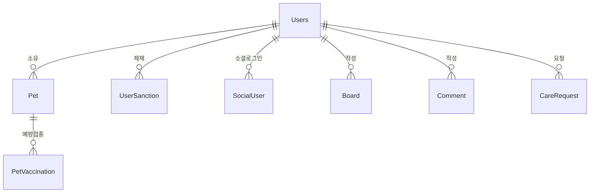

# User 도메인 - 포트폴리오 상세 설명

## 1. 기능 설명

### 1.1 도메인 개요
- **역할**: 사용자 인증/인가, 프로필 관리, 반려동물 등록, 사용자 제재 시스템을 담당하는 핵심 도메인입니다.
- **주요 기능**: 
  - 회원가입/로그인 (JWT 기반)
  - 소셜 로그인 (Google, Naver) - OAuth2 기반, JWT 토큰 발급
  - 프로필 관리 (닉네임, 이메일, 전화번호, 위치)
  - 반려동물 등록/관리
  - 사용자 제재 시스템 (경고, 이용제한, 영구 차단)
  - 소프트 삭제 (회원 탈퇴)
  - **이메일 인증 시스템**: 비밀번호 변경, 펫케어/모임 서비스 이용을 위한 인증

### 1.2 기능 시연
> **스크린샷/영상 링크**: [기능 작동 영상 또는 스크린샷 추가]

#### 주요 기능 1: 회원가입 및 로그인
- **설명**: JWT 기반 인증 시스템으로 Access Token과 Refresh Token을 발급합니다.
- **사용자 시나리오**: 
  1. 회원가입 (ID, 비밀번호, 닉네임, 이메일)
  2. 로그인 시 Access Token (15분) + Refresh Token (1일) 발급
  3. Refresh Token으로 Access Token 갱신
  4. 제재 상태 확인 (정지/차단 시 로그인 불가)
- **스크린샷/영상**:

#### 주요 기능 1-1: 소셜 로그인 (Google, Naver)
- **설명**: OAuth2 기반 소셜 로그인으로 Google/Naver 계정으로 간편 로그인 및 회원가입이 가능합니다. 소셜 로그인 성공 시 일반 로그인과 동일하게 JWT 토큰을 발급합니다.
- **사용자 시나리오**:
  1. 소셜 로그인 버튼 클릭 (Google 또는 Naver)
  2. 소셜 제공자 인증 완료
  3. 기존 사용자: 자동 로그인 및 JWT 토큰 발급
  4. 신규 사용자: 자동 회원가입 후 로그인 및 JWT 토큰 발급
  5. 이메일이 동일한 기존 사용자: 소셜 계정 자동 연결
  6. 닉네임이 없는 경우: 닉네임 설정 페이지로 리다이렉트
  7. 토큰은 쿼리 파라미터로 프론트엔드에 전달
- **스크린샷/영상**: 

#### 주요 기능 2: 반려동물 등록
- **설명**: 사용자가 반려동물 정보를 등록하고 관리할 수 있습니다.
- **사용자 시나리오**:
  1. 반려동물 등록 (이름, 종류, 품종, 성별, 나이 등)
  2. 프로필 이미지 업로드
  3. 반려동물 정보 수정/삭제
  4. 예방접종 기록 관리
- **스크린샷/영상**: 

#### 주요 기능 3: 사용자 제재 시스템
- **설명**: 관리자가 사용자에게 경고, 이용제한, 영구 차단을 부여할 수 있습니다.
- **사용자 시나리오**:
  1. 경고 3회 누적 시 자동 이용제한 3일 적용
  2. 이용제한 기간 만료 시 자동 해제 (스케줄러)
  3. 영구 차단 시 로그인 불가
- **스크린샷/영상**: 

#### 주요 기능 4: 이메일 인증 시스템
- **설명**: 단일 이메일 인증 시스템으로 비밀번호 변경, 펫케어/모임 서비스 이용을 위한 인증을 제공합니다. 소셜 로그인 사용자는 자동으로 이메일 인증이 완료되며, 일반 회원가입 사용자는 이메일 인증 링크를 통해 인증을 완료합니다.
- **사용자 시나리오**:
  1. **소셜 로그인**: Google/Naver 로그인 시 자동으로 `emailVerified = true` 설정
  2. **일반 회원가입**: 
     - 회원가입 전 이메일 인증 가능 (Redis에 임시 저장)
     - 회원가입 시 이메일 인증 메일 발송 → 링크 클릭 시 인증 완료
  3. **비밀번호 변경**: 비밀번호 재설정 전 이메일 인증 필수 확인
  4. **펫케어 서비스**: 펫케어 요청/지원 시 이메일 인증 확인 → 미인증 시 예외 발생
  5. **모임 서비스**: 모임 생성/참여 시 이메일 인증 확인 → 미인증 시 예외 발생
- **권한 제어**:
  - 인증 안 된 사용자: 주변 서비스, 커뮤니티는 조회 가능, 펫케어/모임은 이용 불가
  - 인증 완료 후: 모든 서비스 이용 가능
- **스크린샷/영상**: 

#### 주요 기능 5: 비밀번호 찾기 및 변경
- **설명**: 사용자가 비밀번호를 잊어버린 경우 이메일을 통해 비밀번호 재설정 링크를 받아 새 비밀번호를 설정할 수 있습니다. 또한 로그인한 사용자는 현재 비밀번호를 확인하여 새 비밀번호로 변경할 수 있습니다.
- **사용자 시나리오**:
  1. **비밀번호 찾기**:
     - 비밀번호 찾기 페이지에서 이메일 입력
     - 이메일로 비밀번호 재설정 링크 발송
     - 링크 클릭 시 새 비밀번호 설정 페이지로 이동
     - 새 비밀번호 입력 및 저장
  2. **비밀번호 변경** (로그인 상태):
     - 현재 비밀번호 확인
     - 이메일 인증 완료 여부 확인 (필수)
     - 새 비밀번호 입력 및 저장
- **스크린샷/영상**: 

#### 주요 기능 6: 사용자 프로필 조회 및 리뷰
- **설명**: 사용자는 자신의 프로필을 조회할 수 있으며, 다른 사용자의 프로필도 조회할 수 있습니다. 프로필에는 펫케어 서비스에서 받은 리뷰와 평점이 포함됩니다.
- **사용자 시나리오**:
  1. **내 프로필 조회**: 
     - 자신의 프로필 정보 (닉네임, 이메일, 전화번호, 위치 등)
     - 등록한 반려동물 목록
     - 받은 리뷰 목록 및 평균 평점
  2. **다른 사용자 프로필 조회**:
     - 특정 사용자의 프로필 정보 조회
     - 해당 사용자가 받은 리뷰 목록 및 평균 평점
     - 펫케어 서비스 이용 시 상대방 신뢰도 확인 용도
  3. **리뷰 목록 조회**:
     - 특정 사용자의 리뷰만 별도로 조회 가능
- **스크린샷/영상**: 

#### 주요 기능 7: 회원가입 전 이메일 인증 확인
- **설명**: 회원가입 전에 이메일 인증을 완료한 경우, 회원가입 시 인증 상태를 확인하여 자동으로 인증 완료 상태로 설정합니다.
- **사용자 시나리오**:
  1. 회원가입 전 이메일 인증 메일 발송
  2. 이메일 링크 클릭하여 인증 완료 (Redis에 24시간 저장)
  3. 회원가입 시 인증 완료 여부 확인 API 호출
  4. 인증 완료된 경우 회원가입 후 자동으로 `emailVerified = true` 설정
  5. 인증 안 된 경우 회원가입 후 별도 인증 메일 발송
- **스크린샷/영상**: 

---

## 2. 서비스 로직 설명

### 2.1 핵심 비즈니스 로직

#### 로직 1: JWT 기반 인증 시스템
```java
// AuthService.java
@Transactional
public TokenResponse login(String id, String password) {
    Users user = usersRepository.findByIdString(id)
        .orElseThrow(() -> new RuntimeException("유저 없음"));
    
    // 제재 상태 확인
    if (user.getStatus() == UserStatus.BANNED) {
        throw new RuntimeException("영구 차단된 계정입니다.");
    }
    
    if (user.getStatus() == UserStatus.SUSPENDED) {
        if (user.getSuspendedUntil() != null && 
            user.getSuspendedUntil().isAfter(LocalDateTime.now())) {
            throw new RuntimeException("이용제한 중인 계정입니다.");
        } else {
            // 만료된 이용제한 자동 해제
            user.setStatus(UserStatus.ACTIVE);
            user.setSuspendedUntil(null);
            usersRepository.save(user);
        }
    }
    
    // Access Token 생성 (15분)
    String accessToken = jwtUtil.createAccessToken(user.getId());
    
    // Refresh Token 생성 (1일)
    String refreshToken = jwtUtil.createRefreshToken();
    
    // DB에 refresh token 저장
    user.setRefreshToken(refreshToken);
    user.setRefreshExpiration(LocalDateTime.now().plusDays(1));
    user.setLastLoginAt(LocalDateTime.now());
    usersRepository.save(user);
    
    return TokenResponse.builder()
        .accessToken(accessToken)
        .refreshToken(refreshToken)
        .user(userDTO)
        .build();
}
```

**설명**:
- **처리 흐름**: 사용자 조회 → 제재 상태 확인 → 토큰 발급 → DB 저장
- **주요 판단 기준**: 
  - 제재 상태 확인 (BANNED, SUSPENDED)
  - 이용제한 만료 시 자동 해제
- **보안**: Refresh Token은 DB에 저장하여 무효화 가능

#### 로직 1-1: OAuth2 소셜 로그인 처리
```java
// OAuth2Service.java
@Transactional
public TokenResponse processOAuth2Login(OAuth2User oauth2User, Provider provider) {
    // Provider별로 사용자 정보 추출 (표준화된 형태)
    String providerId = extractProviderId(oauth2User, provider);
    String email = extractEmail(oauth2User, provider);
    String name = extractName(oauth2User, provider);
    
    // SocialUser 조회 (기존 소셜 로그인 사용자 확인)
    Optional<SocialUser> socialUserOpt = 
        socialUserRepository.findByProviderAndProviderId(provider, providerId);
    
    Users user;
    if (socialUserOpt.isPresent()) {
        // 기존 소셜 로그인 사용자
        user = socialUserOpt.get().getUser();
    } else {
        // 신규 소셜 로그인 사용자 - 회원가입 처리
        user = createOrLinkUser(oauth2User, provider, providerId, email, name);
    }
    
    // 제재 상태 확인 (일반 로그인과 동일)
    if (user.getStatus() == UserStatus.BANNED) {
        throw new RuntimeException("영구 차단된 계정입니다.");
    }
    
    // Access Token 생성 (15분) - 일반 로그인과 동일
    String accessToken = jwtUtil.createAccessToken(user.getId());
    
    // Refresh Token 생성 (1일) - 일반 로그인과 동일
    String refreshToken = jwtUtil.createRefreshToken();
    
    // DB에 refresh token 저장
    user.setRefreshToken(refreshToken);
    user.setRefreshExpiration(LocalDateTime.now().plusDays(1));
    user.setLastLoginAt(LocalDateTime.now());
    usersRepository.save(user);
    
    return TokenResponse.builder()
        .accessToken(accessToken)
        .refreshToken(refreshToken)
        .user(userDTO)
        .build();
}

// OAuth2SuccessHandler.java
public void onAuthenticationSuccess(...) {
    // OAuth2 로그인 처리
    TokenResponse tokenResponse = oAuth2Service.processOAuth2Login(oAuth2User, provider);
    
    // 닉네임이 없으면 닉네임 설정 페이지로 리다이렉트
    boolean needsNickname = tokenResponse.getUser().getNickname() == null ||
            tokenResponse.getUser().getNickname().trim().isEmpty();
    
    String targetUrl = UriComponentsBuilder.fromUriString(redirectUri)
        .queryParam("accessToken", URLEncoder.encode(tokenResponse.getAccessToken(), ...))
        .queryParam("refreshToken", URLEncoder.encode(tokenResponse.getRefreshToken(), ...))
        .queryParam("success", "true")
        .queryParam("needsNickname", needsNickname ? "true" : null)
        .build()
        .toUriString();
    
    getRedirectStrategy().sendRedirect(request, response, targetUrl);
}
```

**설명**:
- **처리 흐름**: OAuth2 인증 → 사용자 정보 추출 → 기존 사용자 확인/신규 생성 → 제재 상태 확인 → JWT 토큰 발급 → 프론트엔드 리다이렉트
- **주요 판단 기준**: 
  - SocialUser 조회로 기존 소셜 로그인 사용자 확인
  - 이메일로 기존 사용자 확인 (소셜 계정 연결)
  - 제재 상태 확인 (일반 로그인과 동일)
  - 닉네임 존재 여부 확인
- **특징**: 
  - Provider별 사용자 정보 표준화 (Google: sub, Naver: id)
  - Naver는 커스텀 TokenResponseClient 사용 (표준 OAuth2와 다른 응답 형식)
  - Google은 기본 클라이언트 사용
  - 일반 로그인과 동일한 JWT 토큰 발급 방식
  - 소셜 로그인 사용자는 닉네임이 없을 수 있음 (추가 설정 필요)

#### 로직 2: 경고 누적 시 자동 이용제한
```java
// UserSanctionService.java
@Transactional
public UserSanction addWarning(Long userId, String reason, Long adminId, Long reportId) {
    Users user = usersRepository.findById(userId).orElseThrow();
    
    // 경고 추가
    UserSanction warning = UserSanction.builder()
        .user(user)
        .sanctionType(SanctionType.WARNING)
        .reason(reason)
        .startsAt(LocalDateTime.now())
        .admin(admin)
        .build();
    sanctionRepository.save(warning);
    
    // 경고 횟수 원자적 증가 (동시성 문제 해결)
    usersRepository.incrementWarningCount(userId);
    
    // 업데이트된 사용자 정보 다시 조회
    user = usersRepository.findById(userId).orElseThrow();
    
    // 경고 3회 이상이면 자동 이용제한
    if (user.getWarningCount() >= WARNING_THRESHOLD) {
        addSuspension(userId, 
            String.format("경고 %d회 누적으로 인한 자동 이용제한", user.getWarningCount()),
            adminId, reportId, AUTO_SUSPENSION_DAYS);
    }
    
    return warning;
}
```

**설명**:
- **처리 흐름**: 경고 추가 → 경고 횟수 원자적 증가 → 3회 도달 시 자동 이용제한
- **주요 판단 기준**: 경고 횟수 >= 3회
- **동시성 처리**: `incrementWarningCount()` 메서드로 원자적 증가 보장
- **자동화**: 스케줄러로 만료된 이용제한 자동 해제

#### 로직 3: 이메일 인증 시스템
```java
// EmailVerificationService.java
@Transactional
public void sendVerificationEmail(String userId, EmailVerificationPurpose purpose) {
    Users user = usersRepository.findByIdString(userId).orElseThrow();
    
    // 이미 인증된 경우 스킵
    if (Boolean.TRUE.equals(user.getEmailVerified())) {
        return;
    }
    
    // 인증 토큰 생성 (JWT 기반, purpose 포함)
    String token = jwtUtil.createEmailVerificationToken(userId, purpose);
    
    // 이메일 발송 (비동기)
    emailService.sendVerificationEmail(user.getEmail(), token, purpose);
}

// 회원가입 전 이메일 인증 (Redis 사용)
public void sendPreRegistrationVerificationEmail(String email) {
    // 이미 가입된 이메일 확인
    usersRepository.findByEmail(email)
        .ifPresent(existingUser -> {
            throw new RuntimeException("이미 사용 중인 이메일입니다.");
        });
    
    // 인증 토큰 생성 (이메일 기반)
    String token = jwtUtil.createEmailVerificationTokenByEmail(email, EmailVerificationPurpose.REGISTRATION);
    
    // 이메일 발송
    emailService.sendVerificationEmail(email, token, EmailVerificationPurpose.REGISTRATION);
}

@Transactional
public EmailVerificationPurpose verifyEmail(String token) {
    // 토큰 검증 및 사용자 ID, purpose 추출
    String email = jwtUtil.extractEmailFromEmailToken(token);
    
    if (email != null) {
        // 회원가입 전 인증인 경우 Redis에 저장
        String redisKey = PRE_REGISTRATION_VERIFICATION_KEY_PREFIX + email;
        stringRedisTemplate.opsValue().set(redisKey, "verified", 
            PRE_REGISTRATION_VERIFICATION_EXPIRE_HOURS, TimeUnit.HOURS);
        return EmailVerificationPurpose.REGISTRATION;
    }
    
    // 기존 사용자 인증 처리
    String userId = jwtUtil.extractUserIdFromEmailToken(token);
    EmailVerificationPurpose purpose = jwtUtil.extractPurposeFromEmailToken(token);
    
    Users user = usersRepository.findByIdString(userId).orElseThrow();
    
    // 이메일 인증 완료 (용도 무관, 단일 인증 상태로 업데이트)
    user.setEmailVerified(true);
    usersRepository.save(user);
    
    return purpose;
}

// 서비스 레벨 권한 체크 예시 (CareRequestService.java)
@PreAuthorize("isAuthenticated()")
public CareRequestDTO createCareRequest(CareRequestDTO dto) {
    String userId = getCurrentUserId();
    Users user = usersRepository.findByIdString(userId).orElseThrow();
    
    // 이메일 인증 확인
    if (user.getEmailVerified() == null || !user.getEmailVerified()) {
        throw new EmailVerificationRequiredException("이메일 인증이 필요합니다.");
    }
    
    // 펫케어 요청 생성 로직...
}
```

**설명**:
- **핵심 원칙**: 이메일 인증은 **하나의 통합 시스템**으로 구현, 용도(purpose)만 분리
- **처리 흐름**: 
  1. 인증 토큰 생성 (JWT 기반, purpose 포함)
  2. 이메일 발송 (비동기)
  3. 링크 클릭 시 토큰 검증
  4. `emailVerified = true` 업데이트 (용도 무관) 또는 Redis에 저장 (회원가입 전)
  5. 용도별 후속 처리 (리다이렉트 등)
- **주요 판단 기준**: 
  - 소셜 로그인: 자동 인증 (Google: `email_verified`, Naver: 기본 `true`)
  - 일반 회원가입: 수동 인증 (이메일 링크 클릭)
  - 회원가입 전 인증: Redis에 임시 저장 (24시간 유효)
- **권한 제어**: 서비스 레벨에서 `emailVerified` 필드 확인
- **특징**: 
  - 단일 인증 상태 (`emailVerified` 필드 하나로 관리)
  - 용도는 토큰에만 포함 (인증 완료 후 용도 무관)
  - 서비스별 독립적인 권한 체크
  - 회원가입 전 이메일 인증 지원 (Redis 활용)

#### 로직 4: 프로필 수정 시 중복 체크
```java
// UsersService.java
public UsersDTO updateMyProfile(String userId, UsersDTO dto) {
    Users user = usersRepository.findByIdString(userId).orElseThrow();
    
    if (dto.getUsername() != null && !dto.getUsername().isEmpty()) {
        // 닉네임 중복 확인
        usersRepository.findByUsername(dto.getUsername())
            .ifPresent(existingUser -> {
                if (!existingUser.getId().equals(userId)) {
                    throw new RuntimeException("이미 사용 중인 닉네임입니다.");
                }
            });
        user.setUsername(dto.getUsername());
    }
    
    if (dto.getEmail() != null && !dto.getEmail().isEmpty()) {
        // 이메일 중복 확인
        usersRepository.findByEmail(dto.getEmail())
            .ifPresent(existingUser -> {
                if (!existingUser.getId().equals(userId)) {
                    throw new RuntimeException("이미 사용 중인 이메일입니다.");
                }
            });
        user.setEmail(dto.getEmail());
    }
    
    Users updated = usersRepository.save(user);
    return usersConverter.toDTO(updated);
}
```

**설명**:
- **처리 흐름**: 사용자 조회 → 중복 체크 → 필드 업데이트
- **주요 판단 기준**: 다른 사용자가 이미 사용 중인지 확인

### 2.2 서비스 메서드 구조

#### AuthService
| 메서드 | 설명 | 주요 로직 |
|--------|------|-----------|
| `login()` | 로그인 | 제재 상태 확인, 토큰 발급, DB 저장 |
| `refreshAccessToken()` | Access Token 갱신 | Refresh Token 검증, 새 Access Token 발급 |
| `logout()` | 로그아웃 | Refresh Token 제거 |
| `validateRefreshToken()` | Refresh Token 검증 | JWT 검증 + DB 확인 |

#### OAuth2Service
| 메서드 | 설명 | 주요 로직 |
|--------|------|-----------|
| `processOAuth2Login()` | 소셜 로그인 처리 | 사용자 정보 추출, 기존 사용자 확인/신규 생성, 제재 상태 확인, JWT 토큰 발급 |
| `extractProviderId()` | Provider별 ID 추출 | Google: sub, Naver: id |
| `extractEmail()` | 이메일 추출 | 표준화된 attributes에서 추출 |
| `extractName()` | 이름 추출 | 표준화된 attributes에서 추출 |
| `createOrLinkUser()` | 사용자 생성/연결 | 이메일로 기존 사용자 확인, 신규 생성 또는 소셜 계정 연결 |

#### UsersService
| 메서드 | 설명 | 주요 로직 |
|--------|------|-----------|
| `createUser()` | 회원가입 | 비밀번호 암호화, 사용자 저장, 이메일 인증 메일 발송 |
| `updateMyProfile()` | 프로필 수정 | 중복 체크, 필드 업데이트 |
| `changePassword()` | 비밀번호 변경 | 이메일 인증 확인, 현재 비밀번호 확인, 새 비밀번호 암호화 |
| `deleteUser()` | 회원 탈퇴 | 소프트 삭제 (isDeleted = true) |
| `checkIdAvailability()` | 아이디 중복 검사 | 아이디 사용 가능 여부 확인 |
| `checkNicknameAvailability()` | 닉네임 중복 검사 | 닉네임 사용 가능 여부 확인 |
| `setNickname()` | 닉네임 설정 | 소셜 로그인 사용자용 닉네임 설정 |

#### EmailVerificationService
| 메서드 | 설명 | 주요 로직 |
|--------|------|-----------|
| `sendVerificationEmail()` | 인증 메일 발송 | 인증 토큰 생성, 이메일 발송 (비동기) |
| `sendPreRegistrationVerificationEmail()` | 회원가입 전 인증 메일 발송 | 이메일 기반 토큰 생성, 이메일 발송 |
| `verifyEmail()` | 이메일 인증 처리 | 토큰 검증, `emailVerified = true` 업데이트 또는 Redis 저장 |
| `verifyPreRegistrationEmail()` | 회원가입 전 인증 처리 | 토큰 검증, Redis에 인증 상태 저장 |
| `checkEmailVerification()` | 인증 상태 확인 | 사용자의 이메일 인증 여부 확인 |

#### PetService
| 메서드 | 설명 | 주요 로직 |
|--------|------|-----------|
| `createPet()` | 반려동물 등록 | ETC 타입 검증, 이미지 업로드 |
| `updatePet()` | 반려동물 수정 | 필드 업데이트, 이미지 동기화 |
| `deletePet()` | 반려동물 삭제 | 소프트 삭제 |
| `getPetsByUserId()` | 사용자별 반려동물 조회 | 삭제되지 않은 펫만 조회 |

#### UserSanctionService
| 메서드 | 설명 | 주요 로직 |
|--------|------|-----------|
| `addWarning()` | 경고 부여 | 경고 추가, 경고 횟수 원자적 증가, 3회 시 자동 이용제한 |
| `addSuspension()` | 이용제한 부여 | 이용제한 추가, 상태 변경 |
| `addBan()` | 영구 차단 | 영구 차단 추가, 상태 변경 |
| `releaseExpiredSuspensions()` | 만료된 이용제한 해제 | 스케줄러로 자동 실행 |

### 2.3 트랜잭션 처리
- **트랜잭션 범위**: 
  - 로그인, 회원가입, 프로필 수정: `@Transactional`
  - 조회 메서드: `@Transactional(readOnly = true)`
- **격리 수준**: 기본값 (READ_COMMITTED)
- **롤백 조건**: 예외 발생 시 자동 롤백

### 2.4 예외 처리
- **처리하는 예외**: 
  - `RuntimeException`: 사용자를 찾을 수 없는 경우, 중복 체크 실패
  - `IllegalArgumentException`: 잘못된 파라미터
  - `EmailVerificationRequiredException`: 이메일 인증이 필요한 경우
- **예외 처리 전략**: 
  - Service 레이어에서 예외 발생 시 Controller로 전파
  - GlobalExceptionHandler에서 통합 처리

---

## 3. 아키텍처 설명

### 3.1 도메인 구조
```
domain/user/
  ├── controller/
  │   ├── AuthController.java          # 인증 API
  │   ├── UsersController.java          # 사용자 API
  │   ├── UserProfileController.java    # 사용자 프로필 API
  │   ├── PetController.java            # 반려동물 API
  │   └── AdminUserManagementController.java  # 관리자 사용자 관리 API
  ├── service/
  │   ├── AuthService.java             # 인증 비즈니스 로직
  │   ├── UsersService.java            # 사용자 비즈니스 로직
  │   ├── PetService.java              # 반려동물 비즈니스 로직
  │   ├── UserSanctionService.java     # 제재 비즈니스 로직
  │   ├── OAuth2Service.java           # 소셜 로그인 비즈니스 로직
  │   ├── EmailVerificationService.java # 이메일 인증 비즈니스 로직
  │   ├── EmailService.java            # 이메일 발송 서비스
  │   ├── GoogleOAuth2UserService.java # Google OAuth2 사용자 서비스
  │   ├── NaverOAuth2UserService.java  # Naver OAuth2 사용자 서비스
  │   ├── OAuth2UserProviderRouter.java # Provider별 라우터
  │   ├── NaverOAuth2TokenResponseClient.java # Naver 토큰 응답 클라이언트
  │   ├── ConditionalOAuth2TokenResponseClient.java # 조건부 토큰 응답 클라이언트
  │   └── OAuth2DataCollector.java     # OAuth2 데이터 수집기
  ├── handler/
  │   ├── OAuth2SuccessHandler.java    # 소셜 로그인 성공 핸들러
  │   └── OAuth2FailureHandler.java    # 소셜 로그인 실패 핸들러
  ├── repository/
  │   ├── UsersRepository.java
  │   ├── PetRepository.java
  │   ├── PetVaccinationRepository.java
  │   ├── UserSanctionRepository.java
  │   └── SocialUserRepository.java
  ├── entity/
  │   ├── Users.java
  │   ├── Pet.java
  │   ├── PetVaccination.java
  │   ├── UserSanction.java
  │   ├── SocialUser.java
  │   ├── Provider.java               # 소셜 로그인 제공자 (GOOGLE, NAVER)
  │   ├── UserStatus.java             # 사용자 상태 (ACTIVE, SUSPENDED, BANNED)
  │   ├── Role.java                   # 역할 (USER, ADMIN, MASTER)
  │   └── EmailVerificationPurpose.java # 이메일 인증 용도
  ├── converter/
  │   ├── UsersConverter.java
  │   ├── PetConverter.java
  │   ├── PetVaccinationConverter.java
  │   └── SocialUserConverter.java
  ├── dto/
  │   ├── UsersDTO.java
  │   ├── PetDTO.java
  │   ├── PetVaccinationDTO.java
  │   ├── TokenResponse.java
  │   ├── LoginRequest.java
  │   └── UserPageResponseDTO.java
  ├── exception/
  │   └── EmailVerificationRequiredException.java
  └── scheduler/
      └── UserSanctionScheduler.java  # 제재 만료 자동 해제 스케줄러
```

### 3.2 엔티티 구조

#### Users (사용자)
```java
@Entity
@Table(name = "users")
public class Users {
    private Long idx;
    private String id;                     // 로그인용 아이디 (UNIQUE)
    private String username;                // 사용자명 (UNIQUE)
    private String nickname;                // 닉네임 (UNIQUE, 소셜 로그인 사용자 필수)
    private String email;                  // 이메일 (UNIQUE)
    private String phone;                  // 전화번호
    private String password;               // 비밀번호 (암호화)
    private String profileImage;           // 프로필 이미지 URL (소셜 로그인)
    private String birthDate;              // 생년월일 (소셜 로그인)
    private String gender;                 // 성별 (소셜 로그인)
    private Boolean emailVerified;         // 이메일 인증 여부
    private Role role;                     // 역할 (USER, ADMIN, MASTER)
    private String location;               // 위치
    private String petInfo;                // 반려동물 정보
    private String refreshToken;           // Refresh Token
    private LocalDateTime refreshExpiration; // Refresh Token 만료일
    private LocalDateTime lastLoginAt;     // 마지막 로그인 시간
    private UserStatus status;             // 상태 (ACTIVE, SUSPENDED, BANNED)
    private Integer warningCount;           // 경고 횟수
    private LocalDateTime suspendedUntil;  // 이용제한 종료일
    private Boolean isDeleted;             // 삭제 여부
    private LocalDateTime deletedAt;       // 삭제 시간
    private LocalDateTime createdAt;
    private LocalDateTime updatedAt;
    private List<SocialUser> socialUsers;   // 소셜 로그인 정보
    private List<UserSanction> sanctions;  // 제재 이력
    private List<Pet> pets;                // 등록한 반려동물 목록
}
```

#### Pet (반려동물)
```java
@Entity
@Table(name = "pets")
public class Pet {
    private Long idx;
    private Users user;                    // 소유자
    private String petName;                // 반려동물 이름
    private PetType petType;               // 종류 (DOG, CAT, ETC)
    private String breed;                  // 품종
    private PetGender gender;              // 성별 (M, F, UNKNOWN)
    private String age;                    // 나이
    private String color;                  // 색상/털색
    private BigDecimal weight;             // 몸무게 (kg)
    private Boolean isNeutered;            // 중성화 여부
    private LocalDate birthDate;           // 생년월일
    private String healthInfo;             // 건강 정보
    private String specialNotes;            // 특이사항
    private String profileImageUrl;        // 프로필 사진 URL
    private LocalDateTime createdAt;
    private LocalDateTime updatedAt;
    private Boolean isDeleted;
    private List<PetVaccination> vaccinations; // 예방접종 기록
}
```

#### UserSanction (사용자 제재)
```java
@Entity
@Table(name = "user_sanctions")
public class UserSanction {
    private Long idx;
    private Users user;                    // 제재 대상
    private SanctionType sanctionType;     // 제재 타입 (WARNING, SUSPENSION, BAN)
    private String reason;                 // 제재 사유
    private Integer durationDays;           // 제재 기간 (일) - null이면 영구
    private LocalDateTime startsAt;        // 제재 시작일
    private LocalDateTime endsAt;          // 제재 종료일 - null이면 영구
    private Users admin;                   // 처리한 관리자
    private Long reportIdx;                // 관련 신고 ID
    private LocalDateTime createdAt;
}
```

#### SocialUser (소셜 로그인)
```java
@Entity
@Table(name = "socialuser")
public class SocialUser {
    private Long idx;
    private Users user;                    // 사용자
    private Provider provider;             // 제공자 (GOOGLE, NAVER)
    private String providerId;             // 제공자 ID (Google: sub, Naver: id)
    private String providerData;           // Provider별 원본 데이터 JSON
    private String providerProfileImage;    // Provider별 프로필 이미지 URL
    private String providerName;           // Provider별 이름
    private String providerPhone;          // Provider별 전화번호
    private String providerAgeRange;        // Provider별 나이대
    private LocalDateTime createdAt;
    private LocalDateTime updatedAt;
}
```

**설명**:
- **역할**: 소셜 로그인 사용자와 제공자 간의 연결 정보 저장
- **관계**: Users와 Many-to-One 관계
- **특징**: 
  - 하나의 사용자가 여러 소셜 계정 연결 가능
  - provider + providerId로 기존 소셜 로그인 사용자 식별
  - Provider별 원본 데이터를 JSON으로 저장하여 추후 활용 가능

### 3.3 엔티티 관계도 (ERD)


### 3.4 API 설계
| 엔드포인트 | Method | 설명 | 요청/응답 |
|-----------|--------|------|----------|
| `/api/auth/login` | POST | 로그인 | `LoginRequest` → `TokenResponse` |
| `/api/auth/register` | POST | 회원가입 | `UsersDTO` → `UsersDTO` |
| `/api/auth/refresh` | POST | 토큰 갱신 | `refreshToken` → `TokenResponse` |
| `/api/auth/logout` | POST | 로그아웃 | - → `204 No Content` |
| `/api/auth/validate` | POST | 토큰 검증 | `Authorization Header` → `{valid: boolean, user: UsersDTO}` |
| `/oauth2/authorization/google` | GET | Google 소셜 로그인 시작 | - → 리다이렉트 |
| `/oauth2/authorization/naver` | GET | Naver 소셜 로그인 시작 | - → 리다이렉트 |
| `/oauth2/callback` | GET | 소셜 로그인 콜백 | - → 리다이렉트 (토큰 포함) |
| `/api/users/me` | GET | 내 프로필 조회 (리뷰 포함) | - → `UserProfileWithReviewsDTO` |
| `/api/users/me` | PUT | 프로필 수정 | `UsersDTO` → `UsersDTO` |
| `/api/users/me/password` | PATCH | 비밀번호 변경 | `{currentPassword, newPassword}` → `{message: string}` |
| `/api/users/me/username` | PATCH | 닉네임 변경 | `{username}` → `UsersDTO` |
| `/api/users/me/nickname` | POST | 닉네임 설정 (소셜 로그인 사용자용) | `{nickname}` → `UsersDTO` |
| `/api/users/{userId}/profile` | GET | 다른 사용자 프로필 조회 (리뷰 포함) | - → `UserProfileWithReviewsDTO` |
| `/api/users/{userId}/reviews` | GET | 특정 사용자의 리뷰 목록 조회 | - → `List<CareReviewDTO>` |
| `/api/users/pets` | GET | 내 반려동물 목록 | - → `List<PetDTO>` |
| `/api/users/pets` | POST | 반려동물 등록 | `PetDTO` → `PetDTO` |
| `/api/users/pets/{petIdx}` | PUT | 반려동물 수정 | `PetDTO` → `PetDTO` |
| `/api/users/pets/{petIdx}` | DELETE | 반려동물 삭제 | - → `204 No Content` |
| `/api/users/id/check` | GET | 아이디 중복 검사 | `id` → `{available: boolean}` |
| `/api/users/nickname/check` | GET | 닉네임 중복 검사 | `nickname` → `{available: boolean}` |
| `/api/users/email/verify` | POST | 이메일 인증 메일 발송 | `{purpose}` → `{success: boolean, message: string}` |
| `/api/users/email/verify/pre-registration` | POST | 회원가입 전 이메일 인증 메일 발송 | `{email}` → `{success: boolean, message: string}` |
| `/api/users/email/verify/pre-registration/check` | GET | 회원가입 전 이메일 인증 완료 여부 확인 | `email` → `{verified: boolean, message: string}` |
| `/api/users/email/verify/{token}` | GET | 이메일 인증 처리 | - → `{success: boolean, purpose: string, redirectUrl: string}` |
| `/api/auth/forgot-password` | POST | 비밀번호 찾기 (비밀번호 재설정 이메일 발송) | `{email}` → `{success: boolean, message: string}` |
| `/api/admin/users` | GET | 사용자 목록 (관리자) | `page`, `size` → `UserPageResponseDTO` |
| `/api/admin/users/{id}/warn` | POST | 경고 부여 | `reason` → `UserSanction` |
| `/api/admin/users/{id}/suspend` | POST | 이용제한 부여 | `days`, `reason` → `UserSanction` |
| `/api/admin/users/{id}/ban` | POST | 영구 차단 | `reason` → `UserSanction` |

**소셜 로그인 플로우**:
1. 사용자가 `/oauth2/authorization/{provider}` 접근
2. Spring Security가 소셜 제공자로 리다이렉트
3. 사용자가 소셜 제공자에서 인증 완료
4. 소셜 제공자가 `/oauth2/callback`으로 리다이렉트 (인증 코드 포함)
5. `OAuth2SuccessHandler`에서 `OAuth2Service.processOAuth2Login()` 호출
6. JWT 토큰 발급 후 프론트엔드로 리다이렉트 (쿼리 파라미터로 토큰 전달)
7. 닉네임이 없으면 `needsNickname=true` 파라미터와 함께 리다이렉트

### 3.5 다른 도메인과의 연관관계
- **Board 도메인**: Users가 게시글/댓글 작성
- **Care 도메인**: Users가 펫케어 요청 생성/지원 (이메일 인증 필수)
- **Report 도메인**: Users가 신고 접수, 제재 부여
- **Notification 도메인**: Users에게 알림 전송
- **File 도메인**: Users 프로필 이미지, Pet 프로필 이미지

### 3.6 데이터 흐름
```
[사용자 요청] 
  → [AuthController/UsersController] 
  → [AuthService/UsersService] 
  → [UsersRepository] 
  → [Database]
  → [UsersConverter] (Entity → DTO)
  → [응답 반환]
```

---

## 4. 트러블슈팅

### 4.1 제재 시스템 동시성 문제
**가정 상황**: 여러 관리자가 동시에 같은 사용자에게 경고 부여
**문제 발생 위치**: `UserSanctionService.addWarning()` 메서드에서 경고 횟수 증가 시
**문제 내용**: 
- 여러 스레드가 동시에 `user.getWarningCount()`를 읽고 증가시키면 Lost Update 발생
- 예: 경고 2회 상태에서 3명이 동시에 경고 부여 시, 예상값 5가 아닌 3~4로 누락 가능
- 경고 3회 도달 판단이 부정확해져 자동 이용제한이 누락되거나 중복 적용될 수 있음
**해결 방법**: DB 레벨에서 원자적 증가 쿼리 사용
```java
// UsersRepository.java
@Modifying
@Query("UPDATE Users u SET u.warningCount = u.warningCount + 1 WHERE u.idx = :userId")
void incrementWarningCount(@Param("userId") Long userId);
```
**효과**: 동시 요청 시에도 경고 횟수가 정확하게 증가하며, 경고 3회 도달 시 자동 이용제한이 정확히 한 번만 적용됨

### 4.2 소셜 로그인 동시성 문제
**가정 상황**: 같은 소셜 계정(같은 provider + providerId 또는 같은 email)으로 동시에 여러 번 로그인 시도
**문제 발생 위치**: `OAuth2Service.createOrLinkUser()` 메서드에서 사용자 생성/연결 시
**문제 내용**:
- 여러 스레드가 동시에 `findByEmail()` 또는 `findByProviderAndProviderId()` 조회 시 모두 null 반환
- 각 스레드가 신규 사용자로 판단하여 중복 계정 생성 가능 (Race Condition)
- 같은 이메일로 여러 Users 엔티티가 생성되거나, 같은 provider+providerId로 여러 SocialUser가 생성될 수 있음
**해결 방법**: DB UNIQUE 제약조건 + 트랜잭션 격리 수준 활용
- `Users.email` UNIQUE 제약조건: 같은 이메일로 중복 계정 생성 방지
- `SocialUser.provider + providerId` UNIQUE 제약조건: 같은 소셜 계정으로 중복 SocialUser 생성 방지
- `@Transactional`: 트랜잭션 내에서 일관성 보장
- 중복 생성 시도 시 DB 제약조건 위반 예외 발생 → 트랜잭션 롤백
**효과**: 동시 요청 시에도 하나의 사용자 계정만 생성되며, 기존 계정과의 연결도 정확하게 처리됨

### 4.3 소셜 로그인 Provider별 데이터 표준화
**문제**: Google과 Naver의 OAuth2 응답 형식이 다름
**해결**: Provider별 OAuth2UserService에서 표준화된 형태로 변환
- Google: `sub`, `email`, `name`, `picture`, `email_verified`
- Naver: `id`, `email`, `name`, `profile_image`, `birthyear`, `birthday`, `gender`

---

## 5. 성능 최적화

### 5.1 DB 최적화

#### 인덱스 전략

**users 테이블**:
```sql
-- 이메일 조회 (Unique)
CREATE UNIQUE INDEX email ON users(email);

-- 로그인용 ID 조회 (Unique)
CREATE UNIQUE INDEX id ON users(id);

-- 닉네임 조회 (Unique)
CREATE UNIQUE INDEX uk_users_nickname ON users(nickname);

-- 사용자명 조회 (Unique)
CREATE UNIQUE INDEX username ON users(username);
```

**socialuser 테이블**:
```sql
-- 사용자별 소셜 계정 조회
CREATE INDEX users_idx ON socialuser(users_idx);
```

**user_sanctions 테이블**:
```sql
-- 관리자별 제재 조회
CREATE INDEX admin_idx ON user_sanctions(admin_idx);

-- 제재 종료일 조회 (만료된 제재 조회)
CREATE INDEX idx_ends_at ON user_sanctions(ends_at);

-- 사용자별 제재 조회
CREATE INDEX idx_user_idx ON user_sanctions(user_idx);
```

**pets 테이블**:
```sql
-- 품종별 조회
CREATE INDEX idx_pets_breed ON pets(breed);

-- 삭제 여부 조회
CREATE INDEX idx_pets_deleted ON pets(is_deleted);

-- 반려동물 종류별 조회
CREATE INDEX idx_pets_type ON pets(pet_type);

-- 사용자별 반려동물 조회
CREATE INDEX idx_pets_user ON pets(user_idx);
```

**pet_vaccinations 테이블**:
```sql
-- 삭제 여부 조회
CREATE INDEX idx_pet_vaccine_deleted ON pet_vaccinations(is_deleted);

-- 반려동물별 예방접종 조회
CREATE INDEX idx_pet_vaccine_pet_idx ON pet_vaccinations(pet_idx);
```

**선정 이유**:
- 자주 조회되는 컬럼 (id, email, nickname, username)
- UNIQUE 제약조건으로 중복 방지
- JOIN에 사용되는 외래키 (user_idx, users_idx)
- 제재 만료일 조회 최적화 (idx_ends_at)
- 반려동물 관련 조회 최적화

#### 쿼리 최적화
```sql
-- Before: 비효율적인 쿼리
SELECT * FROM users WHERE id = ?;
SELECT * FROM pet WHERE user_idx = ?;  -- N+1

-- After: 최적화된 쿼리 (Fetch Join)
SELECT u.*, p.* 
FROM users u 
LEFT JOIN pet p ON u.idx = p.user_idx 
WHERE u.id = ? AND u.is_deleted = false;
```

**개선 포인트**:
- Fetch Join으로 N+1 문제 해결
- 소프트 삭제 필터링

**성능 측정**:
- Before: 사용자 조회 + 펫 조회 = 2개 쿼리
- After: Fetch Join으로 1개 쿼리

### 5.2 애플리케이션 레벨 최적화

#### 비밀번호 암호화
```java
// BCryptPasswordEncoder 사용
@Bean
public PasswordEncoder passwordEncoder() {
    return new BCryptPasswordEncoder();
}

// 비밀번호 암호화
user.setPassword(passwordEncoder.encode(dto.getPassword()));
```

**효과**:
- 보안: Salt 자동 생성, 해시 충돌 방지
- 성능: 암호화 시간 < 100ms

#### 소프트 삭제
```java
// 물리 삭제 대신 소프트 삭제
public void deleteUser(long idx) {
    Users user = usersRepository.findById(idx).orElseThrow();
    user.setIsDeleted(true);
    user.setDeletedAt(LocalDateTime.now());
    usersRepository.save(user);
}
```

**효과**:
- 데이터 복구 가능
- 연관 데이터 보존 (게시글, 댓글 등)

#### 이메일 인증 Redis 활용
**회원가입 전 이메일 인증**: Redis에 임시 저장하여 회원가입 전 인증 상태 관리
- TTL: 24시간
- 키 형식: `email_verification:pre_registration:{email}`

---

## 6. 핵심 포인트 요약

### 기술적 하이라이트
1. **JWT 기반 인증**: Access Token + Refresh Token 패턴
2. **OAuth2 소셜 로그인**: Google, Naver 지원, 일반 로그인과 동일한 JWT 토큰 발급
3. **Provider별 표준화**: 각 소셜 제공자의 다른 응답 형식을 표준화하여 일관된 처리
4. **제재 시스템**: 경고 누적 시 자동 이용제한, 동시성 문제 해결
5. **소프트 삭제**: 데이터 복구 가능
6. **비밀번호 암호화**: BCryptPasswordEncoder 사용
7. **이메일 인증 시스템**: 단일 통합 시스템으로 모든 용도 처리, 회원가입 전 인증 지원 (Redis)


