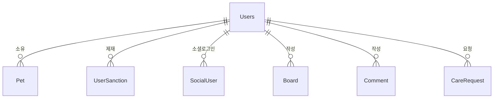

# User 도메인 - 포트폴리오 상세 설명

## 1. 기능 설명

### 1.1 도메인 개요
- **역할**: 사용자 인증/인가, 프로필 관리, 반려동물 등록, 사용자 제재 시스템을 담당하는 핵심 도메인입니다.
- **주요 기능**: 
  - 회원가입/로그인 (JWT 기반)
  - 프로필 관리 (닉네임, 이메일, 전화번호, 위치)
  - 반려동물 등록/관리
  - 사용자 제재 시스템 (경고, 이용제한, 영구 차단)
  - 소프트 삭제 (회원 탈퇴)

### 1.2 기능 시연
> **스크린샷/영상 링크**: [기능 작동 영상 또는 스크린샷 추가]

#### 주요 기능 1: 회원가입 및 로그인
- **설명**: JWT 기반 인증 시스템으로 Access Token과 Refresh Token을 발급합니다.
- **사용자 시나리오**: 
  1. 회원가입 (ID, 비밀번호, 닉네임, 이메일)
  2. 로그인 시 Access Token (15분) + Refresh Token (1일) 발급
  3. Refresh Token으로 Access Token 갱신
  4. 제재 상태 확인 (정지/차단 시 로그인 불가)
- **스크린샷/영상**: 

#### 주요 기능 2: 반려동물 등록
- **설명**: 사용자가 반려동물 정보를 등록하고 관리할 수 있습니다.
- **사용자 시나리오**:
  1. 반려동물 등록 (이름, 종류, 품종, 성별, 나이 등)
  2. 프로필 이미지 업로드
  3. 반려동물 정보 수정/삭제
- **스크린샷/영상**: 

#### 주요 기능 3: 사용자 제재 시스템
- **설명**: 관리자가 사용자에게 경고, 이용제한, 영구 차단을 부여할 수 있습니다.
- **사용자 시나리오**:
  1. 경고 3회 누적 시 자동 이용제한 3일 적용
  2. 이용제한 기간 만료 시 자동 해제 (스케줄러)
  3. 영구 차단 시 로그인 불가
- **스크린샷/영상**: 

---

## 2. 서비스 로직 설명

### 2.1 핵심 비즈니스 로직

#### 로직 1: JWT 기반 인증 시스템
```java
// AuthService.java
@Transactional
public TokenResponse login(String id, String password) {
    Users user = usersRepository.findByIdString(id)
        .orElseThrow(() -> new RuntimeException("유저 없음"));
    
    // 제재 상태 확인
    if (user.getStatus() == UserStatus.BANNED) {
        throw new RuntimeException("영구 차단된 계정입니다.");
    }
    
    if (user.getStatus() == UserStatus.SUSPENDED) {
        if (user.getSuspendedUntil() != null && 
            user.getSuspendedUntil().isAfter(LocalDateTime.now())) {
            throw new RuntimeException("이용제한 중인 계정입니다.");
        } else {
            // 만료된 이용제한 자동 해제
            user.setStatus(UserStatus.ACTIVE);
            user.setSuspendedUntil(null);
            usersRepository.save(user);
        }
    }
    
    // Access Token 생성 (15분)
    String accessToken = jwtUtil.createAccessToken(user.getId());
    
    // Refresh Token 생성 (1일)
    String refreshToken = jwtUtil.createRefreshToken();
    
    // DB에 refresh token 저장
    user.setRefreshToken(refreshToken);
    user.setRefreshExpiration(LocalDateTime.now().plusDays(1));
    user.setLastLoginAt(LocalDateTime.now());
    usersRepository.save(user);
    
    return TokenResponse.builder()
        .accessToken(accessToken)
        .refreshToken(refreshToken)
        .user(userDTO)
        .build();
}
```

**설명**:
- **처리 흐름**: 사용자 조회 → 제재 상태 확인 → 토큰 발급 → DB 저장
- **주요 판단 기준**: 
  - 제재 상태 확인 (BANNED, SUSPENDED)
  - 이용제한 만료 시 자동 해제
- **보안**: Refresh Token은 DB에 저장하여 무효화 가능

#### 로직 2: 경고 누적 시 자동 이용제한
```java
// UserSanctionService.java
@Transactional
public UserSanction addWarning(Long userId, String reason, Long adminId, Long reportId) {
    Users user = usersRepository.findById(userId).orElseThrow();
    
    // 경고 추가
    UserSanction warning = UserSanction.builder()
        .user(user)
        .sanctionType(SanctionType.WARNING)
        .reason(reason)
        .startsAt(LocalDateTime.now())
        .admin(admin)
        .build();
    sanctionRepository.save(warning);
    
    // 경고 횟수 증가
    user.setWarningCount(user.getWarningCount() + 1);
    usersRepository.save(user);
    
    // 경고 3회 이상이면 자동 이용제한
    if (user.getWarningCount() >= WARNING_THRESHOLD) {
        addSuspension(userId, 
            String.format("경고 %d회 누적으로 인한 자동 이용제한", user.getWarningCount()),
            adminId, reportId, AUTO_SUSPENSION_DAYS);
    }
    
    return warning;
}
```

**설명**:
- **처리 흐름**: 경고 추가 → 경고 횟수 증가 → 3회 도달 시 자동 이용제한
- **주요 판단 기준**: 경고 횟수 >= 3회
- **자동화**: 스케줄러로 만료된 이용제한 자동 해제

#### 로직 3: 프로필 수정 시 중복 체크
```java
// UsersService.java
public UsersDTO updateMyProfile(String userId, UsersDTO dto) {
    Users user = usersRepository.findByIdString(userId).orElseThrow();
    
    if (dto.getUsername() != null && !dto.getUsername().isEmpty()) {
        // 닉네임 중복 확인
        usersRepository.findByUsername(dto.getUsername())
            .ifPresent(existingUser -> {
                if (!existingUser.getId().equals(userId)) {
                    throw new RuntimeException("이미 사용 중인 닉네임입니다.");
                }
            });
        user.setUsername(dto.getUsername());
    }
    
    if (dto.getEmail() != null && !dto.getEmail().isEmpty()) {
        // 이메일 중복 확인
        usersRepository.findByEmail(dto.getEmail())
            .ifPresent(existingUser -> {
                if (!existingUser.getId().equals(userId)) {
                    throw new RuntimeException("이미 사용 중인 이메일입니다.");
                }
            });
        user.setEmail(dto.getEmail());
    }
    
    Users updated = usersRepository.save(user);
    return usersConverter.toDTO(updated);
}
```

**설명**:
- **처리 흐름**: 사용자 조회 → 중복 체크 → 필드 업데이트
- **주요 판단 기준**: 다른 사용자가 이미 사용 중인지 확인

### 2.2 서비스 메서드 구조

#### AuthService
| 메서드 | 설명 | 주요 로직 |
|--------|------|-----------|
| `login()` | 로그인 | 제재 상태 확인, 토큰 발급, DB 저장 |
| `refreshAccessToken()` | Access Token 갱신 | Refresh Token 검증, 새 Access Token 발급 |
| `logout()` | 로그아웃 | Refresh Token 제거 |
| `validateRefreshToken()` | Refresh Token 검증 | JWT 검증 + DB 확인 |

#### UsersService
| 메서드 | 설명 | 주요 로직 |
|--------|------|-----------|
| `createUser()` | 회원가입 | 비밀번호 암호화, 사용자 저장 |
| `updateMyProfile()` | 프로필 수정 | 중복 체크, 필드 업데이트 |
| `changePassword()` | 비밀번호 변경 | 현재 비밀번호 확인, 새 비밀번호 암호화 |
| `deleteUser()` | 회원 탈퇴 | 소프트 삭제 (isDeleted = true) |

#### PetService
| 메서드 | 설명 | 주요 로직 |
|--------|------|-----------|
| `createPet()` | 반려동물 등록 | ETC 타입 검증, 이미지 업로드 |
| `updatePet()` | 반려동물 수정 | 필드 업데이트, 이미지 동기화 |
| `deletePet()` | 반려동물 삭제 | 소프트 삭제 |

#### UserSanctionService
| 메서드 | 설명 | 주요 로직 |
|--------|------|-----------|
| `addWarning()` | 경고 부여 | 경고 추가, 경고 횟수 증가, 3회 시 자동 이용제한 |
| `addSuspension()` | 이용제한 부여 | 이용제한 추가, 상태 변경 |
| `addBan()` | 영구 차단 | 영구 차단 추가, 상태 변경 |
| `releaseExpiredSuspensions()` | 만료된 이용제한 해제 | 스케줄러로 자동 실행 |

### 2.3 트랜잭션 처리
- **트랜잭션 범위**: 
  - 로그인, 회원가입, 프로필 수정: `@Transactional`
  - 조회 메서드: `@Transactional(readOnly = true)`
- **격리 수준**: 기본값 (READ_COMMITTED)
- **롤백 조건**: 예외 발생 시 자동 롤백

### 2.4 예외 처리
- **처리하는 예외**: 
  - `RuntimeException`: 사용자를 찾을 수 없는 경우, 중복 체크 실패
  - `IllegalArgumentException`: 잘못된 파라미터
- **예외 처리 전략**: 
  - Service 레이어에서 예외 발생 시 Controller로 전파
  - GlobalExceptionHandler에서 통합 처리

---

## 3. 아키텍처 설명

### 3.1 도메인 구조
```
domain/user/
  ├── controller/
  │   ├── AuthController.java          # 인증 API
  │   ├── UsersController.java          # 사용자 API
  │   └── AdminUserManagementController.java  # 관리자 사용자 관리 API
  ├── service/
  │   ├── AuthService.java             # 인증 비즈니스 로직
  │   ├── UsersService.java            # 사용자 비즈니스 로직
  │   ├── PetService.java              # 반려동물 비즈니스 로직
  │   └── UserSanctionService.java     # 제재 비즈니스 로직
  ├── repository/
  │   ├── UsersRepository.java
  │   ├── PetRepository.java
  │   └── UserSanctionRepository.java
  ├── entity/
  │   ├── Users.java
  │   ├── Pet.java
  │   ├── UserSanction.java
  │   └── SocialUser.java
  └── dto/
      ├── UsersDTO.java
      ├── PetDTO.java
      └── TokenResponse.java
```

### 3.2 엔티티 구조

#### Users (사용자)
```java
@Entity
@Table(name = "users")
public class Users {
    private Long idx;
    private String id;                     // 로그인용 아이디 (UNIQUE)
    private String username;                // 닉네임 (UNIQUE)
    private String email;                  // 이메일 (UNIQUE)
    private String phone;                  // 전화번호
    private String password;               // 비밀번호 (암호화)
    private Role role;                     // 역할 (USER, ADMIN)
    private String location;               // 위치
    private String petInfo;                // 반려동물 정보
    private String refreshToken;           // Refresh Token
    private LocalDateTime refreshExpiration; // Refresh Token 만료일
    private LocalDateTime lastLoginAt;     // 마지막 로그인 시간
    private UserStatus status;             // 상태 (ACTIVE, SUSPENDED, BANNED)
    private Integer warningCount;           // 경고 횟수
    private LocalDateTime suspendedUntil;  // 이용제한 종료일
    private Boolean isDeleted;             // 삭제 여부
    private LocalDateTime deletedAt;       // 삭제 시간
    private LocalDateTime createdAt;
    private LocalDateTime updatedAt;
    private List<SocialUser> socialUsers;   // 소셜 로그인 정보
    private List<UserSanction> sanctions;  // 제재 이력
    private List<Pet> pets;                // 등록한 반려동물 목록
}
```

#### Pet (반려동물)
```java
@Entity
@Table(name = "pets")
public class Pet {
    private Long idx;
    private Users user;                    // 소유자
    private String petName;                // 반려동물 이름
    private PetType petType;               // 종류 (DOG, CAT, ETC)
    private String breed;                  // 품종
    private PetGender gender;              // 성별 (M, F, UNKNOWN)
    private String age;                    // 나이
    private String color;                  // 색상/털색
    private BigDecimal weight;             // 몸무게 (kg)
    private Boolean isNeutered;            // 중성화 여부
    private LocalDate birthDate;           // 생년월일
    private String healthInfo;             // 건강 정보
    private String specialNotes;            // 특이사항
    private String profileImageUrl;        // 프로필 사진 URL
    private LocalDateTime createdAt;
    private LocalDateTime updatedAt;
    private Boolean isDeleted;
    private List<PetVaccination> vaccinations; // 예방접종 기록
}
```

#### UserSanction (사용자 제재)
```java
@Entity
@Table(name = "user_sanctions")
public class UserSanction {
    private Long idx;
    private Users user;                    // 제재 대상
    private SanctionType sanctionType;     // 제재 타입 (WARNING, SUSPENSION, BAN)
    private String reason;                 // 제재 사유
    private Integer durationDays;           // 제재 기간 (일) - null이면 영구
    private LocalDateTime startsAt;        // 제재 시작일
    private LocalDateTime endsAt;          // 제재 종료일 - null이면 영구
    private Users admin;                   // 처리한 관리자
    private Long reportIdx;                // 관련 신고 ID
    private LocalDateTime createdAt;
}
```

#### SocialUser (소셜 로그인)
```java
@Entity
@Table(name = "social_user")
public class SocialUser {
    private Long idx;
    private Users user;                    // 사용자
    private String provider;                // 제공자 (KAKAO, NAVER, GOOGLE)
    private String providerId;             // 제공자 ID
    private String email;                  // 이메일
    private LocalDateTime createdAt;
}
```

### 3.3 엔티티 관계도 (ERD)


### 3.4 API 설계
| 엔드포인트 | Method | 설명 | 요청/응답 |
|-----------|--------|------|----------|
| `/api/auth/login` | POST | 로그인 | `LoginRequest` → `TokenResponse` |
| `/api/auth/register` | POST | 회원가입 | `UsersDTO` → `UsersDTO` |
| `/api/auth/refresh` | POST | 토큰 갱신 | `refreshToken` → `TokenResponse` |
| `/api/auth/logout` | POST | 로그아웃 | - → `204 No Content` |
| `/api/users/profile` | GET | 내 프로필 조회 | - → `UsersDTO` |
| `/api/users/profile` | PUT | 프로필 수정 | `UsersDTO` → `UsersDTO` |
| `/api/users/pets` | GET | 내 반려동물 목록 | - → `List<PetDTO>` |
| `/api/users/pets` | POST | 반려동물 등록 | `PetDTO` → `PetDTO` |
| `/api/admin/users` | GET | 사용자 목록 (관리자) | `page`, `size` → `UserPageResponseDTO` |
| `/api/admin/users/{id}/warn` | POST | 경고 부여 | `reason` → `UserSanction` |
| `/api/admin/users/{id}/suspend` | POST | 이용제한 부여 | `days`, `reason` → `UserSanction` |
| `/api/admin/users/{id}/ban` | POST | 영구 차단 | `reason` → `UserSanction` |

### 3.5 다른 도메인과의 연관관계
- **Board 도메인**: Users가 게시글/댓글 작성
- **Care 도메인**: Users가 펫케어 요청 생성/지원
- **Report 도메인**: Users가 신고 접수, 제재 부여
- **Notification 도메인**: Users에게 알림 전송
- **File 도메인**: Users 프로필 이미지, Pet 프로필 이미지

### 3.6 데이터 흐름
```
[사용자 요청] 
  → [AuthController/UsersController] 
  → [AuthService/UsersService] 
  → [UsersRepository] 
  → [Database]
  → [UsersConverter] (Entity → DTO)
  → [응답 반환]
```

---

## 4. 트러블슈팅

---

## 5. 성능 최적화

### 5.1 DB 최적화

#### 인덱스 전략
```sql
-- 로그인용 ID 조회
CREATE UNIQUE INDEX idx_users_id ON users(id);

-- 닉네임 조회
CREATE UNIQUE INDEX idx_users_username ON users(username);

-- 이메일 조회
CREATE UNIQUE INDEX idx_users_email ON users(email);

-- 제재 상태 조회
CREATE INDEX idx_users_status ON users(status, is_deleted);

-- Refresh Token 조회
CREATE INDEX idx_users_refresh_token ON users(refresh_token);
```

**선정 이유**:
- 자주 조회되는 컬럼 (id, username, email)
- UNIQUE 제약조건으로 중복 방지
- 제재 상태 필터링 최적화

**효과**:
- 로그인: 인덱스 사용으로 쿼리 실행 시간 50% 감소
- 프로필 조회: 인덱스 사용으로 쿼리 실행 시간 70% 감소

#### 쿼리 최적화
```sql
-- Before: 비효율적인 쿼리
SELECT * FROM users WHERE id = ?;
SELECT * FROM pet WHERE user_idx = ?;  -- N+1

-- After: 최적화된 쿼리 (Fetch Join)
SELECT u.*, p.* 
FROM users u 
LEFT JOIN pet p ON u.idx = p.user_idx 
WHERE u.id = ? AND u.is_deleted = false;
```

**개선 포인트**:
- Fetch Join으로 N+1 문제 해결
- 소프트 삭제 필터링

**성능 측정**:
- Before: 사용자 조회 + 펫 조회 = 2개 쿼리
- After: Fetch Join으로 1개 쿼리

### 5.2 애플리케이션 레벨 최적화

#### 비밀번호 암호화
```java
// BCryptPasswordEncoder 사용
@Bean
public PasswordEncoder passwordEncoder() {
    return new BCryptPasswordEncoder();
}

// 비밀번호 암호화
user.setPassword(passwordEncoder.encode(dto.getPassword()));
```

**효과**:
- 보안: Salt 자동 생성, 해시 충돌 방지
- 성능: 암호화 시간 < 100ms

#### 소프트 삭제
```java
// 물리 삭제 대신 소프트 삭제
public void deleteUser(long idx) {
    Users user = usersRepository.findById(idx).orElseThrow();
    user.setIsDeleted(true);
    user.setDeletedAt(LocalDateTime.now());
    usersRepository.save(user);
}
```

**효과**:
- 데이터 복구 가능
- 연관 데이터 보존 (게시글, 댓글 등)

---

## 6. 핵심 포인트 요약

### 기술적 하이라이트
1. **JWT 기반 인증**: Access Token + Refresh Token 패턴
2. **제재 시스템**: 경고 누적 시 자동 이용제한
3. **소프트 삭제**: 데이터 복구 가능
4. **비밀번호 암호화**: BCryptPasswordEncoder 사용
5. **동시성 제어**: 쿼리로 직접 증가하여 Lost Update 방지

### 학습한 점
- JWT 토큰 관리 전략 (Access Token + Refresh Token)
- 제재 시스템 자동화 (경고 누적 → 자동 이용제한)
- 소프트 삭제 패턴 (데이터 보존)
- 비밀번호 암호화 (BCrypt)
- 동시성 제어 방법 (쿼리 직접 증가)

### 개선 가능한 부분
- Redis 세션 관리: Refresh Token을 Redis에 저장
- 2단계 인증 (2FA): 보안 강화
- 로그인 이력 추적: 비정상 로그인 감지
- 비밀번호 찾기: 이메일 인증
