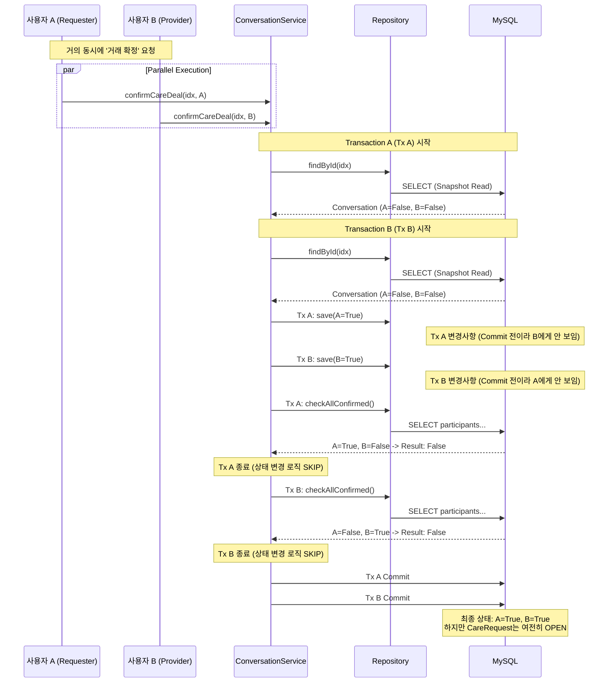
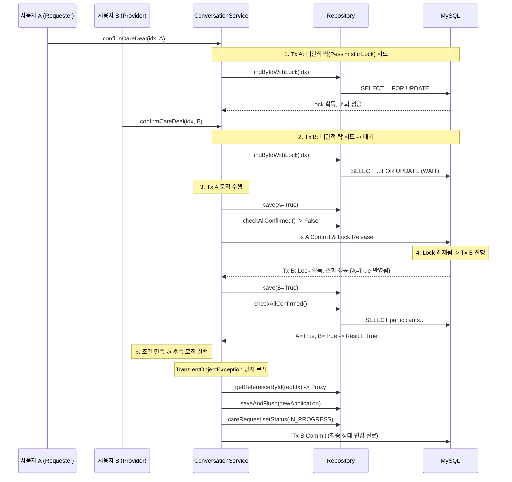

# 펫케어 거래 확정 동시성 문제 시퀀스 다이어그램

## 포트폴리오용 간결 버전

### 비관적 락 적용 전 (Race Condition 발생)

```javascript
// 시퀀스 다이어그램 (동시성 문제 발생)
const raceConditionSequence = `sequenceDiagram
    participant UserA as 사용자 A
    participant UserB as 사용자 B
    participant Service as ConversationService
    participant DB as MySQL

    Note over UserA,UserB: 동시에 거래 확정 버튼 클릭

    par 동시 요청
        UserA->>Service: confirmCareDeal() (Tx A)
        UserB->>Service: confirmCareDeal() (Tx B)
    end

    Service->>DB: Tx A: 내 상태 '확정' 변경
    Service->>DB: Tx B: 내 상태 '확정' 변경

    Note over Service,DB: 격리 수준(Isolation)으로 인해<br/>상대방의 변경사항 안 보임

    Service->>DB: Tx A: 전체 확정 여부 확인? -> False (B 미확정)
    Service->>DB: Tx B: 전체 확정 여부 확인? -> False (A 미확정)

    Service-->>UserA: 완료 (상태 변경 없음)
    Service-->>UserB: 완료 (상태 변경 없음)

    Note over DB: 결과: 둘 다 확정했으나<br/>상태는 여전히 OPEN (Stuck)`;
```

### 비관적 락 적용 후 (동시성 문제 해결)

```javascript
// 시퀀스 다이어그램 (비관적 락 적용)
const pessimisticLockSequence = `sequenceDiagram
    participant UserA as 사용자 A
    participant UserB as 사용자 B
    participant Service as ConversationService
    participant DB as MySQL

    Note over UserA,UserB: 동시에 거래 확정 버튼 클릭

    UserA->>Service: confirmCareDeal() (Tx A)
    Service->>DB: SELECT ... FOR UPDATE (Lock 획득)
    
    UserB->>Service: confirmCareDeal() (Tx B)
    Service->>DB: SELECT ... FOR UPDATE (Lock 대기)
    
    Note over Service,DB: Tx A 먼저 수행
    Service->>DB: Tx A: 내 상태 '확정' 변경
    Service->>DB: Tx A: 전체 확정 여부 확인? -> False
    Service->>DB: Tx A: 커밋 & Lock 반납
    
    Note over Service,DB: Tx B 수행 (대기 해제)
    Service->>DB: Tx B: Lock 획득 (최신 데이터 조회)
    Service->>DB: Tx B: 내 상태 '확정' 변경
    Service->>DB: Tx B: 전체 확정 여부 확인? -> True (A 확정 보임)
    
    Service->>DB: Tx B: CareRequest 상태 IN_PROGRESS 변경
    Service-->>UserB: 완료 및 상태 변경 성공`;
```

---

## 상세 버전 (문서용)

### 문제 상황: Race Condition에 의한 상태 누락 (Stuck State)



### 해결: Pessimistic Lock & Persistent Handling


