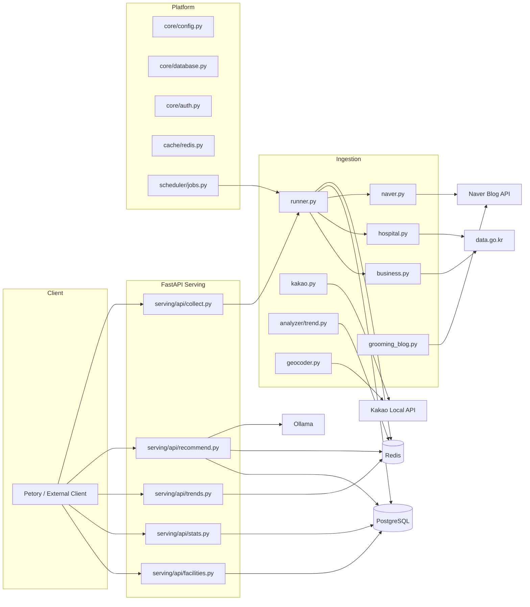
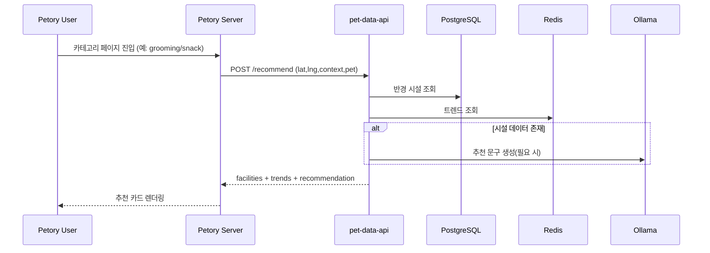
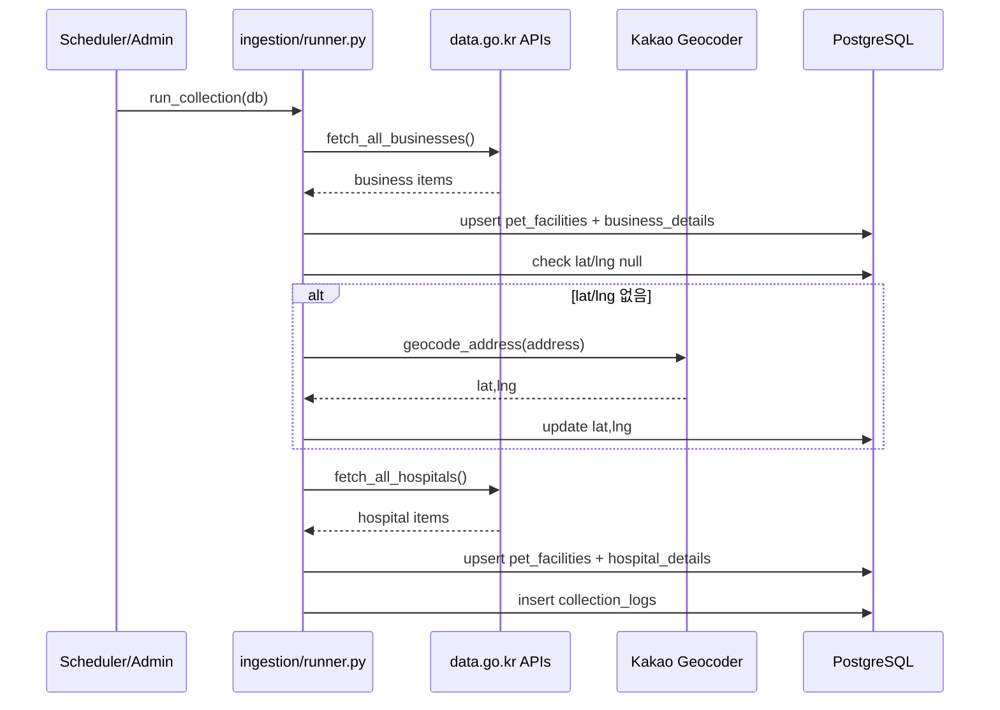
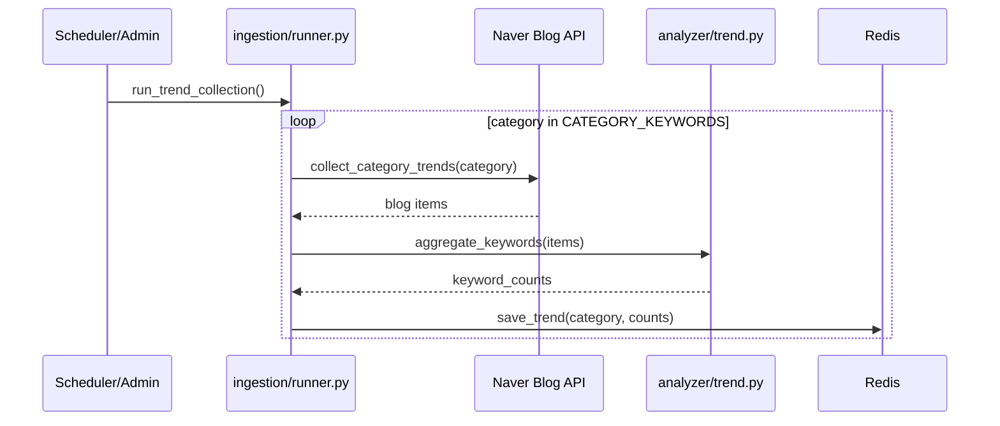
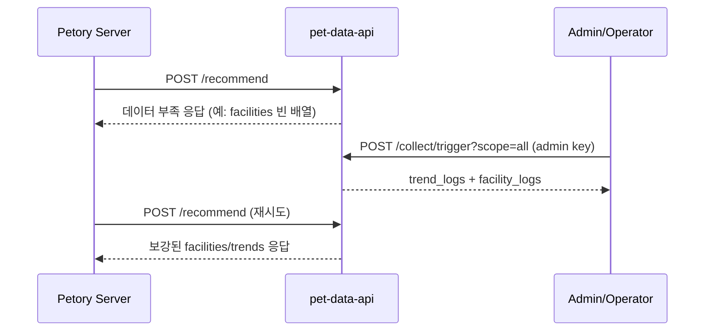

# pet-data-api 아키텍처 상세 문서

이 문서는 `pet-data-api`의 전체 구조를 코드 기준으로 상세 설명합니다.

- 대상 코드: `app/`, `migrations/`, `tests/`
- 보조 문서: `docs/USAGE.md`, `docs/PROJECT-OVERVIEW.md`, `docs/DATA-AND-API-FLOW.md`

---

## 1. 아키텍처 목표와 경계

### 1.1 목표

1. 공공 API 시설 데이터를 안정적으로 수집해 PostgreSQL에 적재
2. 네이버 블로그 기반 트렌드를 Redis에 캐시
3. FastAPI로 조회/통계/추천 API 제공
4. 추천에서 외부 의존성 실패(Ollama/Redis/Kakao)에도 서비스 응답성 유지

### 1.2 시스템 경계

- 시스템 내부
1. `ingestion` 계층: 외부 데이터 호출, 정규화, 저장
2. `platform` 계층: 설정/DB/캐시/인증/스케줄
3. `serving` 계층: API 라우팅과 추천 응답 조합

- 시스템 외부
1. data.go.kr 공공 API
2. Naver Blog Search API
3. Kakao Local API
4. Ollama(로컬/별도 프로세스)
5. API 클라이언트(Petory 등)

---

## 2. 컴포넌트 뷰



---

## 3. 런타임 뷰

### 3.1 애플리케이션 부팅

1. `app/main.py`에서 FastAPI 앱 생성
2. 라우터 등록: `facilities`, `stats`, `trends`, `recommend`, `collect`
3. lifespan 시작 시 `start_scheduler()` 호출
4. 종료 시 `stop_scheduler()` 호출

예시 코드 흐름:

```python
# app/main.py (개념)
app.include_router(facilities_router)
...

@asynccontextmanager
async def lifespan(app):
    start_scheduler()
    yield
    stop_scheduler()
```

### 3.2 스케줄 배치

스케줄 정의: `app/platform/scheduler/jobs.py`

1. `18:00` `daily_trend_collection`: `run_trend_collection()`
2. `18:05` `daily_collection`: `run_collection(db)`
3. 두 잡 모두 `max_instances=1`로 중복 실행 방지

주의:
- 타임존을 명시하지 않았으므로 프로세스 로컬 시간 기준입니다.

### 3.3 수동 배치 트리거

`POST /collect/trigger?scope=facilities|trends|all`

1. 관리자 API Key 검증 (`require_admin_key`)
2. `run_collection_by_scope()` 분기
3. 결과를 로그 요약 형태로 반환

예시 응답 (`scope=all`):

```json
{
  "scope": "all",
  "trend_logs": [
    {"category": "grooming", "status": "success", "keywords_count": 92}
  ],
  "facility_logs": [
    {"source": "petShop", "status": "partial", "total_fetched": 1200, "total_saved": 1180}
  ]
}
```

### 3.4 조회 API 런타임

- `/facilities`, `/facilities/{id}`, `/stats/summary`
1. PostgreSQL 읽기
2. 외부 API 직접 호출 없음

- `/trends/{category}`
1. Redis 읽기 (`get_trend`, `get_updated_at`)
2. 데이터 없음 또는 Redis 오류면 503

### 3.5 추천 API 런타임

핵심 파일: `app/serving/api/recommend.py`

### 공통 단계

1. `context` 유효성 검증
2. `normalize_context()` 적용
3. Redis 트렌드 로딩
4. `GROOMING_MVP_ENABLED` + 컨텍스트에 따라 파이프 분기

### 분기 A: 확장 파이프 (`grooming/hospital/supplies`)

1. DB 반경 후보 조회 (`get_nearby_facilities`)
2. 블로그 멘션 추출 (`extract_grooming_mentions` 또는 `extract_context_mentions`)
3. 카카오 장소 후보 보강 (`search_kakao_places`)
4. 랭킹/병합/중복제거 (`rank_grooming_facilities` 공통 재사용)
5. 규칙 기반 추천 카피 (`build_context_copy`)
6. `recommend_version = {context}-mvp-v1`

### 분기 B: 레거시 파이프

1. DB 반경 후보 조회
2. 시설이 없고 트렌드만 있으면 규칙 문구
3. 시설이 있으면 LLM 호출 (`generate_recommendation`)
4. `recommend_version = legacy`

### 3.6 Petory 요청 기준 End-to-End 플로우

Petory에서 추천 요청이 들어왔을 때 핵심은 다음입니다.

1. `/recommend` 요청 자체가 공공 API/네이버 API를 새로 수집하지는 않음
2. 추천은 이미 저장된 PostgreSQL/Redis 데이터를 읽어 조합
3. 데이터가 부족하면 관리자 트리거(`POST /collect/trigger`) 또는 스케줄 수집 후 재요청



예시 요청:

```http
POST /recommend
X-API-Key: <user-api-key>
Content-Type: application/json

{
  "lat": 37.5665,
  "lng": 126.9780,
  "context": "hospital",
  "radius_km": 3.0,
  "top_n": 5,
  "pet": {"type": "dog", "breed": "푸들", "age": "4살"}
}
```

예시 응답(요약):

```json
{
  "context": "hospital",
  "recommend_version": "hospital-mvp-v1",
  "facilities": [{"name": "행복동물병원", "distance_m": 420}],
  "trends": [{"keyword": "건강검진", "score": 11}],
  "recommendation": "근처 3개 동물병원 후보를 찾았습니다...",
  "generated_at": "2026-05-03T03:00:00+00:00"
}
```

---

## 4. 데이터 흐름 상세

### 4.1 시설 수집 흐름



핵심 정책:
1. `status == "폐업"`이면 해당 `source_id` 삭제
2. `source_id` 없거나 `name` 없으면 skip
3. 업종 타입별 상세 테이블 분기 저장

### 4.2 트렌드 수집 흐름



핵심 정책:
1. 카테고리 단위 실패 격리 (`try/except`)
2. Redis 저장 시 Sorted Set + `updated_at`
3. TTL 기반 만료

### 4.3 추천 보강 흐름 예시 (`context=snack`)

`snack`은 내부적으로 `supplies` 정규화 후 확장 파이프 진입.

1. DB에서 `BUSINESS` 반경 후보 조회
2. 블로그 멘션 추출은 supplies 쿼리 + snack/food 키워드까지 포함
3. 카카오 키워드는 `반려동물용품` suffix로 검색
4. 결과 병합 후 상위 N개 반환
5. 응답 `recommend_version`은 `supplies-mvp-v1`

예시 응답:

```json
{
  "context": "snack",
  "recommend_version": "supplies-mvp-v1",
  "facilities": [
    {
      "name": "펫마트",
      "distance_m": 180,
      "address": "서울 ...",
      "mention_count": 4,
      "mention_score": 1.0,
      "source": "public",
      "score": 0.83
    }
  ],
  "trends": [
    {"keyword": "오리젠", "score": 7},
    {"keyword": "로얄캐닌", "score": 5}
  ],
  "recommendation": "근처 1개 용품점 후보를 찾았습니다...",
  "generated_at": "2026-05-03T03:00:00+00:00"
}
```

### 4.4 데이터 부족 시 수집 연계 플로우 (Petory 운영 시나리오)

초기 배포 직후나 Redis 만료 직후에는 추천에 필요한 데이터가 부족할 수 있습니다.

운영 시 권장 순서:

1. Petory가 `/recommend` 호출
2. `facilities=[]` 또는 `trends=[]`가 반복되면 관리자 수집 트리거 실행
3. 수집 완료 후 동일 요청 재호출



관리자 수집 예시:

```http
POST /collect/trigger?scope=all
X-API-Key: <admin-api-key>
```

검증 포인트:

1. `facility_logs[].total_saved`가 0보다 큰지
2. `/trends/{category}`의 `updated_at`이 최근 시각인지
3. 동일 좌표로 `/recommend` 재호출 시 `facilities`/`trends`가 채워지는지

---

## 5. 저장소 설계

### 5.1 PostgreSQL

핵심 테이블:
1. `pet_facilities`: 공통 시설 마스터
2. `business_details`: 영업장 상세
3. `hospital_details`: 병원 상세
4. `collection_logs`: 수집 실행 로그

인덱스:
1. `source_id` unique
2. 지역/타입/상태 조합 인덱스
3. 검색/통계 빈도 높은 컬럼 인덱스

반경 조회 SQL 패턴 (`serving/recommender/facilities.py`):

```sql
WITH distances AS (
  SELECT
    source_id, name, address, lat, lng,
    6371000 * acos(...) AS distance_m
  FROM pet_facilities
  WHERE lat IS NOT NULL
    AND type = :ftype
)
SELECT ...
FROM distances
WHERE distance_m <= :radius_m
ORDER BY distance_m
LIMIT :top_n
```

### 5.2 Redis

키 스키마:
1. `trends:{category}:keywords` (Sorted Set)
2. `trends:{category}:updated_at` (String)
3. `kakao:place:{context}:{normalized_name}:{lat_grid}:{lng_grid}` (String JSON, TTL 600)

---

## 6. 인증/권한 모델

구현 위치: `app/platform/core/auth.py`

1. 모든 보호 API는 `X-API-Key` 필요
2. 일반 API와 관리자 API 분리
3. 서버는 SHA-256 해시만 저장

권한 분리:
1. 일반 키: 조회 API + 추천 API
2. 관리자 키: `POST /collect/trigger`

오류 정책:
1. 키 누락/형식 오류: 422
2. 키 불일치: 401/403 분리

---

## 7. 실패 대응(폴백) 설계

| 실패 지점 | 영향 | 처리 방식 |
|---|---|---|
| 공공 API 일부 실패 | 시설 수집 partial | 소스별 `collection_logs` 기록 후 계속 |
| Naver 수집 실패(카테고리 단위) | 해당 카테고리 트렌드 미갱신 | 카테고리별 `failed` 로그 반환 |
| Redis 조회 실패 | `/trends` 및 추천 트렌드 일부 영향 | `/trends`는 503, 추천은 빈 trends 허용 |
| 블로그 멘션 실패 | 추천 보강 품질 저하 | `mention_map={}` 폴백 후 계속 |
| Kakao 검색 실패 | 추천 보강 품질 저하 | `kakao_map={}` 폴백 후 계속 |
| Ollama 실패 | 추천 문구만 비어짐 | `recommendation=null` 허용 |

핵심 원칙:
1. 실패를 전파해 전체 요청을 죽이기보다 degraded response 우선
2. 수집/서빙 경계를 분리해 요청-응답 지연을 안정화

---

## 8. 관측성과 운영 포인트

### 8.1 로그

추천 파이프는 request id 기반 구조 로그를 남깁니다.

예시 로그 키:
1. `context_pipe [rid] start...`
2. `public_db count`
3. `candidate_raw/after_cap`
4. `kakao_keys`
5. `latency_total`, `blog`, `kakao`, `rank`

### 8.2 운영 점검 체크리스트

1. 스케줄러 프로세스가 단일 인스턴스로 실행 중인지
2. `collection_logs`에서 최근 성공/부분성공 추이
3. Redis 메모리/키 TTL 상태
4. Kakao/Naver API 키 만료 여부
5. Ollama 프로세스 가용성

---

## 9. 확장 가이드 (새 카테고리 추가 예시)

예: `training` 카테고리를 추가하려면

1. `serving/recommender/facilities.py`
- `CONTEXT_TO_FACILITY_TYPE`에 타입 매핑 추가
- 필요 시 alias 추가

2. `ingestion/naver.py`
- `CATEGORY_KEYWORDS["training"]` 정의

3. `ingestion/grooming_blog.py`
- `_CONTEXT_QUERIES`, `_CONTEXT_HINTS`, 패턴 룰 추가

4. `ingestion/kakao.py`
- `_QUERY_SUFFIXES`, `_CONTEXT_HINTS` 추가

5. `serving/api/recommend.py`
- `ENRICHED_CONTEXTS`에 추가

6. 테스트
- `tests/test_recommend_api.py`
- `tests/test_kakao_place_filter.py`
- `tests/test_naver_collector.py`

---

## 10. 테스트 전략 요약

주요 테스트 축:
1. API 계약 테스트 (`recommend`, `trends`, `collect`)
2. 수집기 단위 테스트 (`business`, `hospital`, `naver`, `kakao`, `grooming_blog`)
3. 랭킹/병합 규칙 테스트 (`grooming_ranker`)

실행 예시:

```bash
source venv/bin/activate
pytest tests/ -v
```

---

## 11. 핵심 파일 인덱스

| 주제 | 파일 |
|---|---|
| 앱 엔트리포인트 | `app/main.py` |
| 수집 런너 | `app/ingestion/runner.py` |
| 공공 수집기 | `app/ingestion/business.py`, `app/ingestion/hospital.py` |
| 트렌드 수집기 | `app/ingestion/naver.py` |
| 멘션 추출 | `app/ingestion/grooming_blog.py` |
| 카카오 검색/캐시 | `app/ingestion/kakao.py` |
| 추천 API | `app/serving/api/recommend.py` |
| 반경 조회 | `app/serving/recommender/facilities.py` |
| 랭킹/병합 | `app/serving/recommender/grooming_ranker.py` |
| Redis 캐시 | `app/platform/cache/redis.py` |
| 인증 | `app/platform/core/auth.py` |
| 스케줄 | `app/platform/scheduler/jobs.py` |
