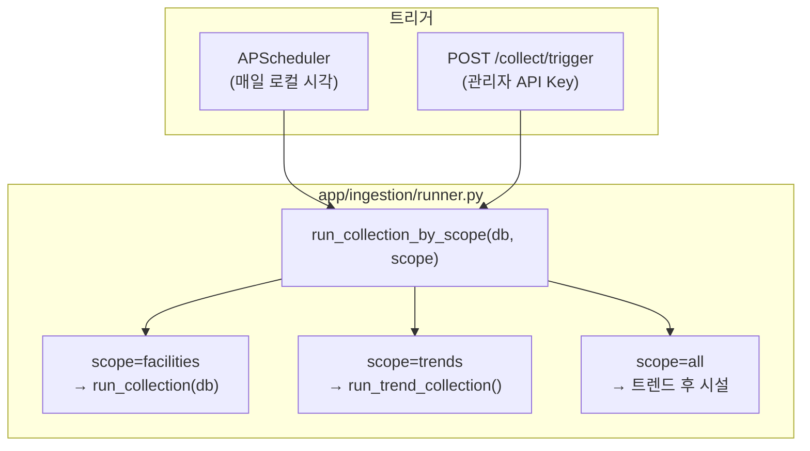
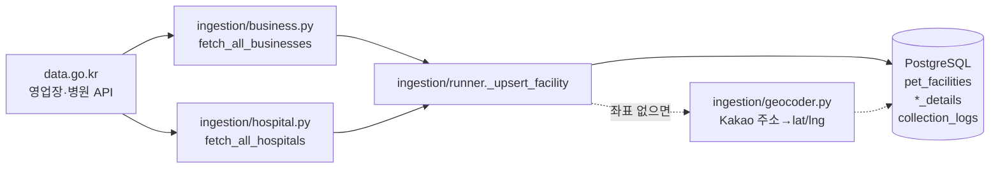
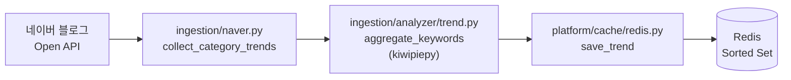
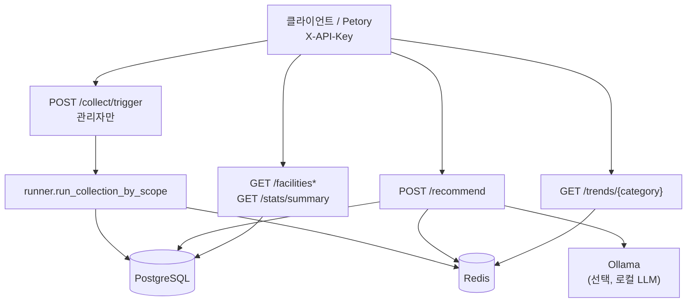

# 데이터 수집·저장·API 흐름 (포트폴리오용)

이 문서는 **“어디서 데이터가 들어오고, API는 무엇만 읽는가”**를 한 번에 이해할 수 있게 정리한 것입니다.  
실행 절차는 [`USAGE.md`](USAGE.md), 전체 개요는 [`PROJECT-OVERVIEW.md`](PROJECT-OVERVIEW.md)를 참고하세요.  
**폴더 기준으로 수집 vs 서빙 코드 위치**는 [`INGESTION-VS-SERVING.md`](INGESTION-VS-SERVING.md).

---

## 1. 꼭 구분할 두 가지

| 구분 | 하는 일 | 네이버/공공 API를 부르나? |
|------|---------|---------------------------|
| **배치 수집** | 정해진 시간(또는 관리자 트리거)에 외부 API를 호출해 DB·Redis를 채움 | **예** (시설=공공, 트렌드=네이버) |
| **일반 API 요청** | 이미 쌓인 DB·Redis(·로컬 LLM)만 조합해 응답 | **아니오** (외부 “수집” API 재호출 없음) |

그래서 **`POST /recommend`만 여러 번 호출한다고 네이버가 계속 찍히지 않습니다.**  
트렌드·시설이 비어 있으면, 먼저 **수집 배치가 돌았는지**(또는 DB에 시설·좌표가 있는지)를 확인하는 편이 맞습니다.

---

## 2. 배치 수집: 진입점과 갈래

모든 “데이터 끌어오기”의 진입점은 **`run_collection_by_scope`** 입니다.

| `scope` | 호출되는 함수 | 목적 |
|---------|----------------|------|
| `facilities` (기본) | `run_collection` | 공공데이터 시설 적재 |
| `trends` | `run_trend_collection` | 네이버 블로그 → 키워드 → Redis |
| `all` | 위 둘 순차 | 한 번에 전부 |

스케줄 시각은 [`app/platform/scheduler/jobs.py`](../app/platform/scheduler/jobs.py) 기준: **트렌드 18:00**, **시설 18:05** (프로세스 로컬 타임).

---

## 3. 갈래 A: 시설 수집 (네이버 아님 → PostgreSQL)

- **함수**: `run_collection` → `_collect_source` + `fetch_all_businesses` / `fetch_all_hospitals`
- **저장**: `pet_facilities`, `business_details` / `hospital_details`, 소스별 `collection_logs`
- **지오코딩**: 수집 직후 `lat`/`lng`가 비어 있으면 Kakao 로컬 API 시도 ([`app/ingestion/geocoder.py`](../app/ingestion/geocoder.py))
- **HTTP 재시도**: 공통 [`app/ingestion/client.py`](../app/ingestion/client.py)

---

## 4. 갈래 B: 트렌드 수집 (네이버 → 형태소 → Redis)

- **함수**: `run_trend_collection` → 카테고리별 `collect_category_trends` → `aggregate_keywords` → `save_trend`
- **카테고리 키**: [`app/ingestion/naver.py`](../app/ingestion/naver.py)의 `CATEGORY_KEYWORDS`와 일치해야 `GET /trends/{category}` 등과 맞습니다.

### 네이버 데이터·이용 범위 (포트폴리오·배포 시)

- **API에서 오는 것**: 블로그 **검색 API** 응답의 `title`·`description`(스니펫)뿐이며, `display` 한도 내 검색 결과입니다.
- **코드가 오래 저장하는 것**: 위 문자열의 **원문 통째**가 아니라, 형태소로 뽑은 **명사 빈도**만 Redis Sorted Set에 넣고 **TTL(현재 24h)** 로 만료시킵니다. 집계 과정 외에는 별도 DB 적재 없음.
- **상용·공개 서비스**로 가져갈 때는 [네이버 개발자센터](https://developers.naver.com) **검색 API 이용약관**(호출 한도, 결과 표시·저장·가공 허용 범위 등)과 저작권을 **직접 확인**해야 합니다. 본 레포는 학습·포트폴리오 맥락을 두고 구현된 예시에 가깝습니다.

---

## 5. API 레이어: 무엇을 “읽기만” 하는가

일반 클라이언트 요청은 **이미 적재된 저장소**를 봅니다.

| 엔드포인트 | 주로 읽는 곳 | 비고 |
|------------|--------------|------|
| `GET /facilities` | PostgreSQL | 수집된 시설 목록 |
| `GET /facilities/{id}` | PostgreSQL | 상세·유형별 확장 필드 |
| `GET /stats/summary` | PostgreSQL | 집계 |
| `GET /trends/{category}` | Redis | 수집이 돌았을 때만 의미 있음 |
| `POST /recommend` | PostgreSQL + Redis (+ Ollama) | **수집 파이프라인을 다시 돌리지 않음** |
| `POST /collect/trigger` | — | **유일하게** 배치 수집 재실행 (관리자) |

---

## 6. 포트폴리오에서 한 줄로 말하기 예시

- **“공공 API로 시설을 PostgreSQL에, 네이버 블로그 텍스트를 형태소 분석해 Redis에 넣고, FastAPI는 API Key로 보호된 REST와 위치 기반 추천을 제공한다.”**
- **“추천 API는 실시간으로 외부 수집을 돌리지 않고, 스케줄·관리자 트리거로 채워진 저장소를 읽는다.”**

---

## 7. 관련 소스 (빠른 점프)

| 역할 | 파일 |
|------|------|
| 수집 분기 | [`app/ingestion/runner.py`](../app/ingestion/runner.py) |
| 시설 API 클라이언트 | [`app/ingestion/business.py`](../app/ingestion/business.py), [`hospital.py`](../app/ingestion/hospital.py) |
| 네이버 트렌드 | [`app/ingestion/naver.py`](../app/ingestion/naver.py) |
| 스케줄 | [`app/platform/scheduler/jobs.py`](../app/platform/scheduler/jobs.py) |
| 수동 트리거 | [`app/serving/api/collect.py`](../app/serving/api/collect.py) |
| 트렌드 API | [`app/serving/api/trends.py`](../app/serving/api/trends.py) |
| 추천 API | [`app/serving/api/recommend.py`](../app/serving/api/recommend.py) |

---

## 8. 설계를 다시 볼 때 체크리스트

아키텍처를 재설계·단순화할 때 아래를 순서대로 보면 의사결정이 빨라집니다.

1. **데이터 소스** — 공공 API·네이버·Kakao 각각의 약관·한도·장기 보관 가능 여부
2. **수집 vs 서빙** — 배치 주기, 실패 시 재시도, `collection_logs`로 관측 가능한지
3. **트렌드** — 키워드만으로 충분한지, 대체 소스(자체 설문, 파트너 데이터) 필요한지
4. **추천** — LLM 없이 규칙만으로 할지, 시설·트렌드·프롬프트 가드가 여전히 맞는지
5. **멀티 클라이언트** — Petory 연동 전면(API 버전, 컨텍스트 명세) 정리

해당 스펙 초안은 `docs/superpowers/specs/` 아래 문서와 맞춰 두면 이력 관리에 좋습니다.
