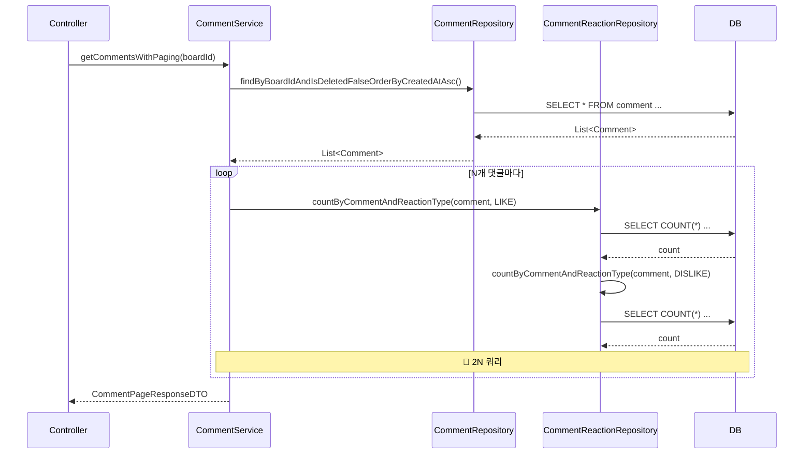
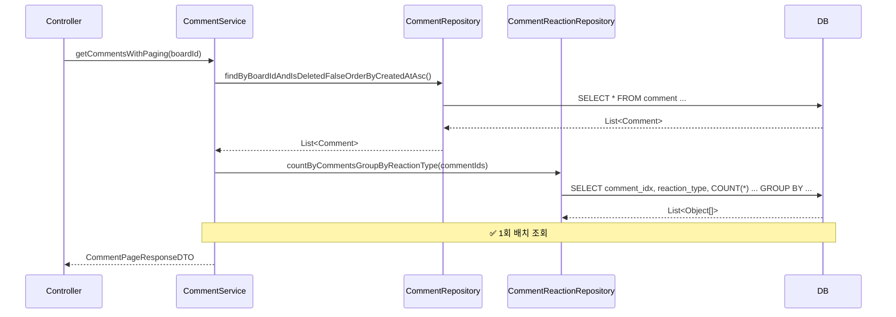

# CommentService 댓글 반응 N+1 쿼리 트러블슈팅

## 1. 개요

**분류**: 트러블슈팅 (런타임 발견 이슈)

Board 도메인에서 `getCommentsWithPaging()`, `getComments()`, `getCommentsForAdmin()` 호출 시 댓글마다 `countByCommentAndReactionType` 2회(LIKE, DISLIKE) 호출로 N+1 유사 패턴의 쿼리가 발생하는 문제입니다.

---

## 2. 문제 발견

### 2.1 현상

- **API**: `GET /api/boards/{boardId}/comments`, `GET /api/admin/boards/{boardId}/comments`
- **증상**: 댓글 수가 많을수록 쿼리 수 급증, 응답 시간 증가
- **예시**: 댓글 20개 조회 시 → 1 (댓글 페이징) + 40 (반응 카운트) = **41개 쿼리**

### 2.2 영향 범위

| 호출 경로 | 메서드 | N+1 발생 |
|-----------|--------|----------|
| BoardController.getComments() | CommentService.getCommentsWithPaging() | ✅ |
| BoardController.getComments() (비페이징) | CommentService.getComments() | ✅ |
| AdminBoardController.listComments() | CommentService.getCommentsForAdmin() | ✅ |

---

## 3. 원인 분석

### 3.1 엔티티 구조

```java
// Comment.java - Board와 연관
// CommentReaction.java - Comment, Users, ReactionType과 연관

// 댓글별 반응(좋아요/싫어요)은 comment_reaction 테이블에 저장
// countByCommentAndReactionType(comment, ReactionType.LIKE) → 댓글마다 2회 호출
```

### 3.2 트리거 위치

```java
// CommentService.java - mapWithReactionCountsWithoutFiles (Before)
private CommentDTO mapWithReactionCountsWithoutFiles(Comment comment) {
    CommentDTO dto = commentConverter.toDTO(comment);
    long likeCount = commentReactionRepository.countByCommentAndReactionType(comment, ReactionType.LIKE);   // 1
    long dislikeCount = commentReactionRepository.countByCommentAndReactionType(comment, ReactionType.DISLIKE); // 2
    dto.setLikeCount(Math.toIntExact(likeCount));
    dto.setDislikeCount(Math.toIntExact(dislikeCount));
    return dto;
}
```

- `getCommentsWithPaging()` 등에서 `comments.stream().map(this::mapWithReactionCountsWithoutFiles)` 호출
- 댓글 N개마다 `countByCommentAndReactionType` 2회 실행 → **2N 쿼리**
- `mapWithReactionCounts()`: 추가로 `getAttachments()` N회 → **3N 쿼리** (getComments, getCommentsForAdmin)

### 3.3 쿼리 흐름 (Before)

```
1. SELECT * FROM comment WHERE board_idx = ? ...;     -- 댓글 페이징 1회
2. SELECT COUNT(*) FROM comment_reaction WHERE comment_idx = 1 AND reaction_type = 'LIKE';
3. SELECT COUNT(*) FROM comment_reaction WHERE comment_idx = 1 AND reaction_type = 'DISLIKE';
4. SELECT COUNT(*) FROM comment_reaction WHERE comment_idx = 2 AND reaction_type = 'LIKE';
5. SELECT COUNT(*) FROM comment_reaction WHERE comment_idx = 2 AND reaction_type = 'DISLIKE';
...
2N+1. SELECT COUNT(*) FROM comment_reaction WHERE comment_idx = N AND reaction_type = 'DISLIKE';
```

**쿼리 수**: 1 (댓글) + 2N (반응) = **1 + 2N**

---

## 4. 해결 방안

### 4.1 방안: 배치 조회 (적용됨 ✅)

**BoardReactionRepository.countByBoardsGroupByReactionType** 패턴 참고하여 CommentReaction에도 동일 적용.

**SpringDataJpaCommentReactionRepository에 추가**:

```java
@Query("SELECT cr.comment.idx as commentId, cr.reactionType, COUNT(cr) " +
       "FROM CommentReaction cr " +
       "WHERE cr.comment.idx IN :commentIds " +
       "GROUP BY cr.comment.idx, cr.reactionType")
List<Object[]> countByCommentsGroupByReactionType(@Param("commentIds") List<Long> commentIds);
```

**CommentService 로직**:

1. 댓글 ID 목록 추출: `commentIds = comments.stream().map(Comment::getIdx).collect(toList())`
2. 배치 조회: `commentReactionRepository.countByCommentsGroupByReactionType(commentIds)`
3. 결과를 `Map<CommentId, Map<ReactionType, Long>>` 형태로 파싱
4. DTO 변환 시 Map에서 조회하여 설정

### 4.2 IN 절 크기 제한

- DB별 IN 절 제한(예: 1000) 고려
- `BATCH_SIZE = 500`으로 분할 조회

```java
for (int i = 0; i < commentIds.size(); i += BATCH_SIZE) {
    List<Long> batch = commentIds.subList(i, Math.min(i + BATCH_SIZE, commentIds.size()));
    List<Object[]> results = commentReactionRepository.countByCommentsGroupByReactionType(batch);
    // ...
}
```

---

## 5. 적용 결과 ✅ **해결 완료**

### 5.1 수정 내용

**파일**: `SpringDataJpaCommentReactionRepository`, `CommentReactionRepository`, `JpaCommentReactionAdapter`, `CommentService`

- `countByCommentsGroupByReactionType(List<Long> commentIds)` 배치 조회 메서드 추가
- `getReactionCountsBatch(commentIds)` private 메서드 추가
- `mapCommentsWithReactionCountsBatch()`: 배치 조회 결과로 DTO 변환
- `getCommentsWithPaging`, `getComments`, `getCommentsForAdmin` 배치 조회 적용

### 5.2 해결 원리

- **Before**: 댓글마다 `countByCommentAndReactionType` 2회 → 1 + 2N개 쿼리
- **After**: 댓글 ID 목록으로 1회 배치 조회 → 1 + 1~2개 쿼리 (BATCH_SIZE 분할 시)

| 댓글 수 | Before | After |
|---------|--------|-------|
| 20개 | 41 쿼리 | 3~4 쿼리 |
| 100개 | 201 쿼리 | 4~5 쿼리 |

---

## 6. 시퀀스 다이어그램

### Before (N+1 발생)



### After (배치 조회)



---

## 7. 참고 자료

- [Board 백엔드 성능 최적화](../board-backend-performance-optimization.md)
- [User SocialUsers N+1 트러블슈팅](../../user/social-users-query/troubleshooting.md)
- BoardReactionRepository.countByBoardsGroupByReactionType 패턴
