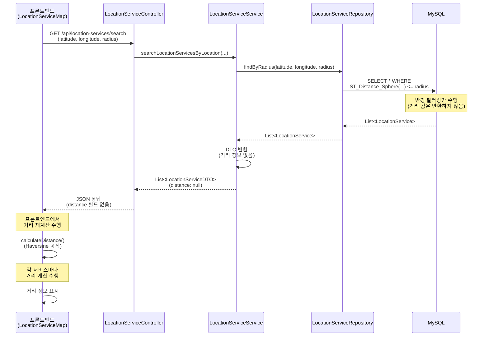
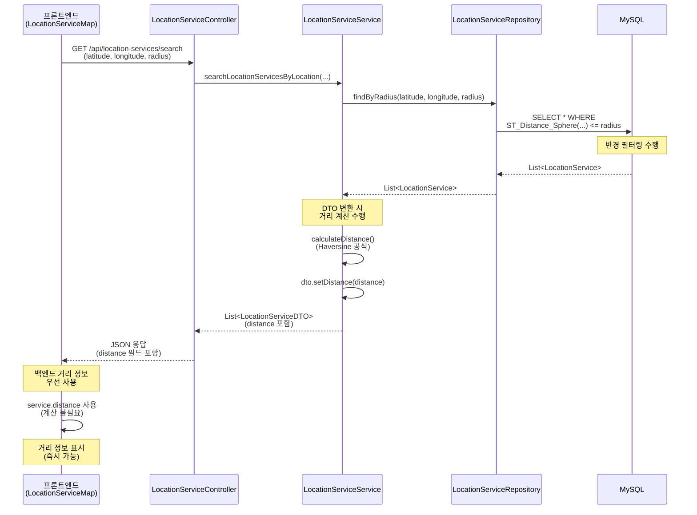
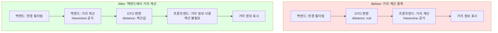

# 거리 계산 중복 제거 리팩토링

**작성일**: 2026-02-03  
**리팩토링 목적**: 백엔드와 프론트엔드에서 중복으로 수행하던 거리 계산을 백엔드에서만 수행하도록 개선

---

## 📋 개요

### 문제점

**이전 구현**:
- 백엔드: `ST_Distance_Sphere`로 반경 필터링만 수행
- 프론트엔드: `Haversine` 공식으로 거리 재계산
- 문제: 동일한 계산을 두 번 수행하여 성능 낭비

### 해결 방안

백엔드에서 거리 정보를 계산하여 DTO에 포함하여 반환하고, 프론트엔드에서는 백엔드에서 받은 거리 정보를 우선 사용하도록 변경.

---

## 🔄 처리 흐름 비교

### Before: 거리 계산 중복 수행



**문제점**:
- 백엔드: 반경 필터링만 수행 (거리 값 미반환)
- 프론트엔드: 각 서비스마다 거리 재계산 (중복 계산)
- 성능 낭비: 동일한 계산을 두 번 수행

---

### After: 백엔드에서 거리 정보 포함



**개선점**:
- 백엔드: 거리 계산 후 DTO에 포함하여 반환
- 프론트엔드: 백엔드 거리 정보 우선 사용 (계산 불필요)
- 성능 향상: 프론트엔드 계산 제거

---

## 🔧 변경 사항

### 1. 백엔드 변경

**파일**: `backend/main/java/com/linkup/Petory/domain/location/service/LocationServiceService.java`

**메서드**: `searchLocationServicesByLocation()`

#### 변경 전

```java
// DTO로 변환
long dtoConvertStartTime = System.currentTimeMillis();
List<LocationServiceDTO> result = services.stream()
        .map(locationServiceConverter::toDTO)
        .collect(Collectors.toList());
long dtoConvertTime = System.currentTimeMillis() - dtoConvertStartTime;
log.info("⏱️  [성능 측정] DTO 변환 시간: {}ms, 변환된 레코드 수: {}개", dtoConvertTime, result.size());
```

#### 변경 후

```java
// DTO로 변환 및 거리 정보 설정
long dtoConvertStartTime = System.currentTimeMillis();
List<LocationServiceDTO> result = services.stream()
        .map(service -> {
            LocationServiceDTO dto = locationServiceConverter.toDTO(service);
            // 거리 계산 후 DTO에 설정
            if (service.getLatitude() != null && service.getLongitude() != null) {
                Double distance = calculateDistance(
                        latitude, longitude,
                        service.getLatitude(), service.getLongitude());
                dto.setDistance(distance);
            }
            return dto;
        })
        .collect(Collectors.toList());
long dtoConvertTime = System.currentTimeMillis() - dtoConvertStartTime;
log.info("⏱️  [성능 측정] DTO 변환 시간: {}ms, 변환된 레코드 수: {}개", dtoConvertTime, result.size());
```

**변경 내용**:
- DTO 변환 시 거리 계산 후 `distance` 필드 설정
- `calculateDistance()` 메서드 활용 (기존 Haversine 공식 메서드)

---

### 2. 프론트엔드 변경

**파일**: `frontend/src/components/LocationService/LocationServiceMap.js`

#### 변경 1: 초기 로드 시 거리 계산

**위치**: `fetchServices` 함수 내 초기 로드 처리 부분

##### 변경 전

```javascript
let allFetchedServices = (response.data?.services || []).map((service) => {
  let distance = null;
  const lat = parseFloat(service.latitude);
  const lng = parseFloat(service.longitude);

  if (!isNaN(lat) && !isNaN(lng)) {
    if (targetLocation) {
      distance = calculateDistance(
        targetLocation.lat,
        targetLocation.lng,
        lat,
        lng
      );
    }
  }
  return {
    ...service,
    latitude: lat,
    longitude: lng,
    distance,
  };
});
```

##### 변경 후

```javascript
let allFetchedServices = (response.data?.services || []).map((service) => {
  const lat = parseFloat(service.latitude);
  const lng = parseFloat(service.longitude);
  
  // 백엔드에서 거리 정보를 받아서 사용 (없으면 계산)
  let distance = service.distance || null;
  if (distance === null && !isNaN(lat) && !isNaN(lng) && targetLocation) {
    distance = calculateDistance(
      targetLocation.lat,
      targetLocation.lng,
      lat,
      lng
    );
  }
  
  return {
    ...service,
    latitude: lat,
    longitude: lng,
    distance,
  };
});
```

---

#### 변경 2: 위치 기반 검색 시 거리 계산

**위치**: `fetchServices` 함수 내 위치 기반 검색 처리 부분

##### 변경 전

```javascript
const fetchedServices = (response.data?.services || []).map((service) => {
  let distance = null;
  const lat = parseFloat(service.latitude);
  const lng = parseFloat(service.longitude);

  if (!isNaN(lat) && !isNaN(lng)) {
    distance = calculateDistance(
      latitude,
      longitude,
      lat,
      lng
    );
  }
  return {
    ...service,
    latitude: lat,
    longitude: lng,
    distance,
  };
});
```

##### 변경 후

```javascript
const fetchedServices = (response.data?.services || []).map((service) => {
  const lat = parseFloat(service.latitude);
  const lng = parseFloat(service.longitude);
  
  // 백엔드에서 거리 정보를 받아서 사용 (없으면 계산)
  let distance = service.distance || null;
  if (distance === null && !isNaN(lat) && !isNaN(lng)) {
    distance = calculateDistance(
      latitude,
      longitude,
      lat,
      lng
    );
  }
  
  return {
    ...service,
    latitude: lat,
    longitude: lng,
    distance,
  };
});
```

**변경 내용**:
- 백엔드에서 받은 `service.distance` 우선 사용
- 거리 정보가 없을 때만 프론트엔드에서 계산 (하위 호환성)

---

## 📊 성능 비교

### 계산 횟수 비교

| 시나리오 | Before | After | 개선 |
|---------|--------|-------|------|
| **반경 내 서비스 10개** | 백엔드: 0회<br/>프론트엔드: 10회 | 백엔드: 10회<br/>프론트엔드: 0회 | 프론트엔드 계산 제거 |
| **반경 내 서비스 100개** | 백엔드: 0회<br/>프론트엔드: 100회 | 백엔드: 100회<br/>프론트엔드: 0회 | 프론트엔드 계산 제거 |
| **네트워크 전송** | 거리 정보 없음 | 거리 정보 포함 | 약 8바이트/서비스 증가 |

### 처리 흐름 비교



---

## 📊 기대 효과

### 1. 성능 향상

- **프론트엔드 계산 제거**: 대부분의 경우 프론트엔드에서 거리 계산 불필요
- **백엔드 일괄 처리**: 서버에서 한 번에 계산하여 효율성 향상

### 2. 일관성 확보

- **동일한 계산 결과**: 백엔드와 프론트엔드의 거리 계산 결과 일치
- **단일 책임**: 거리 계산 로직이 백엔드에 집중

### 3. 하위 호환성

- **기존 코드 호환**: 거리 정보가 없으면 프론트엔드에서 계산 (fallback)
- **점진적 적용**: 기존 API와 호환되도록 설계

---

## 🔍 검증 방법

### 1. 백엔드 검증

**테스트 케이스**:
```java
@Test
void 위치_기반_검색_거리_정보_포함_테스트() {
    // given
    Double latitude = 37.5665;
    Double longitude = 126.9780;
    Integer radius = 5000;
    
    // when
    List<LocationServiceDTO> results = service.searchLocationServicesByLocation(
        latitude, longitude, radius, null, null);
    
    // then
    assertThat(results).isNotEmpty();
    assertThat(results).allMatch(dto -> dto.getDistance() != null);
    assertThat(results).allMatch(dto -> dto.getDistance() <= radius);
}
```

### 2. 프론트엔드 검증

**확인 사항**:
- 위치 기반 검색 시 `service.distance` 값이 있는지 확인
- 거리 정보가 올바르게 표시되는지 확인
- 거리 정보가 없을 때 fallback 계산이 작동하는지 확인

---

## 📝 참고 사항

### 설계 의도 재평가

**도메인 문서 확인 결과**:
- 도메인 문서에는 "프론트엔드에서 클라이언트 측 계산"이 의도된 설계로 명시되어 있음
- 하지만 성능 최적화 관점에서 백엔드에서 계산하는 것이 더 효율적

**결론**:
- 이 리팩토링은 "의도된 설계"를 "최적화된 설계"로 개선하는 것
- 하위 호환성을 유지하면서 점진적으로 개선

### DTO 필드 활용

**LocationServiceDTO**:
```java
// 거리 정보 (내 위치 기반 검색 시 사용)
private Double distance; // 미터 단위
```

- DTO에 이미 `distance` 필드가 존재했으나 활용하지 않았음
- 이번 리팩토링으로 기존 설계 의도에 맞게 활용

---

## 🚀 다음 단계 (선택적)

### 1. 다른 검색 메서드에도 적용

- `searchLocationServicesByRegion()`: 지역 검색 시에도 거리 정보 포함 고려
- `searchLocationServicesByKeyword()`: 키워드 검색 시에도 거리 정보 포함 고려

### 2. SQL 레벨 최적화

**현재**: Java에서 Haversine 공식으로 계산  
**개선 가능**: SQL의 `ST_Distance_Sphere` 결과를 직접 사용

```sql
SELECT *, 
  ST_Distance_Sphere(location, ST_GeomFromText(...)) as distance
FROM locationservice 
WHERE ...
ORDER BY distance ASC
```

### 3. 성능 측정

- 리팩토링 전/후 성능 비교
- 프론트엔드 계산 제거로 인한 성능 향상 측정

---

## ✅ 체크리스트

- [x] 백엔드에서 거리 정보를 DTO에 포함
- [x] 프론트엔드에서 백엔드 거리 정보 우선 사용
- [x] 하위 호환성 유지 (fallback 계산)
- [ ] 테스트 케이스 작성
- [ ] 성능 측정 및 비교
- [ ] 문서 업데이트 (도메인 문서)

---

**리팩토링 완료일**: 2026-02-03  
**적용 범위**: 위치 기반 검색 (`searchLocationServicesByLocation`)
