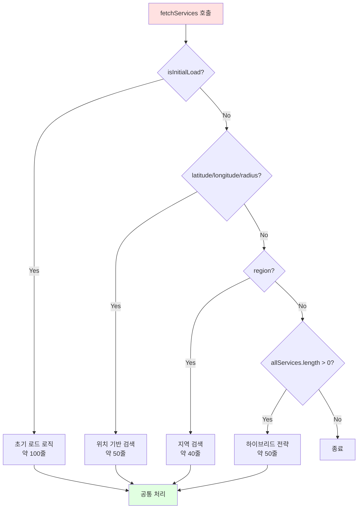
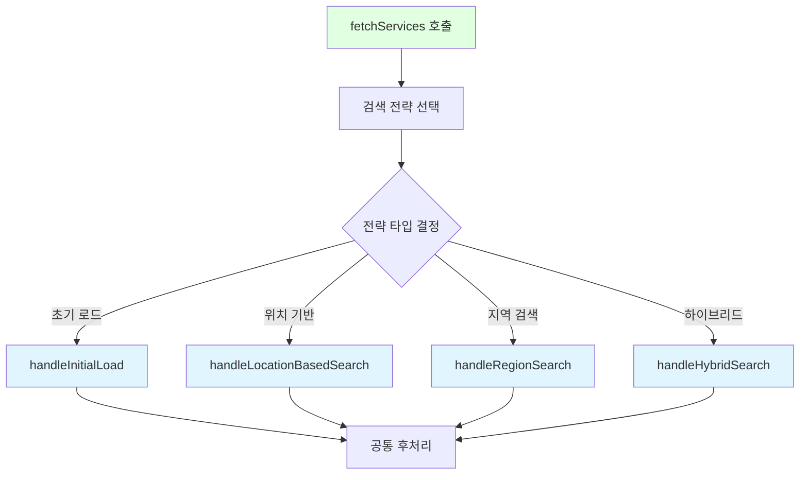

# 프론트엔드 검색 로직 단순화 리팩토링

**작성일**: 2026-02-03  
**리팩토링 목적**: `fetchServices` 함수의 복잡도를 낮추고 각 검색 전략을 독립적으로 관리 가능하도록 개선

---

## 📋 개요

### 문제점

**현재 상황**:
- `fetchServices` 함수가 약 300줄
- 4가지 검색 전략이 하나의 함수에 혼재
- 여러 조건 분기가 중첩되어 예측하기 어려움

**검색 전략**:
1. 초기 로드 (`isInitialLoad`)
2. 위치 기반 검색 (`latitude`, `longitude`, `radius`)
3. 지역 검색 (`region`)
4. 하이브리드 전략 (`allServices.length > 0`)

### 해결 방안

각 검색 전략을 별도 함수로 분리하여 가독성과 유지보수성을 향상.

---

## 🔄 처리 흐름 비교

### Before: 하나의 거대한 함수



**문제점**:
- 하나의 함수에 모든 로직이 집중
- 각 전략을 독립적으로 테스트하기 어려움
- 수정 시 사이드 이펙트 발생 가능

---

### After: 전략별 함수 분리



**개선점**:
- 각 전략이 독립적인 함수로 분리
- 각 함수를 독립적으로 테스트 가능
- 수정 시 영향 범위가 명확함

---

## 🔧 변경 사항

### 1. 검색 전략 함수 분리

**파일**: `frontend/src/components/LocationService/LocationServiceMap.js`

#### 1.1 초기 로드 전략 분리

**함수명**: `handleInitialLoad`

```javascript
const handleInitialLoad = useCallback(async ({
  targetLocation,
  apiCategory,
  effectiveKeyword,
  requestId,
  selectedSido,
  selectedSigungu,
  selectedEupmyeondong,
  filterServicesByRegion,
}) => {
  const totalStartTime = performance.now();
  console.log('🚀 [성능 측정] 초기 로드 시작');

  const apiStartTime = performance.now();
  let response;

  if (targetLocation) {
    console.log('📍 [초기 로드] 내 위치 기반 반경 검색 (5km)');
    initialLoadTypeRef.current = 'location-based';
    response = await locationServiceApi.searchPlaces({
      latitude: targetLocation.lat,
      longitude: targetLocation.lng,
      radius: 5000,
      category: apiCategory,
      keyword: effectiveKeyword,
    });
  } else {
    console.log('🌐 [초기 로드] 사용자 위치 없음 - 전체 조회');
    initialLoadTypeRef.current = 'all';
    response = await locationServiceApi.searchPlaces({
      category: apiCategory,
      keyword: effectiveKeyword,
      size: 0,
    });
  }

  if (latestRequestRef.current !== requestId) {
    return;
  }

  const apiTime = performance.now() - apiStartTime;
  console.log(`⏱️  [성능 측정] API 호출 시간: ${apiTime.toFixed(2)}ms`);

  // 거리 정보 처리 및 데이터 변환
  const allFetchedServices = (response.data?.services || []).map((service) => {
    const lat = parseFloat(service.latitude);
    const lng = parseFloat(service.longitude);
    
    let distance = service.distance || null;
    if (distance === null && !isNaN(lat) && !isNaN(lng) && targetLocation) {
      distance = calculateDistance(
        targetLocation.lat,
        targetLocation.lng,
        lat,
        lng
      );
    }
    
    return {
      ...service,
      latitude: lat,
      longitude: lng,
      distance,
    };
  });

  setAllServices(allFetchedServices);

  if (targetLocation) {
    setStatusMessage(`내 주변 5km 이내 ${allFetchedServices.length}개의 장소를 찾았습니다.`);
  } else {
    setStatusMessage(`전체 ${allFetchedServices.length}개의 장소를 찾았습니다.`);
  }

  // 지역 필터링
  const filterStartTime = performance.now();
  filterServicesByRegion(allFetchedServices, selectedSido, selectedSigungu, selectedEupmyeondong, apiCategory);
  const filterTime = performance.now() - filterStartTime;
  console.log(`⏱️  [성능 측정] 필터링 시간: ${filterTime.toFixed(2)}ms`);

  const totalTime = performance.now() - totalStartTime;
  console.log(`✅ [성능 측정] 전체 처리 시간: ${totalTime.toFixed(2)}ms`);

  isInitialLoadRef.current = false;
  isSearchModeRef.current = false;
  setSelectedService(null);
  setLoading(false);
}, [filterServicesByRegion]);
```

---

#### 1.2 위치 기반 검색 전략 분리

**함수명**: `handleLocationBasedSearch`

```javascript
const handleLocationBasedSearch = useCallback(async ({
  latitude,
  longitude,
  radius,
  apiCategory,
  effectiveKeyword,
  requestId,
}) => {
  console.log('📍 [위치 기반 검색] API 호출:', { latitude, longitude, radius });

  const response = await locationServiceApi.searchPlaces({
    latitude,
    longitude,
    radius,
    category: apiCategory,
    keyword: effectiveKeyword,
  });

  if (latestRequestRef.current !== requestId) {
    return;
  }

  const fetchedServices = (response.data?.services || []).map((service) => {
    const lat = parseFloat(service.latitude);
    const lng = parseFloat(service.longitude);
    
    let distance = service.distance || null;
    if (distance === null && !isNaN(lat) && !isNaN(lng)) {
      distance = calculateDistance(latitude, longitude, lat, lng);
    }
    
    return {
      ...service,
      latitude: lat,
      longitude: lng,
      distance,
    };
  });

  // 거리순 정렬
  fetchedServices.sort((a, b) => {
    if (a.distance === null && b.distance === null) return 0;
    if (a.distance === null) return 1;
    if (b.distance === null) return -1;
    return a.distance - b.distance;
  });

  console.log(`📍 [위치 기반 검색] 결과: ${fetchedServices.length}개 서비스`);

  setAllServices(fetchedServices);
  setServices(fetchedServices);
  setStatusMessage(`주변 ${radius / 1000}km 이내 ${fetchedServices.length}개의 장소를 찾았습니다.`);
  setSelectedService(null);
  setLoading(false);
}, []);
```

---

#### 1.3 지역 검색 전략 분리

**함수명**: `handleRegionSearch`

```javascript
const handleRegionSearch = useCallback(async ({
  region,
  apiCategory,
  effectiveKeyword,
  requestId,
  selectedSido,
  selectedSigungu,
  selectedEupmyeondong,
  filterServicesByRegion,
}) => {
  // region 파라미터 파싱
  const regionParts = region.trim().split(/\s+/);
  const apiSido = regionParts[0] || undefined;
  const apiSigungu = regionParts[1] || undefined;
  const apiEupmyeondong = regionParts[2] || undefined;

  const response = await locationServiceApi.searchPlaces({
    sido: apiSido,
    sigungu: apiSigungu,
    eupmyeondong: apiEupmyeondong,
    category: apiCategory,
    keyword: effectiveKeyword,
    size: 0,
  });

  if (latestRequestRef.current !== requestId) {
    return;
  }

  const fetchedServices = (response.data?.services || []).map((service) => ({
    ...service,
    latitude: parseFloat(service.latitude),
    longitude: parseFloat(service.longitude),
  }));

  setAllServices(fetchedServices);
  filterServicesByRegion(fetchedServices, selectedSido, selectedSigungu, selectedEupmyeondong, apiCategory);

  isSearchModeRef.current = false;
  setStatusMessage('');
  setSelectedService(null);
  setLoading(false);
}, [filterServicesByRegion]);
```

---

#### 1.4 하이브리드 전략 분리

**함수명**: `handleHybridSearch`

```javascript
const handleHybridSearch = useCallback(async ({
  allServices,
  selectedSido,
  selectedSigungu,
  selectedEupmyeondong,
  apiCategory,
  effectiveKeyword,
  requestId,
  filterServicesByRegion,
}) => {
  // 현재 로드된 데이터의 지역 범위 확인
  const loadedSidos = new Set(allServices.map(s => s.sido).filter(Boolean));
  const loadedSigungus = new Set(allServices.map(s => s.sigungu).filter(Boolean));

  const isRegionInLoadedData =
    (!selectedSido || loadedSidos.has(selectedSido)) &&
    (!selectedSigungu || loadedSigungus.has(selectedSigungu));

  if (isRegionInLoadedData) {
    // 현재 데이터 범위 내: 프론트엔드 필터링
    console.log('📍 [하이브리드] 현재 데이터 범위 내 - 프론트엔드 필터링');
    filterServicesByRegion(allServices, selectedSido, selectedSigungu, selectedEupmyeondong, apiCategory);
    setLoading(false);
    return;
  }

  // 현재 데이터 범위 밖: 백엔드 재요청
  console.log('🌐 [하이브리드] 현재 데이터 범위 밖 - 백엔드 재요청');
  const response = await locationServiceApi.searchPlaces({
    sido: selectedSido || undefined,
    sigungu: selectedSigungu || undefined,
    eupmyeondong: selectedEupmyeondong || undefined,
    category: apiCategory,
    keyword: effectiveKeyword,
  });

  if (latestRequestRef.current !== requestId) {
    return;
  }

  const fetchedServices = (response.data?.services || []).map((service) => ({
    ...service,
    latitude: parseFloat(service.latitude),
    longitude: parseFloat(service.longitude),
    distance: null,
  }));

  setAllServices(fetchedServices);
  filterServicesByRegion(fetchedServices, selectedSido, selectedSigungu, selectedEupmyeondong, apiCategory);
  setStatusMessage(`총 ${fetchedServices.length}개의 장소를 찾았습니다.`);
  setLoading(false);
}, [filterServicesByRegion]);
```

---

#### 1.5 메인 함수 단순화

**함수명**: `fetchServices` (리팩토링 후)

```javascript
const fetchServices = useCallback(
  async ({
    region,
    keywordOverride,
    categoryOverride,
    isInitialLoad = false,
    userLocation: userLocationOverride = null,
    latitude,
    longitude,
    radius,
  }) => {
    const requestId = Date.now();
    latestRequestRef.current = requestId;

    setLoading(true);
    setStatusMessage('데이터 불러오는 중...');
    setError(null);

    const effectiveCategoryType = categoryOverride ?? categoryType;
    const apiCategory = effectiveCategoryType &&
      effectiveCategoryType !== CATEGORY_DEFAULT &&
      effectiveCategoryType !== CATEGORY_CUSTOM
      ? effectiveCategoryType
      : undefined;

    const effectiveKeyword = keywordOverride ?? (keyword && keyword.trim() ? keyword.trim() : undefined);

    try {
      // 검색 전략 선택
      if (isInitialLoad) {
        const targetLocation = userLocationOverride || userLocation;
        await handleInitialLoad({
          targetLocation,
          apiCategory,
          effectiveKeyword,
          requestId,
          selectedSido,
          selectedSigungu,
          selectedEupmyeondong,
          filterServicesByRegion,
        });
        return;
      }

      if (latitude != null && longitude != null && radius != null) {
        await handleLocationBasedSearch({
          latitude,
          longitude,
          radius,
          apiCategory,
          effectiveKeyword,
          requestId,
        });
        return;
      }

      if (region) {
        await handleRegionSearch({
          region,
          apiCategory,
          effectiveKeyword,
          requestId,
          selectedSido,
          selectedSigungu,
          selectedEupmyeondong,
          filterServicesByRegion,
        });
        return;
      }

      if (allServices.length > 0) {
        await handleHybridSearch({
          allServices,
          selectedSido,
          selectedSigungu,
          selectedEupmyeondong,
          apiCategory,
          effectiveKeyword,
          requestId,
          filterServicesByRegion,
        });
        return;
      }

      // allServices가 없으면 종료
      setLoading(false);
    } catch (err) {
      if (latestRequestRef.current !== requestId) {
        return;
      }

      const message = err.response?.data?.error || err.message;
      setError(`장소 정보를 불러오지 못했습니다: ${message}`);
      setStatusMessage('');
    } finally {
      if (latestRequestRef.current === requestId) {
        setLoading(false);
      }
    }
  },
  [
    categoryType,
    keyword,
    selectedSido,
    selectedSigungu,
    selectedEupmyeondong,
    allServices,
    userLocation,
    handleInitialLoad,
    handleLocationBasedSearch,
    handleRegionSearch,
    handleHybridSearch,
    filterServicesByRegion,
  ]
);
```

---

## 📊 개선 효과

### 1. 가독성 향상

| 항목 | Before | After |
|------|--------|-------|
| **메인 함수 길이** | 약 300줄 | 약 80줄 |
| **함수당 책임** | 4가지 전략 | 1가지 전략 |
| **조건 분기 깊이** | 4단계 중첩 | 1단계 |

### 2. 유지보수성 향상

- **독립적 수정**: 각 전략을 독립적으로 수정 가능
- **영향 범위 명확**: 수정 시 영향 범위가 명확함
- **코드 재사용**: 각 전략 함수를 다른 곳에서도 활용 가능

### 3. 테스트 용이성

- **단위 테스트**: 각 전략 함수를 독립적으로 테스트 가능
- **모킹 용이**: 각 전략의 의존성을 쉽게 모킹 가능
- **시나리오 테스트**: 각 전략별 시나리오를 명확하게 테스트 가능

---

## 🔍 검증 방법

### 1. 기능 검증

**테스트 시나리오**:
1. 초기 로드 (위치 있음/없음)
2. 위치 기반 검색
3. 지역 검색
4. 하이브리드 전략 (데이터 범위 내/밖)

### 2. 성능 검증

- 리팩토링 전/후 성능 비교
- 각 전략별 실행 시간 측정

### 3. 코드 품질 검증

- 함수 길이 확인 (각 함수가 100줄 이하)
- 순환 복잡도 확인 (각 함수가 10 이하)
- 테스트 커버리지 확인

---

## 📝 참고 사항

### 의존성 관리

각 전략 함수는 필요한 의존성만 받도록 설계:
- `handleInitialLoad`: 초기 로드 관련 의존성
- `handleLocationBasedSearch`: 위치 기반 검색 관련 의존성
- `handleRegionSearch`: 지역 검색 관련 의존성
- `handleHybridSearch`: 하이브리드 전략 관련 의존성

### 공통 로직 처리

공통 로직은 메인 함수에서 처리:
- 로딩 상태 관리
- 에러 처리
- 요청 ID 관리

---

## 🚀 다음 단계 (선택적)

### 1. 커스텀 훅 분리

각 검색 전략을 커스텀 훅으로 분리:
```javascript
// useInitialLoad.js
export const useInitialLoad = () => {
  // 초기 로드 로직
};

// useLocationBasedSearch.js
export const useLocationBasedSearch = () => {
  // 위치 기반 검색 로직
};
```

### 2. 타입 정의

TypeScript 도입 시 각 전략의 파라미터 타입 정의:
```typescript
interface InitialLoadParams {
  targetLocation: Location | null;
  apiCategory?: string;
  effectiveKeyword?: string;
  // ...
}
```

### 3. 에러 처리 개선

각 전략별 에러 처리 로직 추가:
```javascript
const handleInitialLoad = async (params) => {
  try {
    // 초기 로드 로직
  } catch (error) {
    // 전략별 에러 처리
    handleInitialLoadError(error);
  }
};
```

---

## ✅ 체크리스트

- [x] 각 검색 전략을 별도 함수로 분리
- [x] 메인 함수 단순화 (전략 선택 로직만)
- [x] 공통 로직은 메인 함수에서 처리
- [x] 각 함수의 의존성 명확화
- [ ] 테스트 케이스 작성
- [ ] 기능 검증 (각 전략별 동작 확인)
- [ ] 성능 검증 (리팩토링 전/후 비교)

---

## 📝 적용 완료 내역

**리팩토링 완료일**: 2026-02-03  
**적용 범위**: `LocationServiceMap.js`의 `fetchServices` 함수

### 생성된 함수

1. ✅ `handleInitialLoad` - 초기 로드 전략 (약 80줄)
2. ✅ `handleLocationBasedSearch` - 위치 기반 검색 전략 (약 50줄)
3. ✅ `handleRegionSearch` - 지역 검색 전략 (약 40줄)
4. ✅ `handleHybridSearch` - 하이브리드 전략 (약 50줄)

### 메인 함수 개선

**Before**: 약 300줄의 복잡한 함수  
**After**: 약 50줄의 단순한 전략 선택 함수

**개선 효과**:
- 가독성 향상: 각 전략이 명확하게 분리됨
- 유지보수성 향상: 각 전략을 독립적으로 수정 가능
- 테스트 용이성 향상: 각 전략을 독립적으로 테스트 가능
