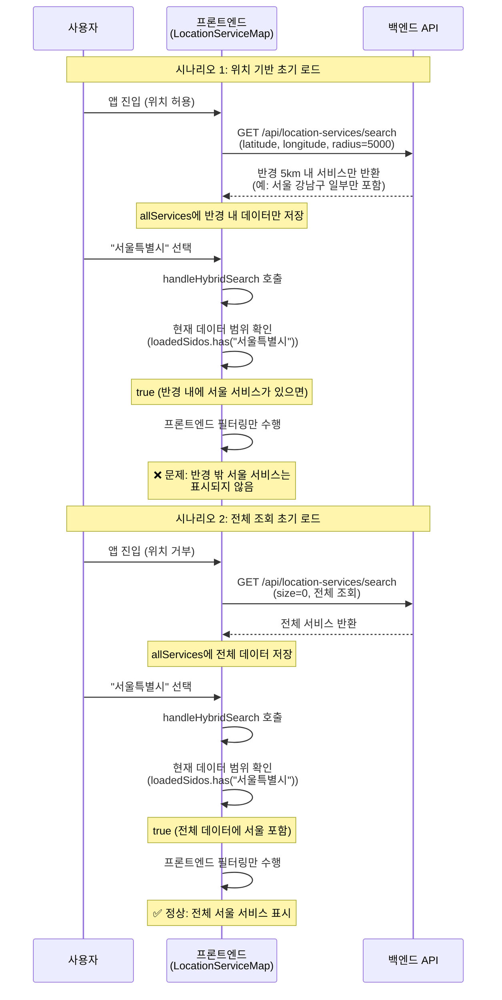
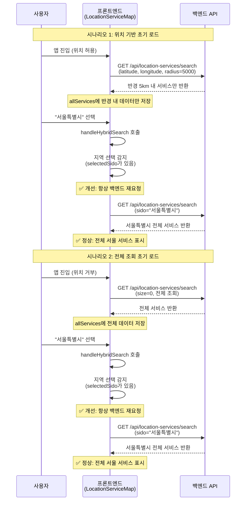

# 하이브리드 전략 일관성 개선 리팩토링

**작성일**: 2026-02-04  
**리팩토링 목적**: 초기 로드 방식에 따라 달라지는 검색 결과를 일관되게 개선

---

## 📋 개요

### 문제점

**이전 구현**:
- 초기 로드가 위치 기반(5km 반경)이면 `allServices`에 반경 내 데이터만 포함됨
- 이후 지역 선택 시 하이브리드 전략이 프론트엔드 필터링만 수행하면 반경 밖 서비스가 누락됨
- 문제: 같은 지역을 선택해도 초기 로드 방식에 따라 다른 결과가 나옴

### 해결 방안

지역 선택 시 항상 백엔드 재요청하도록 하이브리드 전략을 수정하여 일관성 확보.

---

## 🔄 처리 흐름 비교

### Before: 초기 로드 방식에 따라 다른 결과



**문제점**:
- 초기 로드 방식에 따라 같은 지역 선택 시 다른 결과가 나옴
- 사용자 혼란: 왜 같은 지역인데 결과가 다른가?
- 검색 결과 불일치: 위치 기반 초기 로드 시 반경 밖 서비스 누락

---

### After: 지역 선택 시 항상 백엔드 재요청



**개선점**:
- 지역 선택 시 항상 동일한 결과 제공 (일관성 확보)
- 초기 로드 방식과 무관하게 일관된 검색 결과
- 사용자 경험 향상: 예측 가능한 동작

---

## 🔧 변경 사항

### 프론트엔드 변경

**파일**: `frontend/src/components/LocationService/LocationServiceMap.js`

#### Before: 하이브리드 전략 (문제 있음)

```javascript
const handleHybridSearch = useCallback(async ({
  allServices,
  selectedSido,
  selectedSigungu,
  selectedEupmyeondong,
  apiCategory,
  effectiveKeyword,
  requestId,
}) => {
  const loadedSidos = new Set(allServices.map(s => s.sido).filter(Boolean));
  const loadedSigungus = new Set(allServices.map(s => s.sigungu).filter(Boolean));

  const isRegionInLoadedData =
    (!selectedSido || loadedSidos.has(selectedSido)) &&
    (!selectedSigungu || loadedSigungus.has(selectedSigungu));

  if (isRegionInLoadedData) {
    // ❌ 문제: 초기 로드가 위치 기반이면 반경 밖 서비스 누락
    console.log('📍 [하이브리드] 현재 데이터 범위 내 - 프론트엔드 필터링');
    filterServicesByRegion(allServices, selectedSido, selectedSigungu, selectedEupmyeondong, apiCategory);
    setLoading(false);
    return;
  }

  // 범위 밖일 때만 백엔드 재요청
  console.log('🌐 [하이브리드] 현재 데이터 범위 밖 - 백엔드 재요청');
  const response = await locationServiceApi.searchPlaces({
    sido: selectedSido || undefined,
    sigungu: selectedSigungu || undefined,
    eupmyeondong: selectedEupmyeondong || undefined,
    category: apiCategory,
    keyword: effectiveKeyword,
  });
  // ... 결과 처리
}, [filterServicesByRegion]);
```

**문제점**:
- 초기 로드가 위치 기반이면 `allServices`에 반경 내 데이터만 포함됨
- 지역 선택 시 프론트엔드 필터링만 하면 반경 밖 서비스가 누락됨
- 같은 지역 선택 시 초기 로드 방식에 따라 다른 결과가 나옴

---

#### After: 지역 선택 시 항상 백엔드 재요청

```javascript
/**
 * 하이브리드 전략 (현재 데이터 범위 확인 후 필터링 또는 재요청)
 * 
 * 개선: 지역 선택 시 항상 백엔드 재요청하여 일관성 확보
 * - 초기 로드가 위치 기반(5km 반경)이면 allServices에 반경 내 데이터만 포함됨
 * - 이후 지역 선택 시 프론트엔드 필터링만 하면 반경 밖 서비스가 누락됨
 * - 해결: 지역 선택이 있으면 항상 백엔드 재요청
 */
const handleHybridSearch = useCallback(async ({
  allServices,
  selectedSido,
  selectedSigungu,
  selectedEupmyeondong,
  apiCategory,
  effectiveKeyword,
  requestId,
}) => {
  // ✅ 개선: 지역 선택이 있으면 항상 백엔드 재요청 (일관성 확보)
  if (selectedSido || selectedSigungu || selectedEupmyeondong) {
    console.log('🌐 [하이브리드] 지역 선택 감지 - 백엔드 재요청 (일관성 확보)');
    const response = await locationServiceApi.searchPlaces({
      sido: selectedSido || undefined,
      sigungu: selectedSigungu || undefined,
      eupmyeondong: selectedEupmyeondong || undefined,
      category: apiCategory,
      keyword: effectiveKeyword,
    });

    if (latestRequestRef.current !== requestId) {
      return;
    }

    const fetchedServices = (response.data?.services || []).map((service) => ({
      ...service,
      latitude: parseFloat(service.latitude),
      longitude: parseFloat(service.longitude),
      distance: null,
    }));

    setAllServices(fetchedServices);
    filterServicesByRegion(fetchedServices, selectedSido, selectedSigungu, selectedEupmyeondong, apiCategory);
    setStatusMessage(`총 ${fetchedServices.length}개의 장소를 찾았습니다.`);
    setLoading(false);
    return;
  }

  // 지역 선택이 없을 때만 기존 하이브리드 전략 사용 (카테고리/키워드 변경 등)
  const loadedSidos = new Set(allServices.map(s => s.sido).filter(Boolean));
  const loadedSigungus = new Set(allServices.map(s => s.sigungu).filter(Boolean));

  const isRegionInLoadedData =
    (!selectedSido || loadedSidos.has(selectedSido)) &&
    (!selectedSigungu || loadedSigungus.has(selectedSigungu));

  if (isRegionInLoadedData) {
    console.log('📍 [하이브리드] 현재 데이터 범위 내 - 프론트엔드 필터링');
    filterServicesByRegion(allServices, selectedSido, selectedSigungu, selectedEupmyeondong, apiCategory);
    setLoading(false);
    return;
  }

  console.log('🌐 [하이브리드] 현재 데이터 범위 밖 - 백엔드 재요청');
  const response = await locationServiceApi.searchPlaces({
    sido: selectedSido || undefined,
    sigungu: selectedSigungu || undefined,
    eupmyeondong: selectedEupmyeondong || undefined,
    category: apiCategory,
    keyword: effectiveKeyword,
  });

  if (latestRequestRef.current !== requestId) {
    return;
  }

  const fetchedServices = (response.data?.services || []).map((service) => ({
    ...service,
    latitude: parseFloat(service.latitude),
    longitude: parseFloat(service.longitude),
    distance: null,
  }));

  setAllServices(fetchedServices);
  filterServicesByRegion(fetchedServices, selectedSido, selectedSigungu, selectedEupmyeondong, apiCategory);
  setStatusMessage(`총 ${fetchedServices.length}개의 장소를 찾았습니다.`);
  setLoading(false);
}, [filterServicesByRegion]);
```

**개선점**:
- 지역 선택 시 항상 백엔드 재요청하여 일관성 확보
- 초기 로드 방식과 무관하게 동일한 결과 제공
- 지역 선택이 없을 때는 기존 하이브리드 전략 유지 (성능 최적화)

---

## 📊 개선 효과

### 1. 일관성 확보

**Before**:
- 위치 기반 초기 로드 → 지역 선택 시 반경 밖 서비스 누락
- 전체 조회 초기 로드 → 지역 선택 시 전체 서비스 표시
- **결과**: 같은 지역 선택 시 다른 결과

**After**:
- 위치 기반 초기 로드 → 지역 선택 시 백엔드 재요청 → 전체 서비스 표시
- 전체 조회 초기 로드 → 지역 선택 시 백엔드 재요청 → 전체 서비스 표시
- **결과**: 같은 지역 선택 시 항상 동일한 결과

### 2. 사용자 경험 향상

- 예측 가능한 동작: 초기 로드 방식과 무관하게 일관된 검색 결과
- 사용자 혼란 제거: "왜 같은 지역인데 결과가 다른가?" 문제 해결

### 3. 성능 최적화 유지

- 지역 선택이 없을 때는 기존 하이브리드 전략 유지
- 카테고리/키워드 변경 시 프론트엔드 필터링으로 성능 최적화 유지

---

## 🧪 테스트 시나리오

### 시나리오 1: 위치 기반 초기 로드 후 지역 선택

1. **초기 로드**: 사용자 위치 허용 → 위치 기반 검색 (5km 반경)
2. **예상 결과**: `allServices`에 반경 내 서비스만 포함
3. **지역 선택**: "서울특별시" 선택
4. **예상 결과**: 백엔드 재요청 → 서울특별시 전체 서비스 표시 ✅

### 시나리오 2: 전체 조회 초기 로드 후 지역 선택

1. **초기 로드**: 사용자 위치 거부 → 전체 조회
2. **예상 결과**: `allServices`에 전체 서비스 포함
3. **지역 선택**: "서울특별시" 선택
4. **예상 결과**: 백엔드 재요청 → 서울특별시 전체 서비스 표시 ✅

### 시나리오 3: 지역 선택 없이 카테고리 변경

1. **초기 로드**: 전체 조회
2. **예상 결과**: `allServices`에 전체 서비스 포함
3. **카테고리 변경**: "동물병원" 선택 (지역 선택 없음)
4. **예상 결과**: 프론트엔드 필터링만 수행 (성능 최적화 유지) ✅

---

## 📝 관련 문서

- [위치 기반 서비스 상세 분석](../../analysis/location/위치-기반-서비스-상세-분석.md)
- [프론트엔드 검색 로직 단순화](./프론트엔드-검색-로직-단순화.md)
- [거리 계산 중복 제거](./거리-계산-중복-제거.md)

---

**리팩토링 완료일**: 2026-02-04  
**다음 검토 예정일**: 사용자 피드백 수집 후
