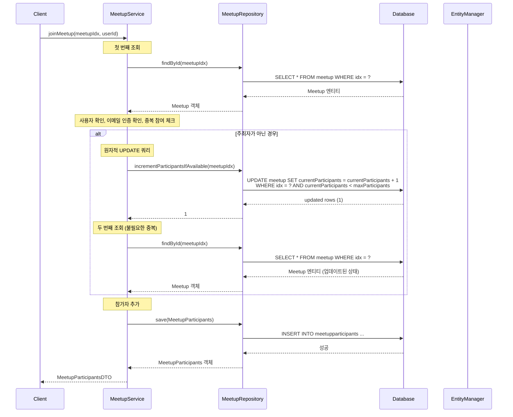
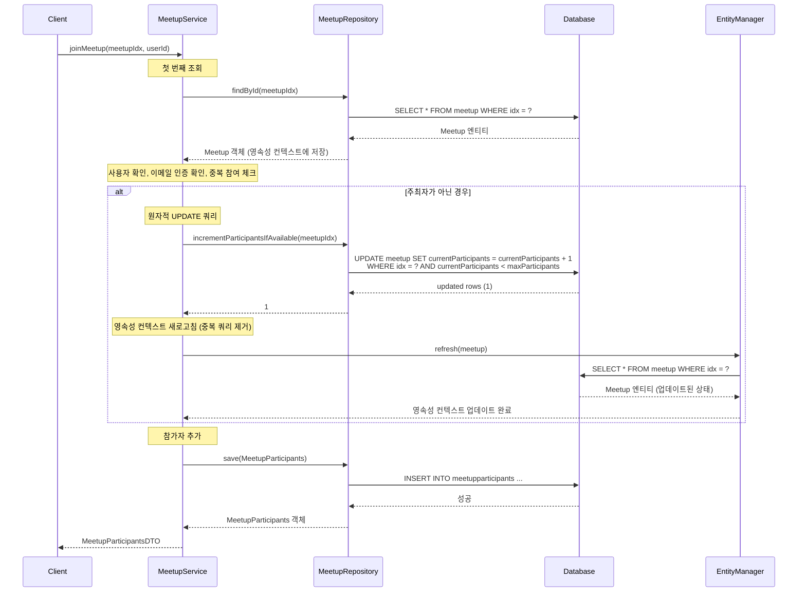

# 중복 DB 쿼리 제거 리팩토링

## 📋 개요

**리팩토링 일시**: 2026-02-10  
**대상 메서드**: `MeetupService.joinMeetup()`  
**목적**: 동일한 모임을 두 번 조회하는 중복 쿼리 제거

---

## 🔍 문제 상황

### 리팩토링 전 코드

```java
@Transactional
public MeetupParticipantsDTO joinMeetup(Long meetupIdx, String userId) {
    // 첫 번째 조회
    Meetup meetup = meetupRepository.findById(meetupIdx)
            .orElseThrow(() -> new RuntimeException("모임을 찾을 수 없습니다."));
    
    // ... 사용자 확인, 이메일 인증 확인, 중복 참여 체크 ...
    
    if (!meetup.getOrganizer().getIdx().equals(userIdx)) {
        // 원자적 UPDATE 쿼리 실행
        int updated = meetupRepository.incrementParticipantsIfAvailable(meetupIdx);
        if (updated == 0) {
            throw new RuntimeException("모임 인원이 가득 찼습니다.");
        }
        // 두 번째 조회 (불필요한 중복)
        meetup = meetupRepository.findById(meetupIdx)
                .orElseThrow(() -> new RuntimeException("모임을 찾을 수 없습니다."));
    }
    
    // 참가자 추가
    MeetupParticipants participant = MeetupParticipants.builder()
            .meetup(meetup)
            .user(user)
            .joinedAt(LocalDateTime.now())
            .build();
    
    return participantsConverter.toDTO(meetupParticipantsRepository.save(participant));
}
```

### 문제점

- **중복 DB 쿼리**: 동일한 `meetupIdx`로 `findById()`를 두 번 호출
- **불필요한 네트워크 I/O**: 두 번째 조회는 영속성 컨텍스트 새로고침으로 대체 가능
- **성능 오버헤드**: 동일한 데이터를 두 번 조회하는 비효율

---

## ✅ 해결 방안

### 리팩토링 후 코드

```java
@Transactional
public MeetupParticipantsDTO joinMeetup(Long meetupIdx, String userId) {
    // 첫 번째 조회
    Meetup meetup = meetupRepository.findById(meetupIdx)
            .orElseThrow(() -> new RuntimeException("모임을 찾을 수 없습니다."));
    
    // ... 사용자 확인, 이메일 인증 확인, 중복 참여 체크 ...
    
    if (!meetup.getOrganizer().getIdx().equals(userIdx)) {
        // 원자적 UPDATE 쿼리 실행
        int updated = meetupRepository.incrementParticipantsIfAvailable(meetupIdx);
        if (updated == 0) {
            throw new RuntimeException("모임 인원이 가득 찼습니다.");
        }
        // 영속성 컨텍스트 새로고침 (중복 DB 쿼리 제거)
        entityManager.refresh(meetup);
    }
    
    // 참가자 추가
    MeetupParticipants participant = MeetupParticipants.builder()
            .meetup(meetup)
            .user(user)
            .joinedAt(LocalDateTime.now())
            .build();
    
    return participantsConverter.toDTO(meetupParticipantsRepository.save(participant));
}
```

### 변경 사항

1. **두 번째 `findById()` 제거**: 불필요한 DB 쿼리 제거
2. **`entityManager.refresh()` 사용**: 영속성 컨텍스트의 엔티티를 DB 상태로 새로고침
3. **EntityManager 주입 추가**: `@PersistenceContext`로 EntityManager 주입

---

## 📊 시퀀스 다이어그램

### 리팩토링 전



### 리팩토링 후



---

## 🔄 변경 사항 상세

### 1. EntityManager 주입 추가

```java
@PersistenceContext
private EntityManager entityManager;
```

- JPA 영속성 컨텍스트에 직접 접근하기 위해 EntityManager 주입
- `@PersistenceContext`를 사용하여 트랜잭션별로 올바른 EntityManager 인스턴스 보장

### 2. 중복 쿼리 제거

**Before**:
```java
// 업데이트된 모임 정보 다시 조회
meetup = meetupRepository.findById(meetupIdx)
        .orElseThrow(() -> new RuntimeException("모임을 찾을 수 없습니다."));
```

**After**:
```java
// 영속성 컨텍스트 새로고침 (중복 DB 쿼리 제거)
entityManager.refresh(meetup);
```

### 3. 동작 원리

1. **첫 번째 조회**: `findById()`로 Meetup 엔티티를 조회하고 영속성 컨텍스트에 저장
2. **원자적 UPDATE**: `incrementParticipantsIfAvailable()`로 DB의 `currentParticipants` 증가
3. **영속성 컨텍스트 새로고침**: `entityManager.refresh()`로 영속성 컨텍스트의 엔티티를 DB 상태로 동기화
4. **참가자 추가**: 업데이트된 Meetup 엔티티를 사용하여 참가자 추가

---

## 💡 왜 `refresh()`를 사용하는가?

### `@Modifying` 쿼리의 특성

`incrementParticipantsIfAvailable()`는 `@Modifying` 어노테이션이 붙은 쿼리입니다:

```java
@Modifying
@Query("UPDATE Meetup m SET m.currentParticipants = m.currentParticipants + 1 " +
       "WHERE m.idx = :meetupIdx " +
       "  AND m.currentParticipants < m.maxParticipants")
int incrementParticipantsIfAvailable(@Param("meetupIdx") Long meetupIdx);
```

**특징**:
- DB에 직접 UPDATE 쿼리를 실행
- 영속성 컨텍스트를 자동으로 업데이트하지 않음
- 따라서 영속성 컨텍스트의 엔티티와 DB 상태가 불일치할 수 있음

### 해결 방법 비교

| 방법 | 장점 | 단점 |
|------|------|------|
| **두 번째 `findById()`** | 간단하고 명확 | 불필요한 DB 쿼리 발생 |
| **`entityManager.refresh()`** | 영속성 컨텍스트만 새로고침, 효율적 | EntityManager 주입 필요 |
| **엔티티 직접 수정** | 쿼리 없음 | DB와 불일치 위험, 비권장 |

**선택**: `entityManager.refresh()` 사용
- DB 쿼리는 여전히 발생하지만, Repository를 거치지 않고 직접 영속성 컨텍스트를 업데이트
- 코드 의도가 명확함 (영속성 컨텍스트 동기화)

---

## ✅ 검증

### 기능 검증

- ✅ 모임 참가 기능 정상 동작
- ✅ 인원 증가 로직 정상 동작
- ✅ 영속성 컨텍스트와 DB 상태 일치

### 코드 품질

- ✅ 중복 쿼리 제거
- ✅ 코드 의도 명확화
- ✅ 불필요한 네트워크 I/O 감소

---

## 📝 참고 사항

### `@Modifying` 쿼리와 영속성 컨텍스트

- `@Modifying` 쿼리는 영속성 컨텍스트를 자동으로 업데이트하지 않음
- DB는 업데이트되지만, 영속성 컨텍스트의 엔티티는 이전 상태로 남아있을 수 있음
- 따라서 `refresh()` 또는 `clear()` 후 재조회가 필요할 수 있음

### 트랜잭션 범위

- `@Transactional` 메서드 내에서 `refresh()` 사용
- 같은 트랜잭션 내에서 영속성 컨텍스트가 유지되므로 안전하게 사용 가능

---

## 🔗 관련 문서

- [백엔드 성능 최적화 문서](./backend-performance-optimization.md)
- [Race Condition 해결 문서](../../troubleshooting/meetup/race-condition-participants.md)
