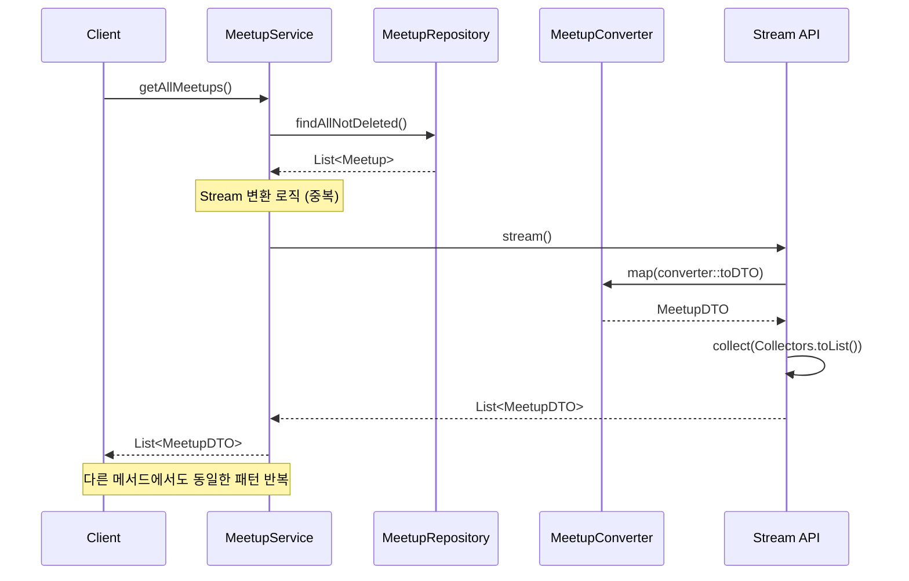
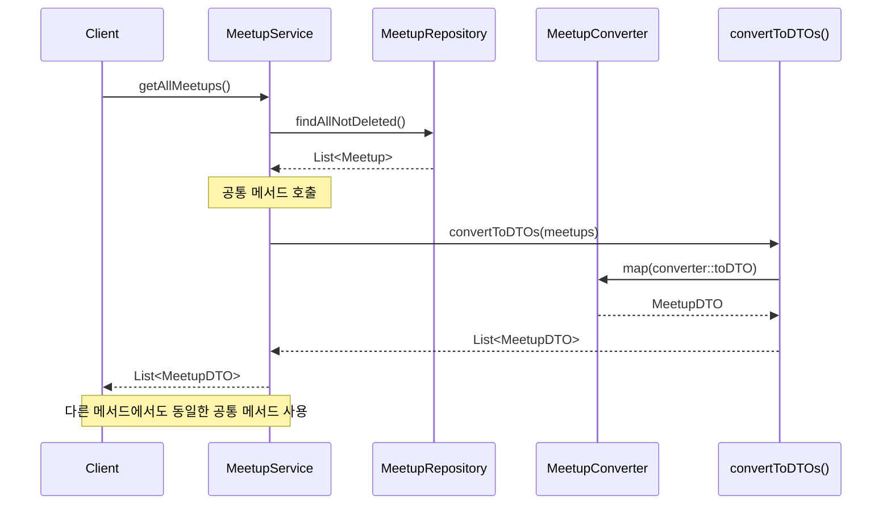

# Stream 연산 중복 코드 제거 리팩토링

## 📋 개요

**리팩토링 일시**: 2026-02-10  
**대상 파일**: `MeetupService.java`  
**목적**: 여러 메서드에서 반복되는 Stream 변환 로직을 공통 메서드로 추출하여 중복 코드 제거

---

## 🔍 문제 상황

### 리팩토링 전 코드

여러 메서드에서 동일한 Stream 변환 패턴이 반복됨:

```java
// 1. getAllMeetups()
List<MeetupDTO> result = meetups.stream()
        .map(converter::toDTO)
        .collect(Collectors.toList());

// 2. getNearbyMeetups()
List<MeetupDTO> result = nearbyMeetups.stream()
        .map(converter::toDTO)
        .collect(Collectors.toList());

// 3. getMeetupsByLocation()
List<MeetupDTO> result = meetups.stream()
        .map(converter::toDTO)
        .collect(Collectors.toList());

// 4. searchMeetupsByKeyword()
List<MeetupDTO> result = meetups.stream()
        .map(converter::toDTO)
        .collect(Collectors.toList());

// 5. getAvailableMeetups()
List<MeetupDTO> result = meetups.stream()
        .map(converter::toDTO)
        .collect(Collectors.toList());

// 6. getMeetupsByOrganizer()
return meetupRepository.findByOrganizerIdxOrderByCreatedAtDesc(organizerIdx)
        .stream()
        .map(converter::toDTO)
        .collect(Collectors.toList());

// 7. getMeetupParticipants()
return meetupParticipantsRepository.findByMeetupIdxOrderByJoinedAtAsc(meetupIdx)
        .stream()
        .map(participantsConverter::toDTO)
        .collect(Collectors.toList());
```

### 문제점

- **코드 중복**: 동일한 Stream 변환 로직이 7개 메서드에서 반복됨
- **유지보수 어려움**: 변환 로직 변경 시 여러 곳을 수정해야 함
- **가독성 저하**: 비즈니스 로직이 Stream 변환 코드에 가려짐
- **일관성 부족**: 동일한 작업을 하는데 코드가 다르게 작성됨

---

## ✅ 해결 방안

### 리팩토링 후 코드

공통 메서드를 추출하여 중복 코드 제거:

```java
// 공통 메서드 추가
private List<MeetupDTO> convertToDTOs(List<Meetup> meetups) {
    return meetups.stream()
            .map(converter::toDTO)
            .collect(Collectors.toList());
}

private List<MeetupParticipantsDTO> convertToParticipantDTOs(List<MeetupParticipants> participants) {
    return participants.stream()
            .map(participantsConverter::toDTO)
            .collect(Collectors.toList());
}

// 사용 예시
public List<MeetupDTO> getAllMeetups() {
    // ...
    List<MeetupDTO> result = convertToDTOs(meetups);
    // ...
}

public List<MeetupDTO> getMeetupsByOrganizer(Long organizerIdx) {
    return convertToDTOs(
            meetupRepository.findByOrganizerIdxOrderByCreatedAtDesc(organizerIdx)
    );
}

public List<MeetupParticipantsDTO> getMeetupParticipants(Long meetupIdx) {
    return convertToParticipantDTOs(
            meetupParticipantsRepository.findByMeetupIdxOrderByJoinedAtAsc(meetupIdx)
    );
}
```

---

## 📊 시퀀스 다이어그램

### 리팩토링 전



### 리팩토링 후



---

## 🔄 변경 사항 상세

### 1. 공통 메서드 추가

**Meetup 엔티티 → DTO 변환**:
```java
private List<MeetupDTO> convertToDTOs(List<Meetup> meetups) {
    return meetups.stream()
            .map(converter::toDTO)
            .collect(Collectors.toList());
}
```

**MeetupParticipants 엔티티 → DTO 변환**:
```java
private List<MeetupParticipantsDTO> convertToParticipantDTOs(List<MeetupParticipants> participants) {
    return participants.stream()
            .map(participantsConverter::toDTO)
            .collect(Collectors.toList());
}
```

### 2. 메서드별 변경 사항

#### getAllMeetups()
```java
// Before
List<MeetupDTO> result = meetups.stream()
        .map(converter::toDTO)
        .collect(Collectors.toList());

// After
List<MeetupDTO> result = convertToDTOs(meetups);
```

#### getNearbyMeetups()
```java
// Before
List<MeetupDTO> result = nearbyMeetups.stream()
        .map(converter::toDTO)
        .collect(Collectors.toList());

// After
List<MeetupDTO> result = convertToDTOs(nearbyMeetups);
```

#### getMeetupsByLocation()
```java
// Before
List<MeetupDTO> result = meetups.stream()
        .map(converter::toDTO)
        .collect(Collectors.toList());

// After
List<MeetupDTO> result = convertToDTOs(meetups);
```

#### searchMeetupsByKeyword()
```java
// Before
List<MeetupDTO> result = meetups.stream()
        .map(converter::toDTO)
        .collect(Collectors.toList());

// After
List<MeetupDTO> result = convertToDTOs(meetups);
```

#### getAvailableMeetups()
```java
// Before
List<MeetupDTO> result = meetups.stream()
        .map(converter::toDTO)
        .collect(Collectors.toList());

// After
List<MeetupDTO> result = convertToDTOs(meetups);
```

#### getMeetupsByOrganizer()
```java
// Before
return meetupRepository.findByOrganizerIdxOrderByCreatedAtDesc(organizerIdx)
        .stream()
        .map(converter::toDTO)
        .collect(Collectors.toList());

// After
return convertToDTOs(
        meetupRepository.findByOrganizerIdxOrderByCreatedAtDesc(organizerIdx)
);
```

#### getMeetupParticipants()
```java
// Before
return meetupParticipantsRepository.findByMeetupIdxOrderByJoinedAtAsc(meetupIdx)
        .stream()
        .map(participantsConverter::toDTO)
        .collect(Collectors.toList());

// After
return convertToParticipantDTOs(
        meetupParticipantsRepository.findByMeetupIdxOrderByJoinedAtAsc(meetupIdx)
);
```

---

## 💡 리팩토링 효과

### 1. 코드 중복 제거

**Before**: 7개 메서드에서 동일한 Stream 변환 로직 반복  
**After**: 공통 메서드 2개로 통합

**코드 라인 수 감소**:
- Before: 약 21줄 (7개 메서드 × 3줄)
- After: 약 6줄 (공통 메서드 2개 × 3줄) + 7줄 (메서드 호출)
- **감소**: 약 8줄 (38% 감소)

### 2. 유지보수성 향상

**변경 시나리오**: Stream 변환 로직 수정 필요 시

**Before**:
- 7개 메서드를 모두 찾아서 수정해야 함
- 누락 가능성 있음
- 테스트 범위 넓음

**After**:
- 공통 메서드 1개만 수정하면 됨
- 모든 호출 지점에 자동 반영
- 테스트 범위 좁음

### 3. 가독성 향상

**Before**:
```java
public List<MeetupDTO> getAllMeetups() {
    // ... 성능 측정 코드 ...
    List<MeetupDTO> result = meetups.stream()
            .map(converter::toDTO)
            .collect(Collectors.toList());
    // ... 로깅 ...
    return result;
}
```

**After**:
```java
public List<MeetupDTO> getAllMeetups() {
    // ... 성능 측정 코드 ...
    List<MeetupDTO> result = convertToDTOs(meetups);
    // ... 로깅 ...
    return result;
}
```

**장점**:
- 비즈니스 로직이 명확해짐
- 메서드 이름으로 의도가 명확함
- Stream 변환 로직이 가려지지 않음

### 4. 일관성 확보

**Before**: 각 메서드마다 다른 스타일로 작성
- 일부는 변수에 할당
- 일부는 직접 return
- 일부는 여러 줄로 작성

**After**: 모든 메서드에서 동일한 패턴 사용
- 공통 메서드 호출로 통일
- 일관된 코드 스타일

---

## 📈 성능 영향

### 성능 변화

**변화 없음**: 성능에 거의 영향 없음

**이유**:
- Stream 연산 자체는 동일하게 실행됨
- 메서드 호출 오버헤드는 무시할 수준 (JVM 최적화)
- 실제 성능 병목은 DB 쿼리와 변환 로직

### 메모리 사용

**변화 없음**: 메모리 사용량 동일

**이유**:
- Stream 연산 방식 동일
- 중간 컬렉션 생성 방식 동일
- 메서드 호출 스택만 약간 증가 (무시 가능)

---

## ✅ 검증

### 기능 검증

- ✅ 모든 메서드 정상 동작
- ✅ 변환 결과 동일
- ✅ 성능 측정 로직 정상 동작

### 코드 품질

- ✅ 중복 코드 제거
- ✅ 가독성 향상
- ✅ 유지보수성 향상
- ✅ 일관성 확보

---

## 📝 참고 사항

### 리팩토링 원칙

1. **DRY (Don't Repeat Yourself)**: 중복 코드 제거
2. **단일 책임 원칙**: 변환 로직을 별도 메서드로 분리
3. **가독성 우선**: 비즈니스 로직이 명확하게 보이도록

### 향후 개선 가능 사항

1. **성능 측정 로직 추출**: AOP나 공통 메서드로 추출 가능
2. **Converter 패턴 확장**: 다른 도메인에도 동일한 패턴 적용 가능
3. **제네릭 활용**: 타입 안전성을 높이기 위해 제네릭 메서드로 확장 가능

---

## 🔗 관련 문서

- [중복 쿼리 제거 리팩토링](./duplicate-query-removal.md)
- [백엔드 성능 최적화 문서](./backend-performance-optimization.md)
- [트랜잭션 어노테이션 가이드](./transaction-annotation-guide.md)
