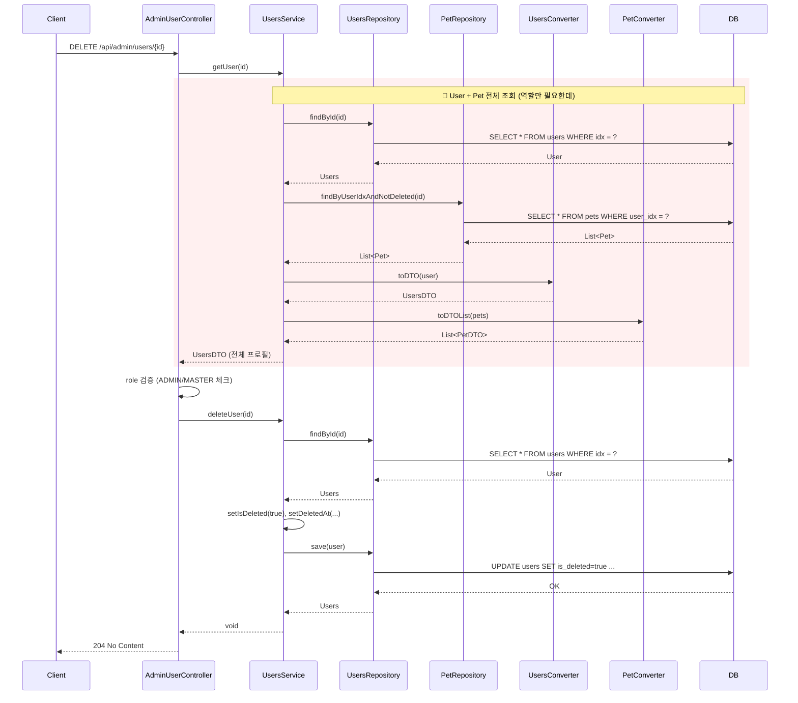
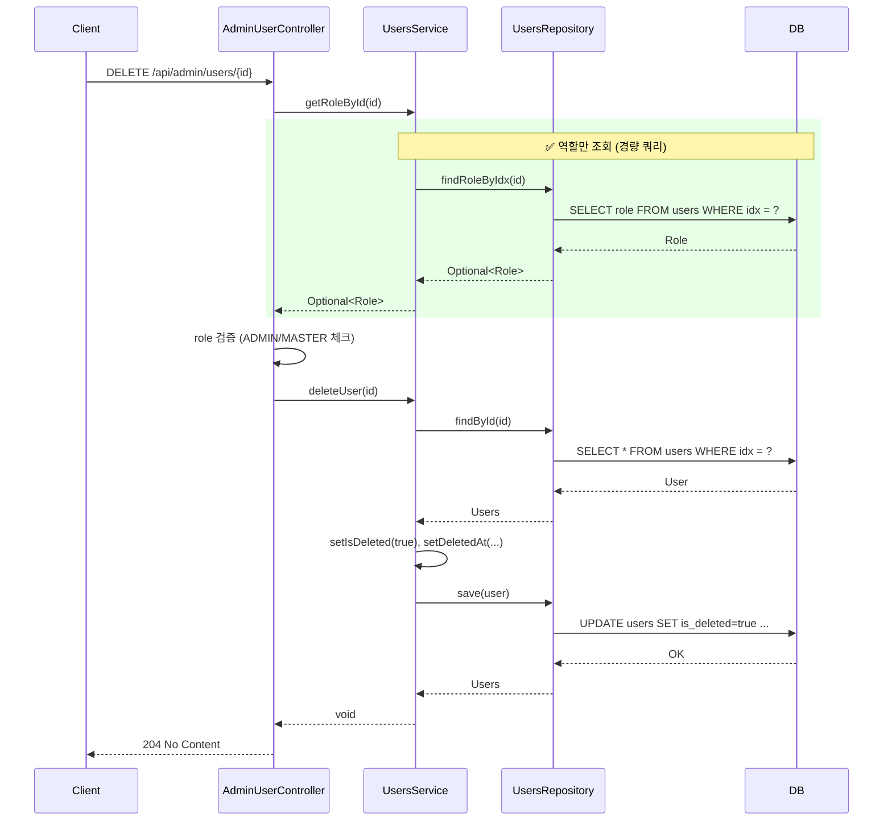

# Admin 사용자 삭제 - 시퀀스 다이어그램

## 개요
AdminUserController의 `deleteUser()`에서 삭제 전 권한 검증을 위해 전체 사용자 프로필(User + Pet)을 조회하던 것을, 역할(role)만 조회하는 경량 쿼리로 최적화한 리팩토링 전후 시퀀스를 비교합니다.

---

## 1. deleteUser() - Before (리팩토링 전)

**문제점**: 
- 권한 검증용으로 User 전체 + Pet 조회 (2+ 쿼리)
- 삭제 시 findById 다시 호출 → 동일 User 2번 조회

---

## 2. deleteUser() - After (리팩토링 후)

**개선점**: 
- 권한 검증: `SELECT role` 1회 (프로젝션) vs `SELECT * FROM users` + `SELECT * FROM pets` 2+ 쿼리
- Pet 조회, DTO 변환 제거

---

## 3. 요약

| 구간 | Before | After |
|------|--------|-------|
| 권한 검증 | findById + Pet 조회 + DTO 변환 | findRoleByIdx (role만 SELECT) |
| DB 쿼리 (검증) | 2+ (users + pets) | 1 (role 프로젝션) |
| 데이터 로드 | User 전체 + Pet 목록 | role 컬럼만 |
