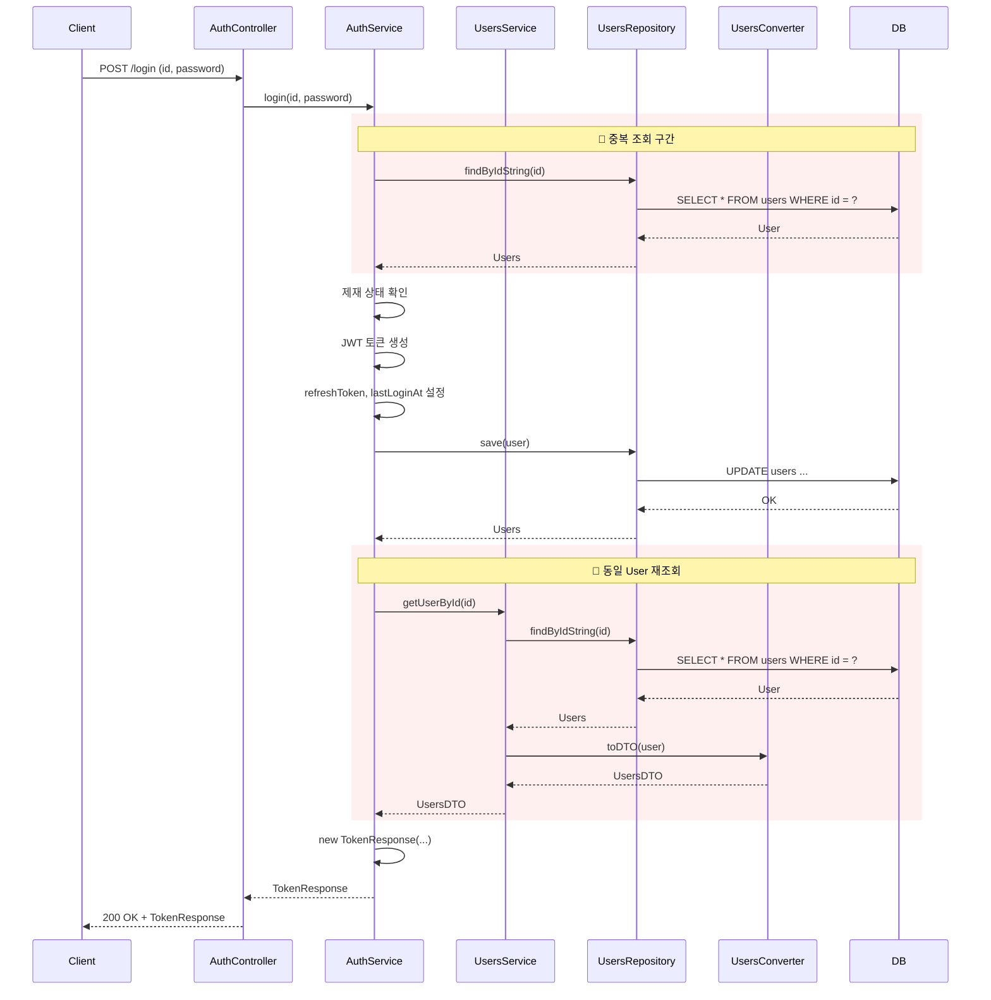
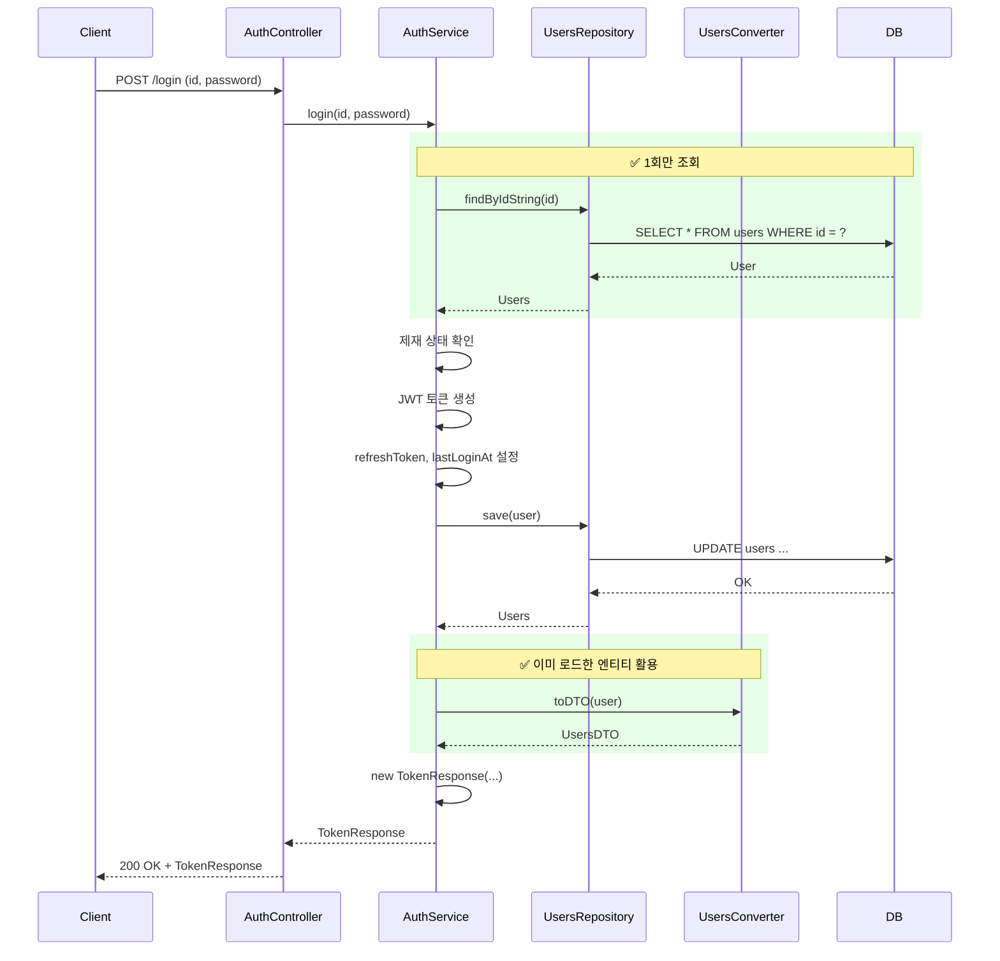
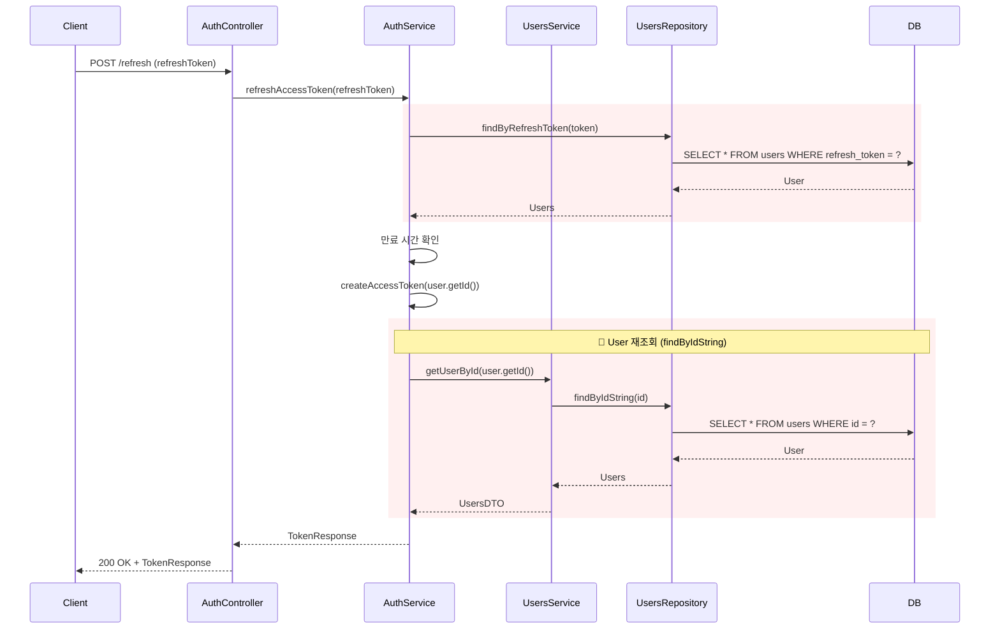
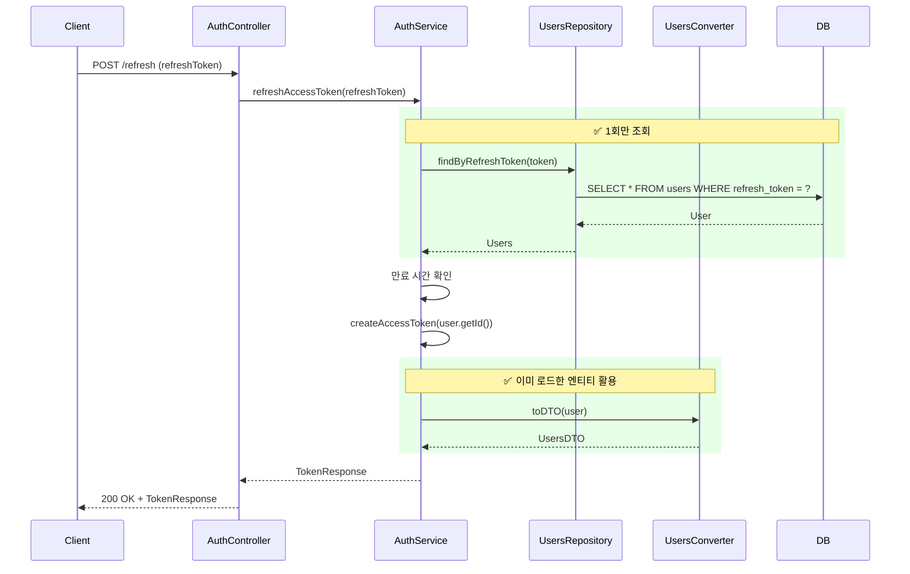

# Auth 로그인/Refresh 토큰 - 시퀀스 다이어그램

## 개요
AuthService의 `login()` 및 `refreshAccessToken()`에서 발생하던 중복 DB 조회를 제거한 리팩토링 전후 시퀀스를 비교합니다.

---

## 1. login() - Before (리팩토링 전)

**문제점**: `findByIdString` 2회 호출 → DB 쿼리 2회

---

## 2. login() - After (리팩토링 후)

**개선점**: `findByIdString` 1회 → DB 쿼리 1회, UsersService 의존성 제거

---

## 3. refreshAccessToken() - Before

**문제점**: User 조회 2회 (findByRefreshToken + findByIdString)

---

## 4. refreshAccessToken() - After

**개선점**: User 조회 1회만 수행

---

## 5. 요약

| 시나리오 | Before (DB 쿼리) | After (DB 쿼리) | 감소 |
|----------|------------------|-----------------|------|
| login() | findByIdString 2회 + save 1~2회 | findByIdString 1회 + save 1~2회 | **1회 감소** |
| refreshAccessToken() | findByRefreshToken 1회 + findByIdString 1회 | findByRefreshToken 1회 | **1회 감소** |

**추가 개선**: AuthService에서 UsersService 의존성 제거 → 결합도 감소
