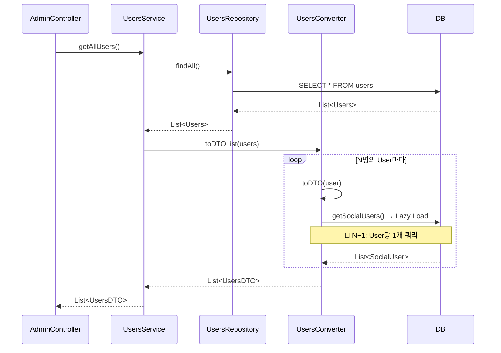

# SocialUsers N+1 쿼리 트러블슈팅

## 1. 개요

**분류**: 트러블슈팅 (런타임 발견 이슈)

User 도메인에서 `getAllUsers()`, `getAllUsersWithPaging()` 등 리스트 조회 시 `UsersConverter.toDTO()` 내부에서 `user.getSocialUsers()` 접근 시 Lazy Loading으로 N+1 쿼리가 발생하는 문제입니다.

---

## 2. 문제 발견

### 2.1 현상

- **API**: `GET /api/admin/users`, `GET /api/admin/users/paging`
- **증상**: 사용자 수가 많을수록 쿼리 수 급증, 응답 시간 증가
- **예시**: 사용자 100명 조회 시 → 1 (Users) + 100 (SocialUser) = **101개 쿼리**

### 2.2 영향 범위

| 호출 경로 | 메서드 | N+1 발생 |
|-----------|--------|-----------|
| AdminUserController.getAllUsers() | UsersService.getAllUsers() | ✅ |
| AdminUserController.getAllUsersWithPaging() | UsersService.getAllUsersWithPaging() | ✅ |
| UsersConverter.toDTO() 사용하는 모든 리스트 조회 | - | ✅ |

---

## 3. 원인 분석

### 3.1 엔티티 구조

```java
// Users.java
@OneToMany(mappedBy = "user", cascade = CascadeType.ALL)
private List<SocialUser> socialUsers;  // FetchType 기본값: LAZY
```

- `@OneToMany` 기본 fetch = `LAZY`
- `socialUsers` 접근 시점에 별도 쿼리 실행

### 3.2 트리거 위치

```java
// UsersConverter.java (Lines 31-36)
public UsersDTO toDTO(Users user) {
    return UsersDTO.builder()
            // ...
            .socialUsers(user.getSocialUsers() != null ? user.getSocialUsers().stream()
                    .map(socialUserConverter::toDTO)
                    .collect(Collectors.toList())
                    : null)
            // ...
            .build();
}
```

- `toDTOList(List<Users> users)` 호출 시 각 User마다 `toDTO(user)` 실행
- `toDTO()` 내부에서 `user.getSocialUsers()` 접근 → **Lazy Loading 트리거**
- N명 사용자 → N번의 `SELECT * FROM socialuser WHERE users_idx = ?` 쿼리

### 3.3 쿼리 흐름 (Before)

```
1. SELECT * FROM users;                    -- 1회
2. SELECT * FROM socialuser WHERE users_idx = 1;   -- User 1
3. SELECT * FROM socialuser WHERE users_idx = 2;   -- User 2
4. ...
N+1. SELECT * FROM socialuser WHERE users_idx = N; -- User N
```

---

## 4. 해결 방안

### 4.1 방안 1: JOIN FETCH (권장)

**Repository에 메서드 추가**:

```java
// SpringDataJpaUsersRepository.java
@Query("SELECT DISTINCT u FROM Users u LEFT JOIN FETCH u.socialUsers")
List<Users> findAllWithSocialUsers();

@Query("SELECT DISTINCT u FROM Users u LEFT JOIN FETCH u.socialUsers")
List<Users> findAllWithSocialUsers(Pageable pageable);
```

**주의**: `Pageable` 사용 시 `COUNT` 쿼리 별도 실행 + `DISTINCT` 시 페이징 이슈 가능.  
→ `@EntityGraph` 또는 `BatchSize` 고려.

**JPQL 페이징 제한**: `JOIN FETCH`와 `Pageable` 함께 사용 시 `DISTINCT` 필요하고, 일부 DB에서는 카운트 쿼리 비효율. `@EntityGraph`가 더 안전할 수 있음.

### 4.2 방안 2: @BatchSize

**Users 엔티티에 추가**:

```java
@OneToMany(mappedBy = "user", cascade = CascadeType.ALL)
@BatchSize(size = 50)
private List<SocialUser> socialUsers;
```

- N+1은 유지하되, **한 번에 50개 User의 socialUsers를 배치**로 조회
- 100명 조회 시: 1 + ceil(100/50) = **3개 쿼리**
- 수정 범위 최소, Converter 코드 변경 불필요

### 4.3 방안 3: 선택적 로딩

**socialUsers 불필요한 API 분리**:

- Admin 사용자 목록에서 소셜 연동 정보가 없으면: `toDTOWithoutSocialUsers()` 추가
- 필요한 API만 `findAllWithSocialUsers()` 사용

```java
// UsersConverter에 오버로드 추가
public UsersDTO toDTO(Users user) { ... }  // socialUsers 포함

public UsersDTO toDTOWithoutSocialUsers(Users user) {
    return UsersDTO.builder()
            // socialUsers 제외
            .socialUsers(null)
            .build();
}
```

---

## 5. 적용 결과 ✅ **해결 완료**

### 5.1 수정 내용

**파일**: `Users.java`

```java
@OneToMany(mappedBy = "user", cascade = CascadeType.ALL)
@BatchSize(size = 50)  // N+1 방지: 한 번에 최대 50개 User의 socialUsers 배치 조회
private List<SocialUser> socialUsers;
```

### 5.2 해결 원리

- **Before**: `getSocialUsers()` 호출 시 User마다 개별 쿼리 → 1 + N개 쿼리
- **After**: Hibernate가 `WHERE user_idx IN (1,2,...,50)` 형태로 **배치 조회** → 1 + ceil(N/50)개 쿼리

| 사용자 수 | Before | After |
|----------|--------|-------|
| 20명 | 21 쿼리 | 2 쿼리 |
| 100명 | 101 쿼리 | 3 쿼리 |

---

## 6. 권장 적용 순서 (참고)

1. **@BatchSize** 적용 (가장 간단, 즉시 효과)
2. 상세 프로필 필요 시 **JOIN FETCH** 메서드 추가 및 `getAllUsers()` 등에서 분리 사용
3. Admin 목록에서 소셜 정보 불필요하면 **선택적 로딩**으로 쿼리 제거

---

## 7. 시퀀스 다이어그램 (N+1 발생 흐름)



**쿼리 수**: 1 (Users) + N (SocialUser) = **N+1**

---

## 8. 참고 자료

- Meetup 도메인 유사 사례: [participants-query/performance-comparison-participants.md](../../meetup/participants-query/performance-comparison-participants.md)
- Hibernate @BatchSize: [BatchSize 공식 문서](https://docs.jboss.org/hibernate/orm/6.0/javadocs/org/hibernate/annotations/BatchSize.html)
