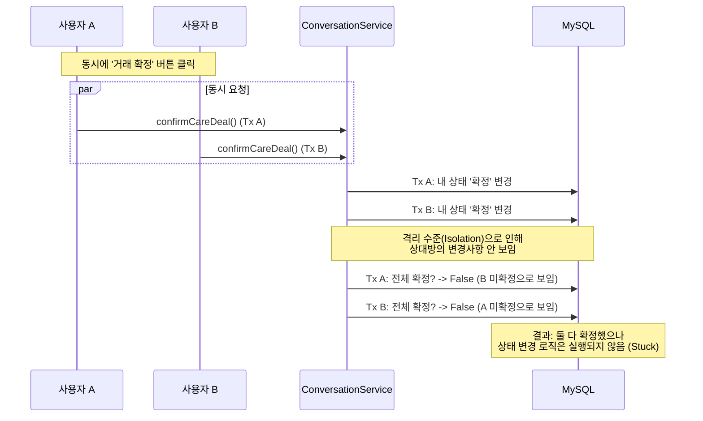
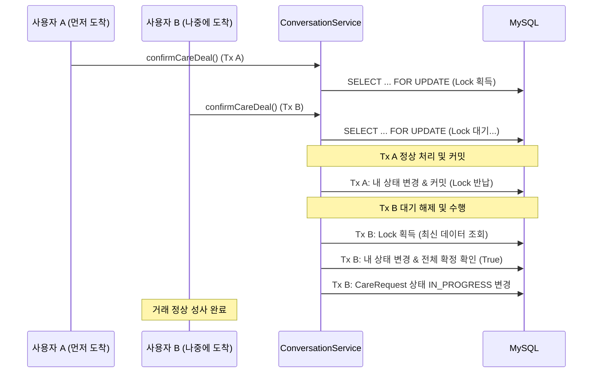
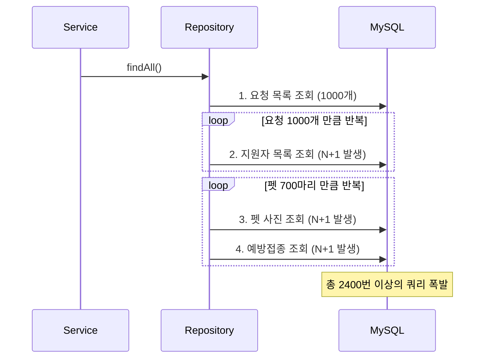
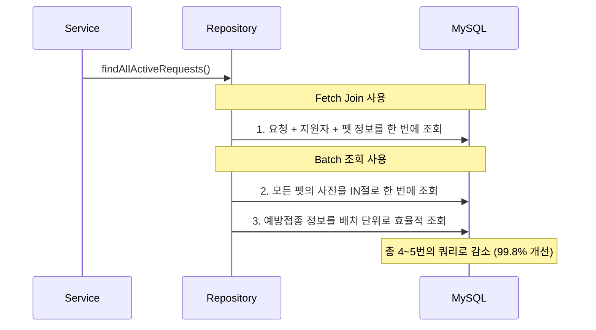

# Care 도메인 기술 심층 분석: 정합성과 성능의 조화

## 1. 개요

Care(펫케어) 도메인은 실제 사용자의 **계약(거래)**이 이루어지고, 수많은 요청 목록이 **실시간으로 조회**되는 펫토리 서비스의 핵심 도메인입니다.

이 문서에서는 Care 도메인의 완성도를 높이기 위해 수행한 두 가지 핵심 기술적 과제인 **데이터 정합성 보장(Write)**과 **조회 성능 최적화(Read)** 과정을 시각적 자료(Sequence Diagram)와 함께 다룹니다.

---

## Part 1. [Data Integrity] 거래 확정 동시성 문제 해결

가장 먼저 해결해야 했던 과제는 **"데이터의 신뢰성"**입니다. 아무리 속도가 빨라도 거래 상태가 꼬인다면 서비스로서의 가치가 없기 때문입니다.

### 1-1. 문제 상황: 상태 변경 누락 (Stuck State)

펫케어 거래는 채팅방의 **두 사용자(요청자, 제공자)가 모두 '거래 확정' 버튼을 눌렀을 때** 성사됩니다. 하지만 두 사용자가 **거의 동시에** 버튼을 누를 경우, 각자의 트랜잭션이 상대방의 변경사항을 읽지 못해(Isolation Level) 로직이 무시되는 현상이 발생했습니다.

### 1-2. 해결: 비관적 락 (Pessimistic Lock) 도입

이 문제는 데이터 조회 시점의 정합성이 중요하므로, **비관적 락(Pessimistic Lock)**을 통해 동시 접근 자체를 순차적으로 제어했습니다. `SELECT ... FOR UPDATE` 쿼리를 통해 먼저 들어온 요청이 처리될 때까지 뒤의 요청을 대기시킵니다.

---

## Part 2. [Performance] 대용량 조회 성능 최적화

데이터의 무결성을 확보한 후, 늘어나는 데이터에 대응하여 사용자 경험(UX)을 개선하기 위한 **조회 성능 최적화**를 진행했습니다.

### 2-1. 문제 상황: 쿼리 폭발 (N+1 문제)

`GET /api/care-requests` API 호출 시, 화면에 필요한 정보를 모으기 위해 과도한 쿼리가 실행되는 현상을 발견했습니다. (요청 1000개 기준, 약 2400번 쿼리 발생)

### 2-2. 해결: 단계별 최적화 (Fetch Join & Batch)

`Fetch Join`으로 연관된 엔티티(`CareApplication`)를 한 번에 가져오고, `Batch Size`와 `IN` 절을 활용하여 컬렉션 조회(`File`, `Vaccination`)를 최적화했습니다.

### 2-3. 최종 성과 (Performance Result)

최적화 전후를 비교했을 때, 압도적인 성능 향상을 달성했습니다.

| 항목 | 최적화 전 | 최적화 후 | 개선율 |
|:---|:---:|:---:|:---:|
| **총 쿼리 수** | ~2,400개 | **4 ~ 5개** | **99.8% 감소** |
| **백엔드 응답 시간** | 1,084ms | **66ms** | **94% 단축** |
| **메모리 사용량** | 21MB | **6MB** | **71% 절약** |

---

## 3. 결론 및 인사이트

이 두 가지 작업을 통해 Care 도메인은 **"믿을 수 있는 데이터(Safe)"** 위에서 **"빠른 사용자 경험(Fast)"**을 제공하는 시스템으로 거듭났습니다.

1.  **순서의 중요성**: 데이터의 정합성(Write)을 먼저 확보하지 않은 상태에서의 성능 최적화(Read)는 사상누각임을 깨닫고, 문제 해결의 우선순위를 명확히 했습니다.
2.  **적재적소의 기술**: 거래 확정에는 **비관적 락**을, 대량 조회에는 **Fetch Join/Batch**를 적용하며 상황에 맞는 최적의 솔루션을 도출했습니다.
