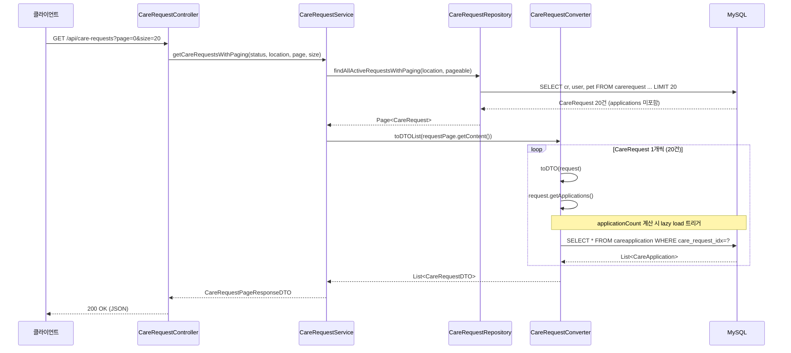
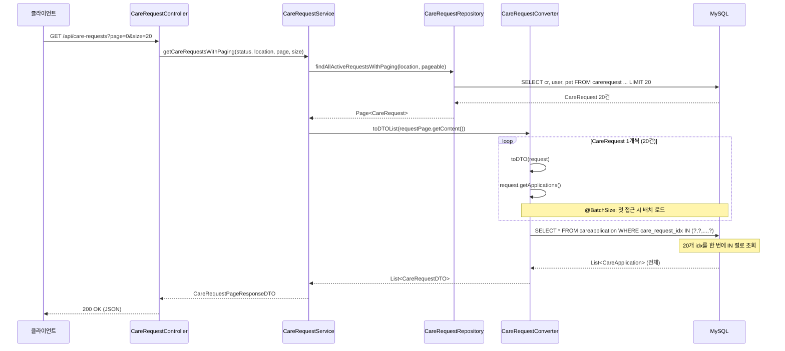

# 펫케어 요청 목록 조회 (페이징) N+1 쿼리 문제

## 개요

펫케어 요청 목록 API에 **페이징**이 적용된 후, 페이징 쿼리 경로에서 N+1 문제가 발생합니다.
비페이징 경로(`findAllActiveRequests` 등)는 이미 `LEFT JOIN FETCH cr.applications`로 최적화되어 있으나,
**페이징 쿼리**에는 해당 fetch가 누락되어 있습니다.

> **관련 문서**: 비페이징 경로 분석은 `care-request-n-plus-one-analysis.md` 참조

---

## 문제 상황

### 발생 시점

`GET /api/care-requests` (페이징 파라미터 `page`, `size` 포함) 또는  
`GET /api/care-requests/search` 호출 시

### 실제 Hibernate 로그 예시

```
Hibernate: select u1_0.idx,... from users u1_0 where u1_0.id=?
Hibernate: select cr1_0.idx,... from carerequest cr1_0 
           join users u1_0 on u1_0.idx=cr1_0.user_idx 
           left join pets p1_0 on p1_0.idx=cr1_0.pet_idx 
           where cr1_0.is_deleted=0 and u1_0.is_deleted=0 and u1_0.status='ACTIVE' 
           and (? is null or ?='' or u1_0.location like concat('%',?,'%') escape '') 
           order by cr1_0.created_at desc, cr1_0.created_at desc limit ?
Hibernate: select count(cr1_0.idx) from carerequest cr1_0 join users u1_0 ...
Hibernate: select af1_0.idx,... from file af1_0 where af1_0.target_type=? and af1_0.target_idx in (?)
Hibernate: select v1_0.pet_idx,... from pet_vaccinations v1_0 where v1_0.pet_idx=?
Hibernate: select a1_0.care_request_idx,... from careapplication a1_0 where a1_0.care_request_idx=?  (20번 반복)
```

### 쿼리별 원인

| 쿼리 | 원인 |
|------|------|
| `users` (id=?) | 인증/세션 등 사용자 조회 |
| `carerequest` + `count` | 페이징 목록 조회 (정상) |
| `file` | Pet 첨부파일 조회 (PetConverter 배치 변환) |
| `pet_vaccinations` | Pet 엔티티의 vaccinations lazy load (@BatchSize 적용 시 배치 조회) |
| **`careapplication` × N** | **CareRequest의 applications lazy load → N+1** |

---

## 원인 분석

### 1. 페이징 쿼리에 applications fetch 누락

**위치**: `SpringDataJpaCareRequestRepository.java` (82~95행)

```java
// 페이징 - 전체 조회 (applications fetch 없음)
@Query(value = "SELECT cr FROM CareRequest cr JOIN FETCH cr.user u LEFT JOIN FETCH cr.pet " +
       "WHERE cr.isDeleted = false AND u.isDeleted = false AND u.status = 'ACTIVE' ... " +
       "ORDER BY cr.createdAt DESC",
       countQuery = "...")
Page<CareRequest> findAllActiveRequestsWithPaging(@Param("location") String location, Pageable pageable);

// 페이징 - 상태별 조회 (applications fetch 없음)
Page<CareRequest> findByStatusAndIsDeletedFalseWithPaging(...);

// 페이징 - 검색 (applications fetch 없음)
Page<CareRequest> searchWithPaging(@Param("keyword") String keyword, Pageable pageable);
```

비페이징 쿼리(`findAllActiveRequests`, `findByStatusAndIsDeletedFalse` 등)에는  
`LEFT JOIN FETCH cr.applications`가 있으나, **페이징 쿼리에는 없음**.

### 2. Converter에서 applications 접근

**위치**: `CareRequestConverter.toDTO()` (45행, 59~62행)

```java
// applicationCount 계산 시 getApplications() 호출 → lazy load
.applicationCount(request.getApplications() != null ? request.getApplications().size() : 0)

// applications 리스트 변환 시에도 접근
if (request.getApplications() != null && !request.getApplications().isEmpty()) {
    builder.applications(request.getApplications().stream()
            .map(careApplicationConverter::toDTO)
            .collect(Collectors.toList()));
}
```

### 3. 호출 흐름

```
CareRequestController (GET /api/care-requests?page=0&size=20)
  → CareRequestService.getCareRequestsWithPaging()
  → careRequestRepository.findAllActiveRequestsWithPaging()  // applications 미 fetch
  → careRequestConverter.toDTOList(requestPage.getContent())
  → toDTO(request) 내 request.getApplications()  // lazy load → N번 쿼리
```

### 4. 시퀀스 다이어그램 (N+1 발생 흐름)



**요약**: 메인 쿼리 1번 + count 1번 + careapplication N번 → **총 2+N번** DB 왕복

---

## 영향

- **페이지당 20건**: careapplication 쿼리 20번
- **페이지당 50건**: careapplication 쿼리 50번
- **페이지당 100건**: careapplication 쿼리 100번

---

## 해결 방안

### 시퀀스 다이어그램 (해결 후: @BatchSize 적용)



**요약**: 메인 쿼리 1번 + count 1번 + careapplication **1번** (배치) → **총 3번** DB 왕복

---

### 방안 1: @BatchSize 적용 (권장)

**위치**: `CareRequest.java`

```java
@OneToMany(mappedBy = "careRequest", cascade = CascadeType.ALL)
@BatchSize(size = 50)  // 추가
private List<CareApplication> applications;
```

- Pet의 vaccinations에 적용된 것과 동일한 패턴
- applications 접근 시 최대 50개씩 배치 조회
- 페이징 크기(20, 50, 100)에 맞게 size 조정 가능

### 방안 2: 페이징 쿼리에 JOIN FETCH 추가

Page + OneToMany JOIN FETCH 조합 시 주의사항:
- `DISTINCT` 필요 (중복 행 방지)
- count 쿼리는 별도 유지
- Hibernate/Spring Data JPA 버전에 따라 페이징 + collection fetch 제약 있을 수 있음

```java
@Query(value = "SELECT DISTINCT cr FROM CareRequest cr " +
       "JOIN FETCH cr.user u LEFT JOIN FETCH cr.pet LEFT JOIN FETCH cr.applications " +
       "WHERE ... ORDER BY cr.createdAt DESC",
       countQuery = "SELECT COUNT(DISTINCT cr) FROM CareRequest cr JOIN cr.user u WHERE ...")
Page<CareRequest> findAllActiveRequestsWithPaging(@Param("location") String location, Pageable pageable);
```

### 방안 3: 목록용 DTO 분리

목록에서는 `applicationCount`만 필요하고 `applications` 상세는 불필요한 경우:
- 별도 `CareRequestListDTO` 사용
- `applicationCount`를 서브쿼리 또는 별도 배치 조회로 계산

---

## 체크리스트

- [x] CareRequest 엔티티에 `@BatchSize` 적용
- [ ] 또는 페이징 쿼리에 `LEFT JOIN FETCH cr.applications` 추가
- [ ] Hibernate 로그로 careapplication 쿼리 수 감소 확인
