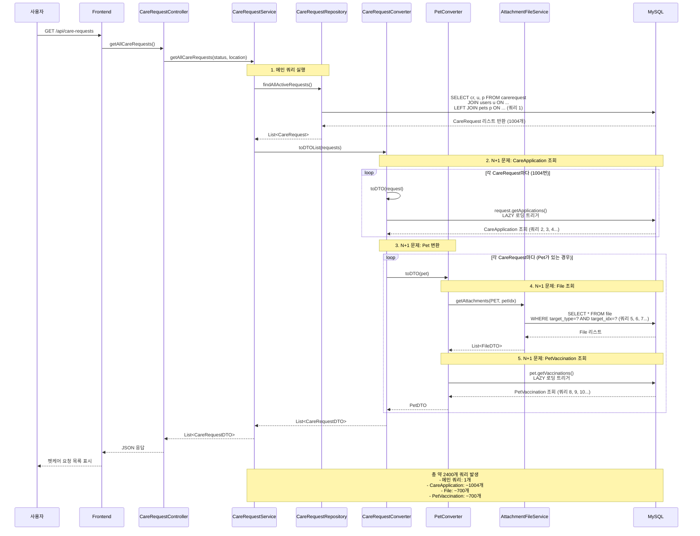
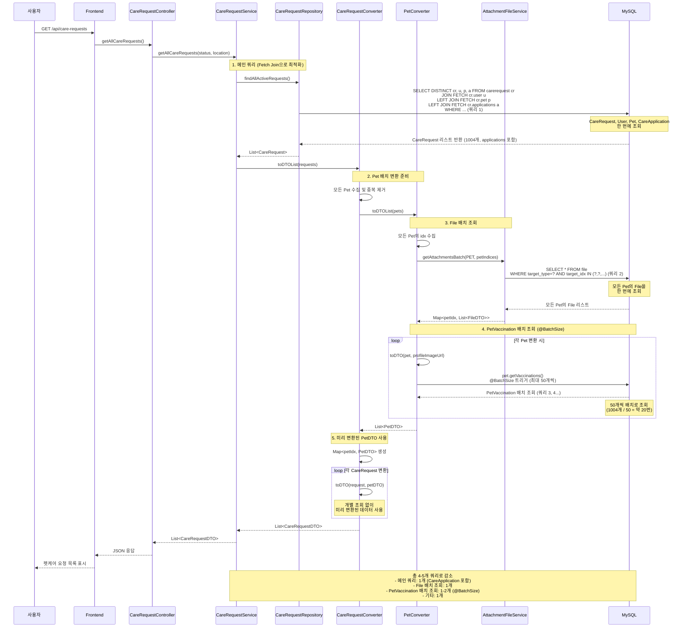

# 펫케어 요청 조회 시퀀스 다이어그램

## 포트폴리오용 간결 버전

### 최적화 전 (N+1 문제 발생)

```javascript
// 시퀀스 다이어그램 (최적화 전)
const beforeOptimizationSequence = `sequenceDiagram
    participant User as 사용자
    participant Frontend as Frontend
    participant Service as CareRequestService
    participant Repo as CareRequestRepository
    participant Converter as CareRequestConverter
    participant PetConverter as PetConverter
    participant FileService as AttachmentFileService
    participant DB as MySQL
    
    User->>Frontend: GET /api/care-requests
    Frontend->>Service: getAllCareRequests()
    Service->>Repo: findAllActiveRequests()
    Repo->>DB: 메인 쿼리 (CareRequest, User, Pet) (1)
    DB-->>Repo: 1004개 CareRequest 반환
    
    Note over Service,DB: N+1 문제 발생
    loop 각 CareRequest마다 (1004번)
        Converter->>DB: getApplications() (2, 3, 4...)
        DB-->>Converter: CareApplication 개별 조회
    end
    
    loop 각 Pet마다 (~700번)
        PetConverter->>FileService: getAttachments(PET, petIdx) (5, 6, 7...)
        FileService->>DB: File 개별 조회
        PetConverter->>DB: getVaccinations() (8, 9, 10...)
        DB-->>PetConverter: PetVaccination 개별 조회
    end
    
    Service-->>Frontend: List<CareRequestDTO>
    Frontend-->>User: 펫케어 요청 목록 표시
    
    Note over Service,DB: 총 ~2400개 쿼리 발생`;
```

### 최적화 후 (N+1 문제 해결)

```javascript
// 시퀀스 다이어그램 (최적화 후)
const afterOptimizationSequence = `sequenceDiagram
    participant User as 사용자
    participant Frontend as Frontend
    participant Service as CareRequestService
    participant Repo as CareRequestRepository
    participant Converter as CareRequestConverter
    participant PetConverter as PetConverter
    participant FileService as AttachmentFileService
    participant DB as MySQL
    
    User->>Frontend: GET /api/care-requests
    Frontend->>Service: getAllCareRequests()
    Service->>Repo: findAllActiveRequests()
    Note over Repo,DB: Fetch Join으로 한 번에 조회
    Repo->>DB: 메인 쿼리 (CareRequest, User, Pet, CareApplication) (1)
    DB-->>Repo: 1004개 CareRequest 반환 (applications 포함)
    
    Note over Service,DB: 배치 조회로 최적화
    Converter->>PetConverter: toDTOList(pets)
    PetConverter->>FileService: getAttachmentsBatch(PET, petIndices) (2)
    FileService->>DB: File 배치 조회 (IN 절)
    DB-->>FileService: 모든 Pet의 File 한 번에 조회
    
    Note over PetConverter,DB: @BatchSize로 배치 조회
    PetConverter->>DB: PetVaccination 배치 조회 (3, 4...)
    Note over DB: 50개씩 배치로 조회 (약 20번)
    DB-->>PetConverter: PetVaccination 배치 조회 결과
    
    Converter->>Converter: 미리 변환된 PetDTO 사용
    Service-->>Frontend: List<CareRequestDTO>
    Frontend-->>User: 펫케어 요청 목록 표시
    
    Note over Service,DB: 총 4-5개 쿼리로 감소<br/>99.8% 쿼리 수 감소`;
```

---

## 상세 버전 (문서용)

### 최적화 전 (N+1 문제 발생)



## 최적화 후 (N+1 문제 해결)



## 최적화 핵심 포인트

### 1단계: CareApplication N+1 해결
- **문제**: 각 CareRequest마다 `getApplications()` 호출 시 LAZY 로딩으로 개별 쿼리 발생
- **해결**: Repository 쿼리에 `LEFT JOIN FETCH cr.applications` 추가
- **효과**: 1004개 쿼리 → 0개 (메인 쿼리에 포함)

### 2단계: File N+1 해결
- **문제**: 각 Pet마다 `getAttachments()` 호출로 개별 쿼리 발생
- **해결**: `PetConverter.toDTOList()`에서 `getAttachmentsBatch()` 사용
- **효과**: ~700개 쿼리 → 1개 (배치 조회)

### 3단계: PetVaccination N+1 해결
- **문제**: 각 Pet마다 `getVaccinations()` 호출 시 LAZY 로딩으로 개별 쿼리 발생
- **해결**: `@BatchSize(size = 50)` 어노테이션 사용
- **효과**: ~700개 쿼리 → 1-2개 (배치 조회, 50개씩)

## 성능 개선 결과

| 항목 | 최적화 전 | 최적화 후 | 개선율 |
|------|----------|----------|--------|
| **쿼리 수** | ~2400개 | 4-5개 | **99.8% 감소** |
| **실행 시간** | 1084ms | 66ms | **94% 감소** |
| **메모리 사용** | 21MB | 6MB | **71% 감소** |
| **네트워크 왕복** | 2400번 | 4-5번 | **99.8% 감소** |

## 기술 스택

- **Backend**: Spring Boot 3.5.7, JPA/Hibernate
- **Database**: MySQL
- **최적화 기법**: 
  - Fetch Join (LEFT JOIN FETCH)
  - 배치 조회 (Batch Fetching)
  - @BatchSize 어노테이션
  - DISTINCT를 활용한 중복 제거

