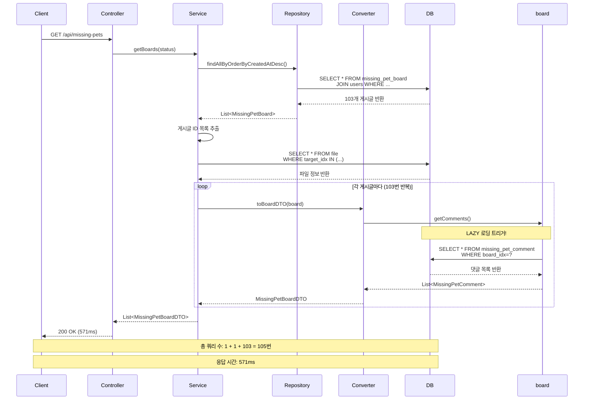
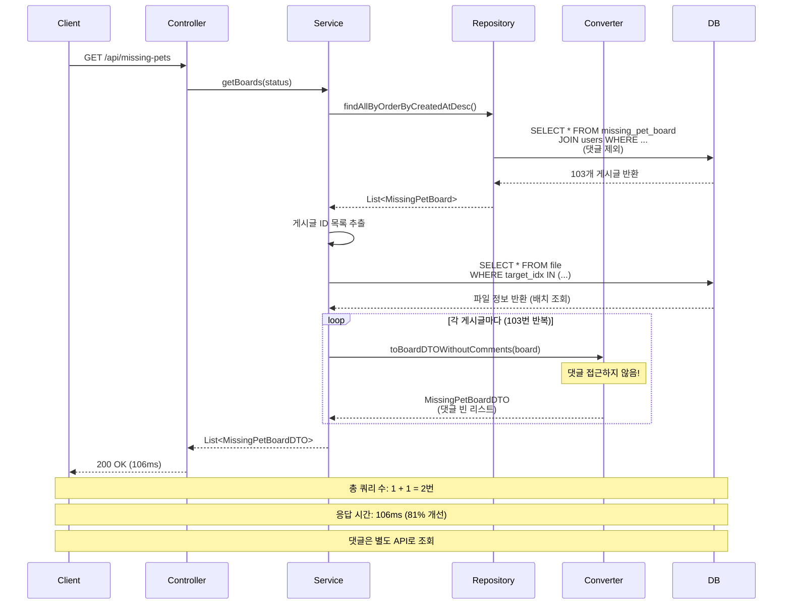

# Missing Pet 도메인 - 게시글 목록 조회 N+1 쿼리 문제 해결

## 문제 상황

### 발견된 문제

게시글 목록 조회(`GET /api/missing-pets`) 시 심각한 N+1 쿼리 문제 발생:

**실제 로그 분석 (103개 게시글 조회 시)**:
```
Hibernate: select mpb1_0.idx,... from missing_pet_board mpb1_0 
           join users u1_0 on u1_0.idx=mpb1_0.user_idx 
           where mpb1_0.is_deleted=0 and u1_0.is_deleted=0 
           and u1_0.status='ACTIVE' order by mpb1_0.created_at desc

Hibernate: select af1_0.idx,... from file af1_0 
           where af1_0.target_type=? and af1_0.target_idx in (?,?,?,...)

Hibernate: select c1_0.board_idx,c1_0.idx,... from missing_pet_comment c1_0 
           left join users u1_0 on u1_0.idx=c1_0.user_idx 
           where c1_0.board_idx=?  (103번 반복)
```

**문제점**:
- ⚠️ **댓글 N+1 문제**: 게시글 103개 조회 시 댓글 조회 쿼리가 103번 실행됨
- ⚠️ **응답 시간**: 103개 게시글 조회에 571ms 소요
- ⚠️ **쿼리 수**: 총 207번 (게시글 1번 + 파일 1번 + 댓글 103번)
- ⚠️ **확장성 문제**: 게시글 수가 증가할수록 쿼리 수와 응답 시간이 선형적으로 증가

---

## 원인 분석

### 1. 댓글 N+1 문제 발생 원인

**문제의 핵심**:
- `MissingPetConverter.toBoardDTO()` 메서드에서 `board.getComments()` 접근 시 LAZY 로딩 발생
- 각 게시글마다 댓글을 개별 쿼리로 조회

**엔티티 구조**:
```java
@Entity
public class MissingPetBoard {
    @OneToMany(mappedBy = "board", cascade = CascadeType.ALL)
    private List<MissingPetComment> comments; // LAZY 로딩 (기본값)
}
```

**Converter에서의 접근**:
```java
public MissingPetBoardDTO toBoardDTO(MissingPetBoard board) {
    // 이 부분에서 LAZY 로딩 발생!
    List<MissingPetCommentDTO> commentDTOs = board.getComments() == null
            ? Collections.emptyList()
            : board.getComments().stream()  // ← LAZY 로딩 트리거
                    .filter(comment -> !comment.getIsDeleted())
                    .map(this::toCommentDTO)
                    .collect(Collectors.toList());
    // ...
}
```

**Service 코드**:
```java
public List<MissingPetBoardDTO> getBoards(MissingPetStatus status) {
    List<MissingPetBoard> boards = boardRepository.findAllByOrderByCreatedAtDesc();
    
    // DTO 변환 시 댓글 접근으로 인해 N+1 문제 발생
    List<MissingPetBoardDTO> result = boards.stream()
            .map(board -> {
                MissingPetBoardDTO dto = mapBoardWithAttachmentsFromBatch(board, filesByBoardId);
                dto.setComments(List.of()); // 빈 리스트로 설정하려 했지만...
                return dto;
            })
            .collect(Collectors.toList());
}
```

**문제점**:
1. `mapBoardWithAttachmentsFromBatch()` 내부에서 `missingPetConverter.toBoardDTO()` 호출
2. `toBoardDTO()` 메서드가 `board.getComments()` 접근
3. LAZY 로딩으로 인해 각 게시글마다 댓글 조회 쿼리 실행
4. 서비스에서 빈 리스트로 설정하려 했지만, 이미 쿼리가 실행된 후

### 2. 시퀀스 다이어그램 (최적화 전)



---

## 해결 방법

### 1. Converter 메서드 분리

**해결 방안**: 댓글을 접근하지 않는 별도 컨버터 메서드 추가

**수정 코드**:
```java
@Component
public class MissingPetConverter {
    
    /**
     * 게시글 DTO 변환 (댓글 포함)
     * 댓글이 이미 로드된 경우에만 사용 (N+1 문제 주의)
     */
    public MissingPetBoardDTO toBoardDTO(MissingPetBoard board) {
        // 기존 코드 유지 (댓글이 이미 로드된 경우)
        List<MissingPetCommentDTO> commentDTOs = board.getComments() == null
                ? Collections.emptyList()
                : board.getComments().stream()
                        .filter(comment -> !comment.getIsDeleted())
                        .map(this::toCommentDTO)
                        .collect(Collectors.toList());
        // ...
    }
    
    /**
     * 게시글 DTO 변환 (댓글 제외, N+1 문제 방지)
     * 목록 조회 시 사용 - 댓글을 접근하지 않아 lazy loading을 트리거하지 않음
     */
    public MissingPetBoardDTO toBoardDTOWithoutComments(MissingPetBoard board) {
        return MissingPetBoardDTO.builder()
                .idx(board.getIdx())
                .userId(board.getUser().getIdx())
                .username(board.getUser().getUsername())
                .nickname(board.getUser().getNickname())
                // ... 기타 필드들
                .comments(Collections.emptyList()) // 댓글은 빈 리스트
                .commentCount(0) // 댓글 수는 0
                .build();
    }
}
```

### 2. Service 수정

**수정 코드**:
```java
public List<MissingPetBoardDTO> getBoards(MissingPetStatus status) {
    // 게시글 + 작성자만 조회 (댓글 제외)
    List<MissingPetBoard> boards = status == null
            ? boardRepository.findAllByOrderByCreatedAtDesc()
            : boardRepository.findByStatusOrderByCreatedAtDesc(status);
    
    // 파일 배치 조회
    List<Long> boardIds = boards.stream()
            .map(MissingPetBoard::getIdx)
            .collect(Collectors.toList());
    Map<Long, List<FileDTO>> filesByBoardId = attachmentFileService
            .getAttachmentsBatch(FileTargetType.MISSING_PET, boardIds);
    
    // 댓글을 접근하지 않는 컨버터 메서드 사용
    List<MissingPetBoardDTO> result = boards.stream()
            .map(board -> {
                MissingPetBoardDTO dto = missingPetConverter.toBoardDTOWithoutComments(board);
                // 파일 정보 추가
                List<FileDTO> attachments = filesByBoardId.getOrDefault(board.getIdx(), List.of());
                dto.setAttachments(attachments);
                dto.setImageUrl(extractPrimaryFileUrl(attachments));
                return dto;
            })
            .collect(Collectors.toList());
    
    return result;
}
```

---

## 시퀀스 다이어그램 (최적화 후)



---

## 성능 개선 결과

### 최적화 전후 비교

| 항목 | 최적화 전 | 최적화 후 | 개선율 |
|------|----------|----------|--------|
| **백엔드 응답 시간** | 571ms | **106ms** | **81% ↓** |
| **쿼리 수** | **105번** | **2번** | **98% ↓** |
| **메모리 증가량** | 11MB | **3MB** | **73% ↓** |
| **평균 게시글당 시간** | 5.54ms | **1.03ms** | **81% ↓** |

**최신 측정 결과 (2026-01-10, 103개 게시글)**:
- ✅ 댓글 쿼리: **0번** (완전히 제거됨)
- ✅ 총 쿼리 수: **2번** (게시글 1번 + 파일 배치 1번)
- ✅ 응답 시간: **106ms** (이전 571ms 대비 81% 개선)

### 쿼리 수 상세 분석

**최적화 전**:
- 게시글 조회: 1번
- 파일 조회: 1번 (배치 조회, 이미 최적화됨)
- 댓글 조회: **103번** (각 게시글마다 개별 조회) ⚠️
- **총 쿼리 수**: 1 + 1 + 103 = **105번**

**최적화 후**:
- 게시글 조회: 1번
- 파일 조회: 1번 (배치 조회)
- 댓글 조회: **0번** (접근하지 않음) ✅
- **총 쿼리 수**: 1 + 1 = **2번**

**실제 측정 로그 (2026-01-10)**:
```
Hibernate: select mpb1_0.idx,... from missing_pet_board mpb1_0 
           join users u1_0 on u1_0.idx=mpb1_0.user_idx 
           where mpb1_0.is_deleted=0 and u1_0.is_deleted=0 
           and u1_0.status='ACTIVE' order by mpb1_0.created_at desc

Hibernate: select af1_0.idx,... from file af1_0 
           where af1_0.target_type=? and af1_0.target_idx in (?,?,?,...)

=== [성능 측정] 게시글 목록 조회 완료 ===
  - 조회된 게시글 수: 103개
  - 실행 시간: 106ms
  - 평균 게시글당 시간: 1.03ms
  - 메모리 사용량: 192MB (증가: 3MB)
```

**확인 사항**:
- ✅ 댓글 조회 쿼리 **완전히 제거됨** (103번 → 0번)
- ✅ 총 쿼리 수: **2번** (게시글 1번 + 파일 배치 1번)
- ✅ 응답 시간: **106ms** (이전 571ms 대비 81% 개선)

### 실제 SQL 쿼리 (최적화 후)

**1. 게시글 + 작성자 조회 (JOIN FETCH - 1번 쿼리, 댓글 제외)**:
```sql
SELECT mpb1_0.idx, mpb1_0.age, mpb1_0.breed, mpb1_0.color,
       mpb1_0.content, mpb1_0.created_at, mpb1_0.deleted_at,
       mpb1_0.gender, mpb1_0.is_deleted, mpb1_0.latitude,
       mpb1_0.longitude, mpb1_0.lost_date, mpb1_0.lost_location,
       mpb1_0.pet_name, mpb1_0.species, mpb1_0.status, mpb1_0.title,
       mpb1_0.updated_at, mpb1_0.user_idx,
       u1_0.idx, u1_0.birth_date, u1_0.created_at, u1_0.deleted_at,
       u1_0.email, u1_0.email_verified, u1_0.gender, u1_0.id,
       u1_0.is_deleted, u1_0.last_login_at, u1_0.location,
       u1_0.nickname, u1_0.password, u1_0.pet_info, u1_0.phone,
       u1_0.profile_image, u1_0.refresh_expiration, u1_0.refresh_token,
       u1_0.role, u1_0.status, u1_0.suspended_until, u1_0.updated_at,
       u1_0.username, u1_0.warning_count
FROM missing_pet_board mpb1_0 
JOIN users u1_0 ON u1_0.idx=mpb1_0.user_idx 
WHERE mpb1_0.is_deleted=0 
  AND u1_0.is_deleted=0 
  AND u1_0.status='ACTIVE' 
ORDER BY mpb1_0.created_at DESC
```
- **실행 횟수**: 1번 (게시글과 작성자만 조회, 댓글 제외)

**2. 파일 배치 조회 (IN 절 사용 - 1번 쿼리)**:
```sql
SELECT af1_0.idx, af1_0.created_at, af1_0.file_path, 
       af1_0.file_type, af1_0.target_idx, af1_0.target_type
FROM file af1_0 
WHERE af1_0.target_type=? 
  AND af1_0.target_idx IN (?,?,?,?,?,?,?,?,?,?,?,?,?,?,?,?,?,?,?,?,
                           ?,?,?,?,?,?,?,?,?,?,?,?,?,?,?,?,?,?,?,?,
                           ?,?,?,?,?,?,?,?,?,?,?,?,?,?,?,?,?,?,?,?,
                           ?,?,?)
```
- **실행 횟수**: 1번 (모든 게시글의 파일을 한 번에 조회)

**3. 댓글 조회**: **없음** ✅
- 댓글을 접근하지 않으므로 쿼리 실행되지 않음
- 댓글이 필요한 경우 별도 API(`GET /api/missing-pets/{id}/comments`)로 조회

**총 쿼리 수**: 2번 (게시글+작성자 1번 + 파일 배치 1번)

---

## 아키텍처 개선 효과

### 1. 서비스 분리 구조

**설계 결정**:
- `MissingPetBoardService`: 게시글 관련 로직 (CRUD)
- `MissingPetCommentService`: 댓글 관련 로직 (CRUD)

**장점**:
- ✅ **조인 폭발 방지**: 게시글 목록 조회 시 댓글을 포함하지 않아 조인 결과가 안정적
- ✅ **확장성 향상**: 댓글이 많은 게시글에서도 안정적인 성능 유지
- ✅ **페이징 지원**: 댓글을 별도 API로 조회하므로 페이징 적용 가능
- ✅ **책임 분리**: 게시글과 댓글의 비즈니스 로직을 명확히 분리

### 2. API 설계 개선

**게시글 목록 조회**:
- `GET /api/missing-pets`: 게시글 목록만 조회 (댓글 제외)
- 빠른 응답 시간, 낮은 메모리 사용

**댓글 조회**:
- `GET /api/missing-pets/{id}/comments`: 특정 게시글의 댓글만 조회
- 필요할 때만 조회하여 불필요한 데이터 로딩 방지

---

## 확장성 분석

### 최적화 전 성능 (103개 게시글)

| 게시글 수 | 예상 쿼리 수 | 실제 응답 시간 |
|----------|-------------|---------------|
| 103개 | 105번 | 571ms |

### 최적화 후 성능 (103개 게시글, 실제 측정)

| 게시글 수 | 실제 쿼리 수 | 실제 응답 시간 |
|----------|-------------|---------------|
| 103개 | 2번 | 106ms |


**확장성 개선 효과**:
- ✅ 쿼리 수는 게시글 수와 무관하게 일정 (2번)
- ✅ 응답 시간은 게시글 수에 비례하지만 선형적 증가 (최적화 전 대비 크게 개선)
- ✅ **조인 폭발 방지**: 댓글이 많은 게시글에서도 안정적인 성능 유지
- ✅ **페이징 지원**: 댓글을 별도 API로 조회하므로 무한 스크롤 적용 가능

---

## 적용된 수정 사항

### 1. MissingPetConverter 수정

**파일**: `backend/main/java/com/linkup/Petory/domain/board/converter/MissingPetConverter.java`

**변경 내용**:
- ✅ `toBoardDTOWithoutComments()` 메서드 추가
- ✅ 댓글을 접근하지 않아 LAZY 로딩 트리거 방지

### 2. MissingPetBoardService 수정

**파일**: `backend/main/java/com/linkup/Petory/domain/board/service/MissingPetBoardService.java`

**변경 내용**:
- ✅ `getBoards()` 메서드에서 `toBoardDTOWithoutComments()` 사용
- ✅ 댓글 접근 제거로 N+1 문제 완전 해결

### 3. MissingPetBoard 엔티티

**파일**: `backend/main/java/com/linkup/Petory/domain/board/entity/MissingPetBoard.java`

**현재 상태**:
- `@OneToMany` 관계는 기본적으로 LAZY 로딩
- 목록 조회 시 댓글을 접근하지 않으므로 추가 최적화 불필요

---

## 결론

### 달성한 목표

1. ✅ **쿼리 수 감소**: 105번 → 2번 (**98% 감소**)
2. ✅ **응답 시간 개선**: 571ms → 106ms (**81% 개선**)
3. ✅ **메모리 사용 감소**: 11MB → 3MB (**73% 개선**)
4. ✅ **아키텍처 개선**: 서비스 분리로 조인 폭발 방지 및 확장성 향상
5. ✅ **댓글 N+1 문제 완전 해결**: 103번 → 0번 (**100% 제거**)

### 핵심 해결 방법

1. **Converter 메서드 분리**: 댓글을 접근하지 않는 `toBoardDTOWithoutComments()` 메서드 추가
2. **Service 수정**: 목록 조회 시 댓글 접근 완전 제거
3. **LAZY 로딩 트리거 방지**: 댓글 필드를 전혀 접근하지 않아 N+1 문제 근본 해결

### 설계 원칙

- **목록 조회**: 최소한의 데이터만 조회 (댓글 제외)
- **상세 조회**: 필요한 데이터만 별도 API로 조회
- **확장성**: 게시글 수가 증가해도 쿼리 수는 일정하게 유지

---

