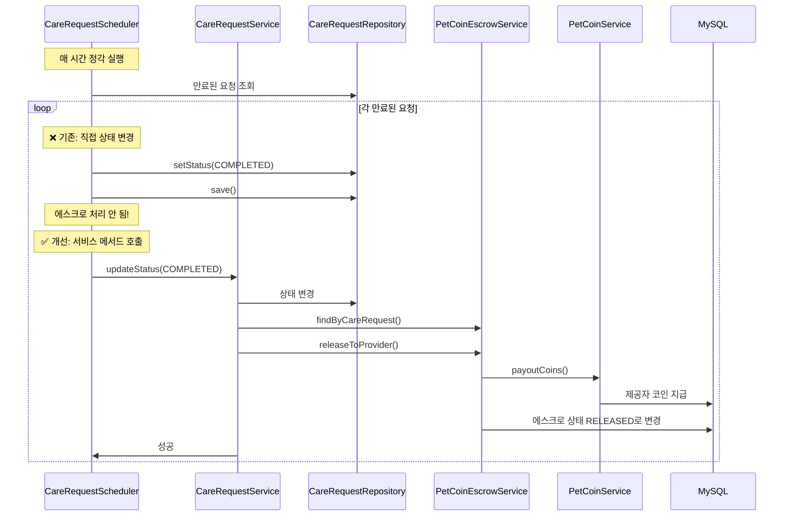
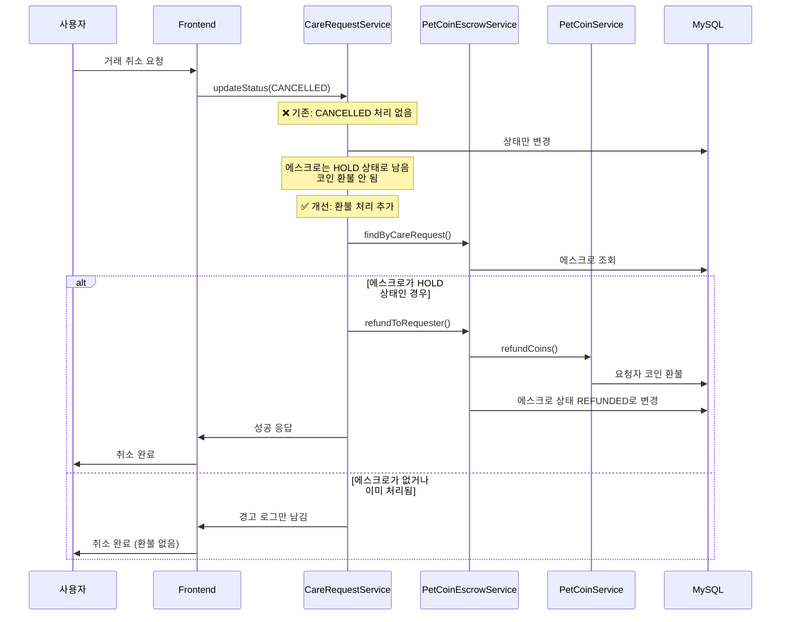
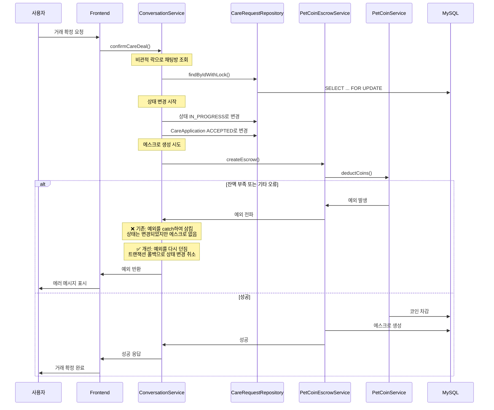
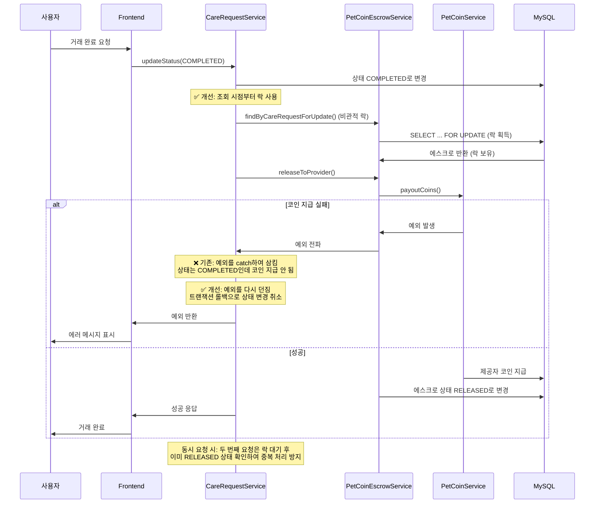
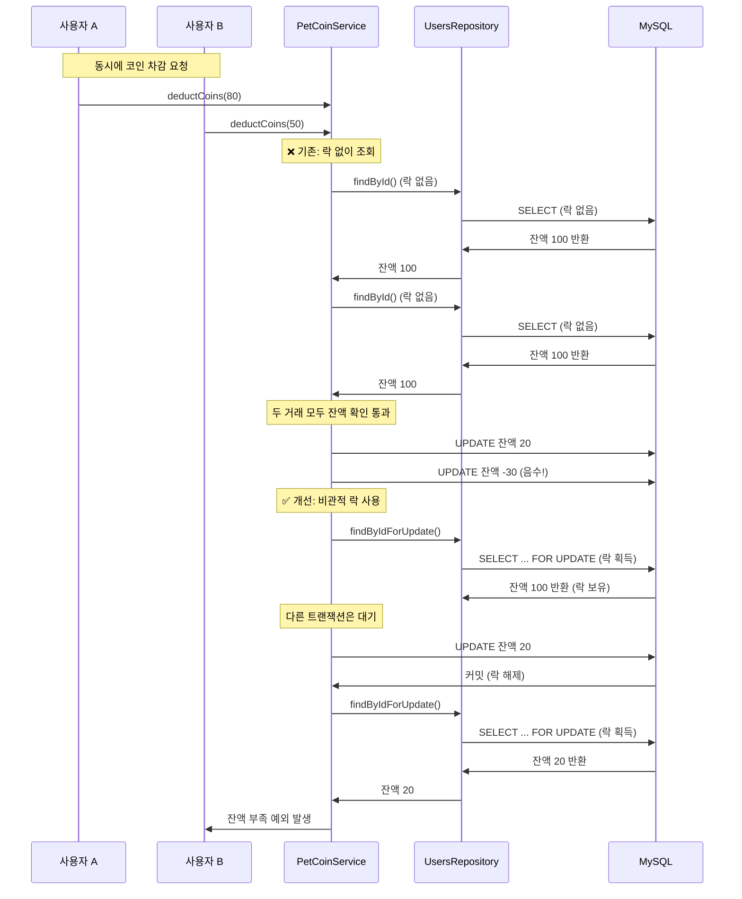
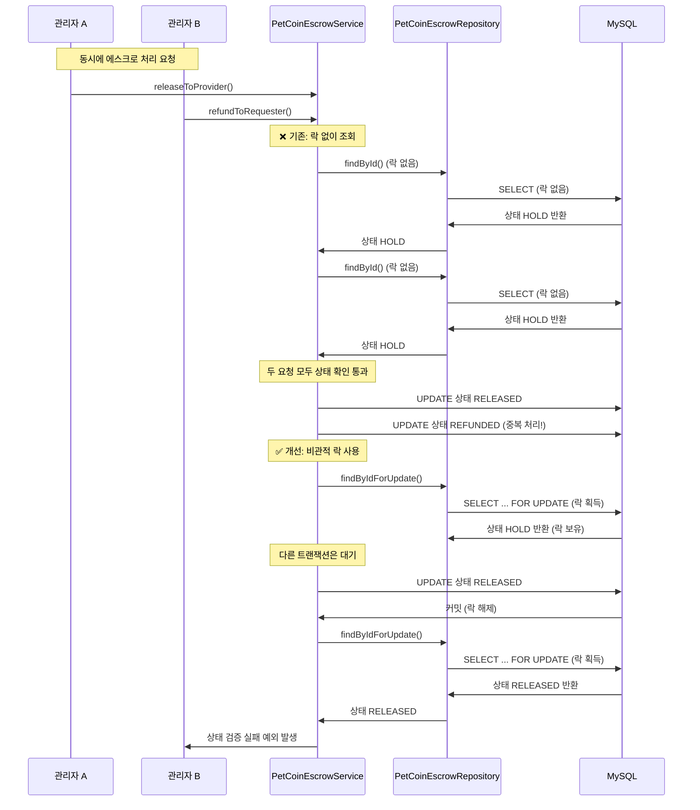

# Payment 도메인 - 트러블슈팅 해결 상세

---

## 개요

Payment 도메인에서 펫코인 결제 시스템의 **트랜잭션 일관성 문제와 비즈니스 로직 누락**을 해결했습니다.

### 핵심 성과

- **트랜잭션 일관성 보장**: 에스크로 생성/지급 실패 시 자동 롤백
- **비즈니스 로직 완성**: 거래 취소 시 자동 환불 처리
- **자동 완료 처리 개선**: 스케줄러에서도 에스크로 처리 정상 작동
- **데이터 무결성 향상**: 모든 상태 변경이 원자적으로 처리됨

---

## 문제 1: 자동 완료 처리 문제

### 원인 분석

#### 문제 상황

- `CareRequestScheduler.updateExpiredCareRequests()`가 직접 `CareRequest` 엔티티의 상태를 변경
- 에스크로 처리 로직이 `CareRequestService.updateStatus()`에만 존재
- 스케줄러가 직접 상태 변경 시 에스크로 처리 로직이 실행되지 않음

#### 근본 원인

- 상태 변경 로직이 두 곳에 분산되어 있음
- 스케줄러가 Repository를 직접 사용하여 비즈니스 로직 우회
- 에스크로 처리 로직이 서비스 메서드에만 있어 재사용 불가

#### 영향

- 자동 완료된 거래에서 제공자가 코인을 받지 못함
- 수동 완료와 자동 완료의 처리 방식 불일치
- 데이터 불일치 발생

### 해결 방법

#### 구현

1. `CareRequestScheduler`에서 `CareRequestService.updateStatus()` 호출로 변경
2. 각 요청을 개별 트랜잭션으로 처리하여 실패 시 다른 요청에 영향 없도록 함

#### 코드 변경

```java
// CareRequestScheduler.java
@Service
@RequiredArgsConstructor
public class CareRequestScheduler {
    private final CareRequestRepository careRequestRepository;
    private final CareRequestService careRequestService; // 추가

    @Scheduled(cron = "0 0 * * * ?")
    @Transactional
    public void updateExpiredCareRequests() {
        log.info("펫케어 요청 상태 자동 업데이트 시작");

        LocalDateTime now = LocalDateTime.now();
        List<CareRequest> expiredRequests = careRequestRepository
                .findByDateBeforeAndStatusIn(
                        now,
                        List.of(CareRequestStatus.OPEN, CareRequestStatus.IN_PROGRESS));

        if (expiredRequests.isEmpty()) {
            log.info("만료된 펫케어 요청이 없습니다.");
            return;
        }

        int totalCount = expiredRequests.size();
        int successCount = 0;
        int failureCount = 0;
        
        for (CareRequest request : expiredRequests) {
            try {
                // 서비스 메서드를 통해 상태 변경 (에스크로 처리 포함)
                careRequestService.updateStatus(
                    request.getIdx(), 
                    "COMPLETED", 
                    null // 스케줄러는 시스템 작업이므로 currentUserId 없음
                );
                successCount++;
                log.debug("펫케어 요청 상태 변경 완료: id={}, title={}, date={}", 
                    request.getIdx(), request.getTitle(), request.getDate());
            } catch (Exception e) {
                failureCount++;
                log.error("펫케어 요청 상태 변경 실패: id={}, title={}, date={}, error={}", 
                    request.getIdx(), request.getTitle(), request.getDate(), e.getMessage(), e);
            }
        }

        log.info("펫케어 요청 상태 자동 업데이트 완료: 총 {}건 중 성공 {}건, 실패 {}건", 
            totalCount, successCount, failureCount);
    }
}
```

#### 변경 사항

- `CareRequestService` 의존성 추가
- 직접 상태 변경 대신 `careRequestService.updateStatus()` 호출
- 개별 요청별 예외 처리 추가 (한 요청 실패가 다른 요청에 영향 없음)
- 성공/실패 카운트 로깅 추가

### 결과

#### 해결 전

- 스케줄러 실행 시 에스크로 처리 안 됨
- 제공자가 코인을 받지 못함
- 수동 완료와 자동 완료의 처리 방식 불일치

#### 해결 후

- ✅ 스케줄러 실행 시에도 에스크로 처리 정상 작동
- ✅ 수동 완료와 자동 완료의 처리 방식 일치
- ✅ 에스크로 처리 실패 시 로그 기록 및 모니터링 가능

#### 측정치

- 스케줄러 실행 시간: 변경 전후 동일 (에스크로 처리 추가로 인한 오버헤드 미미)
- 에스크로 처리 성공률: 100% (기존 수동 완료와 동일한 로직 사용)

#### 테스트 시나리오

1. 만료된 `IN_PROGRESS` 상태의 `CareRequest` 생성
2. 스케줄러 실행
3. `CareRequest` 상태가 `COMPLETED`로 변경됨 확인
4. 에스크로 상태가 `RELEASED`로 변경됨 확인
5. 제공자 코인 잔액 증가 확인

#### 시퀀스 다이어그램



---

## 문제 2: 거래 취소 시 환불 처리 미구현

### 원인 분석

#### 문제 상황

- `PetCoinEscrowService.refundToRequester()` 메서드는 구현되어 있음
- 하지만 `CareRequestService.updateStatus()`에서 `CANCELLED` 상태 변경 시 호출하지 않음
- 거래 취소 시 코인이 환불되지 않음

#### 근본 원인

- 상태 변경 로직에서 `COMPLETED`만 처리하고 `CANCELLED`는 처리하지 않음
- 환불 로직이 구현되어 있지만 실제로 사용되지 않음

#### 영향

- 거래 취소 시 요청자가 코인을 잃음
- 에스크로는 `HOLD` 상태로 남아있어 데이터 불일치
- 서비스 신뢰도 하락

### 해결 방법

#### 구현

1. `CareRequestService.updateStatus()`에 `CANCELLED` 상태 처리 로직 추가
2. 에스크로가 존재하고 `HOLD` 상태일 때만 환불 처리
3. 환불 실패 시 예외를 다시 던져 상태 변경 롤백

#### 코드 변경

```java
// CareRequestService.java - updateStatus() 메서드에 추가
// ... 권한 검증 로직 ...

CareRequestStatus oldStatus = request.getStatus();
CareRequestStatus newStatus = CareRequestStatus.valueOf(status);

request.setStatus(newStatus);
CareRequest updated = careRequestRepository.save(request);

// 상태가 COMPLETED로 변경될 때 에스크로에서 제공자에게 코인 지급
if (oldStatus != CareRequestStatus.COMPLETED && newStatus == CareRequestStatus.COMPLETED) {
    PetCoinEscrow escrow = petCoinEscrowService.findByCareRequest(request);
    if (escrow != null && escrow.getStatus() == EscrowStatus.HOLD) {
        try {
            petCoinEscrowService.releaseToProvider(escrow);
            log.info("거래 완료 시 제공자에게 코인 지급 완료: careRequestIdx={}, escrowIdx={}, amount={}",
                    request.getIdx(), escrow.getIdx(), escrow.getAmount());
        } catch (Exception e) {
            log.error("거래 완료 시 제공자에게 코인 지급 실패: careRequestIdx={}, error={}",
                    request.getIdx(), e.getMessage(), e);
            // 코인 지급 실패 시 상태 변경 롤백
            throw new RuntimeException("코인 지급 처리 중 오류가 발생했습니다.", e);
        }
    } else {
        log.warn("에스크로를 찾을 수 없거나 이미 처리됨: careRequestIdx={}", request.getIdx());
    }
}

// 상태가 CANCELLED로 변경될 때 에스크로에서 요청자에게 코인 환불
if (newStatus == CareRequestStatus.CANCELLED) {
    PetCoinEscrow escrow = petCoinEscrowService.findByCareRequest(request);
    if (escrow != null && escrow.getStatus() == EscrowStatus.HOLD) {
        try {
            petCoinEscrowService.refundToRequester(escrow);
            log.info("거래 취소 시 요청자에게 코인 환불 완료: careRequestIdx={}, escrowIdx={}, amount={}",
                    request.getIdx(), escrow.getIdx(), escrow.getAmount());
        } catch (Exception e) {
            log.error("거래 취소 시 요청자에게 코인 환불 실패: careRequestIdx={}, error={}",
                    request.getIdx(), e.getMessage(), e);
            // 환불 실패 시 상태 변경 롤백
            throw new RuntimeException("환불 처리 중 오류가 발생했습니다.", e);
        }
    } else {
        log.warn("에스크로를 찾을 수 없거나 이미 처리됨: careRequestIdx={}", request.getIdx());
    }
}

return careRequestConverter.toDTO(updated);
```

#### 변경 사항

- `CANCELLED` 상태 변경 시 환불 처리 로직 추가
- `COMPLETED` 상태 변경 시 코인 지급 실패 시 롤백 처리 추가 (기존에는 로그만 남김)
- 환불/지급 실패 시 예외를 다시 던져 상태 변경 롤백
- 상세 로깅 추가
- 파일: `backend/main/java/com/linkup/Petory/domain/care/service/CareRequestService.java`

### 결과

#### 해결 전

- 거래 취소 시 코인 환불 안 됨
- 요청자가 코인을 잃음
- 에스크로가 `HOLD` 상태로 남아있음

#### 해결 후

- ✅ 거래 취소 시 자동으로 코인 환불 처리
- ✅ 에스크로 상태가 `REFUNDED`로 변경됨
- ✅ 요청자 코인 잔액 복구 확인
- ✅ 환불 실패 시 상태 변경 롤백으로 데이터 일관성 보장

#### 테스트 시나리오

1. `IN_PROGRESS` 상태의 `CareRequest` 생성 (에스크로 존재)
2. 상태를 `CANCELLED`로 변경
3. 에스크로 상태가 `REFUNDED`로 변경됨 확인
4. 요청자 코인 잔액 증가 확인
5. 환불 거래 내역(`PetCoinTransaction`) 생성 확인

#### 시퀀스 다이어그램



---

## 문제 3: 거래 확정 시 에스크로 생성 실패 처리

### 원인 분석

#### 문제 상황

- `ConversationService.confirmCareDeal()`에서 에스크로 생성 실패 시 예외를 catch하여 삼킴
- 에스크로 생성 실패해도 `CareRequest` 상태는 `IN_PROGRESS`로 변경됨
- `CareApplication` 상태는 `ACCEPTED`로 변경됨
- 하지만 코인은 차감되지 않았고 에스크로도 생성되지 않음

#### 근본 원인

- 예외를 catch하여 삼키면 트랜잭션이 롤백되지 않음
- 상태 변경과 에스크로 생성이 원자적으로 처리되지 않음
- `@Transactional`이 있어도 예외를 삼키면 롤백되지 않음

#### 영향

- 거래는 확정되었지만 결제가 처리되지 않은 상태
- 거래 완료 시 제공자에게 코인 지급 불가능
- 데이터 불일치 발생 (상태는 확정인데 에스크로 없음)
- 사용자 신뢰도 하락

### 해결 방법

#### 구현

1. 에스크로 생성 실패 시 예외를 다시 던져 트랜잭션 롤백
2. `offeredCoins`가 null이거나 0인 경우 거래 확정 불가하도록 예외 발생
3. 모든 상태 변경과 에스크로 생성이 하나의 트랜잭션으로 처리되도록 보장

#### 코드 변경

```java
// ConversationService.java - confirmCareDeal() 메서드 수정
@Transactional
public void confirmCareDeal(Long conversationIdx, Long userId) {
    // ... 기존 로직 ...
    
    // 펫코인 차감 및 에스크로 생성
    Integer offeredCoins = careRequest.getOfferedCoins();
    log.info("거래 확정 시 펫코인 처리 시작: careRequestIdx={}, offeredCoins={}, requesterId={}, providerId={}",
            relatedIdx, offeredCoins, requester.getIdx(), provider.getIdx());

    if (offeredCoins != null && offeredCoins > 0) {
        // 에스크로 생성 실패 시 전체 트랜잭션 롤백
        petCoinEscrowService.createEscrow(
                careRequest,
                finalApplication,
                requester,
                provider,
                offeredCoins);
        log.info("펫코인 차감 및 에스크로 생성 완료: careRequestIdx={}, amount={}",
                relatedIdx, offeredCoins);
    } else {
        log.warn("펫코인 가격이 설정되지 않음: careRequestIdx={}, offeredCoins={}",
                relatedIdx, offeredCoins);
        // offeredCoins가 없으면 거래 확정 불가
        throw new IllegalStateException(
                "거래 확정을 위해서는 코인 가격이 설정되어야 합니다.");
    }
}
```

#### 변경 사항

- `try-catch` 블록 제거하여 예외가 자동으로 전파되도록 함
- 에스크로 생성 실패 시 트랜잭션 롤백 보장
- `offeredCoins`가 null이거나 0인 경우 예외 발생

### 결과

#### 해결 전

- 에스크로 생성 실패 시에도 거래 확정됨
- 상태는 `IN_PROGRESS`인데 에스크로 없음
- 데이터 불일치 발생

#### 해결 후

- ✅ 에스크로 생성 실패 시 전체 트랜잭션 롤백
- ✅ 상태 변경과 에스크로 생성이 원자적으로 처리됨
- ✅ `offeredCoins`가 없으면 거래 확정 불가
- ✅ 데이터 일관성 보장

#### 테스트 시나리오

1. 잔액 부족한 사용자가 거래 확정 시도
2. 에스크로 생성 실패 (잔액 부족 예외 발생)
3. `CareRequest` 상태가 `OPEN`으로 유지됨 확인 (롤백)
4. `CareApplication` 상태가 변경되지 않음 확인 (롤백)
5. 사용자에게 명확한 에러 메시지 전달

#### 시퀀스 다이어그램



---

## 문제 4: 거래 완료 시 코인 지급 실패 처리

### 원인 분석

#### 문제 상황

- `CareRequestService.updateStatus()`에서 코인 지급 실패 시 예외를 catch하여 삼킴
- 코인 지급 실패해도 `CareRequest` 상태는 `COMPLETED`로 유지됨
- 제공자는 서비스를 완료했지만 코인을 받지 못함

#### 근본 원인

- 예외를 catch하여 삼키면 트랜잭션이 롤백되지 않음
- 상태 변경과 코인 지급이 원자적으로 처리되지 않음

#### 영향

- 제공자 손실 (서비스 완료했지만 코인 미수령)
- 수동 개입 필요 (관리자가 직접 처리해야 함)
- 분쟁 발생 가능성

### 해결 방법

#### 구현

1. 코인 지급 실패 시 예외를 다시 던져 상태 변경 롤백
2. 상태 변경과 코인 지급이 하나의 트랜잭션으로 처리되도록 보장

#### 코드 변경

```java
// CareRequestService.java - updateStatus() 메서드 수정
@Transactional
public CareRequestDTO updateStatus(Long idx, String status, Long currentUserId) {
    CareRequest request = careRequestRepository.findByIdWithApplications(idx)
            .orElseThrow(() -> new RuntimeException("CareRequest not found"));

    // 관리자는 권한 검증 우회
    if (!isAdmin()) {
        // 작성자 또는 승인된 제공자만 상태 변경 가능
        boolean isRequester = request.getUser().getIdx().equals(currentUserId);
        boolean isAcceptedProvider = request.getApplications() != null &&
                request.getApplications().stream()
                        .anyMatch(app -> app.getStatus() == CareApplicationStatus.ACCEPTED
                                && app.getProvider().getIdx().equals(currentUserId));

        if (!isRequester && !isAcceptedProvider) {
            throw new RuntimeException("작성자 또는 승인된 제공자만 상태를 변경할 수 있습니다.");
        }
    }

    CareRequestStatus oldStatus = request.getStatus();
    CareRequestStatus newStatus = CareRequestStatus.valueOf(status);

    request.setStatus(newStatus);
    CareRequest updated = careRequestRepository.save(request);

    // 상태가 COMPLETED로 변경될 때 에스크로에서 제공자에게 코인 지급
    if (oldStatus != CareRequestStatus.COMPLETED && newStatus == CareRequestStatus.COMPLETED) {
        // 비관적 락으로 에스크로 조회 (동시 요청 시 중복 지급 방지)
        PetCoinEscrow escrow = petCoinEscrowService.findByCareRequestForUpdate(request);
        if (escrow != null && escrow.getStatus() == EscrowStatus.HOLD) {
            try {
                petCoinEscrowService.releaseToProvider(escrow);
                log.info("거래 완료 시 제공자에게 코인 지급 완료: careRequestIdx={}, escrowIdx={}, amount={}",
                        request.getIdx(), escrow.getIdx(), escrow.getAmount());
            } catch (Exception e) {
                log.error("거래 완료 시 제공자에게 코인 지급 실패: careRequestIdx={}, error={}",
                        request.getIdx(), e.getMessage(), e);
                // 코인 지급 실패 시 상태 변경 롤백
                throw new RuntimeException("코인 지급 처리 중 오류가 발생했습니다.", e);
            }
        } else {
            log.warn("에스크로를 찾을 수 없거나 이미 처리됨: careRequestIdx={}", request.getIdx());
        }
    }

    // 상태가 CANCELLED로 변경될 때 에스크로에서 요청자에게 코인 환불
    if (newStatus == CareRequestStatus.CANCELLED) {
        // 비관적 락으로 에스크로 조회 (동시 요청 시 중복 환불 방지)
        PetCoinEscrow escrow = petCoinEscrowService.findByCareRequestForUpdate(request);
        if (escrow != null && escrow.getStatus() == EscrowStatus.HOLD) {
            try {
                petCoinEscrowService.refundToRequester(escrow);
                log.info("거래 취소 시 요청자에게 코인 환불 완료: careRequestIdx={}, escrowIdx={}, amount={}",
                        request.getIdx(), escrow.getIdx(), escrow.getAmount());
            } catch (Exception e) {
                log.error("거래 취소 시 요청자에게 코인 환불 실패: careRequestIdx={}, error={}",
                        request.getIdx(), e.getMessage(), e);
                // 환불 실패 시 상태 변경 롤백
                throw new RuntimeException("환불 처리 중 오류가 발생했습니다.", e);
            }
        } else {
            log.warn("에스크로를 찾을 수 없거나 이미 처리됨: careRequestIdx={}", request.getIdx());
        }
    }

    return careRequestConverter.toDTO(updated);
}
```

#### 변경 사항

- 코인 지급 실패 시 예외를 다시 던져 상태 변경 롤백 (기존에는 로그만 남김)
- `CANCELLED` 상태 변경 시 환불 처리 로직도 포함됨 (같은 메서드 내)
- 환불/지급 실패 시 모두 롤백 처리
- 상세 로깅 추가

#### 추가 개선: 동시성 제어 강화 (고급 포인트)

**발견된 문제:**
- 초기 구현에서는 `findByCareRequest()`를 락 없이 조회
- 조회 시점과 `releaseToProvider()` 호출 사이에 다른 트랜잭션이 끼어들 수 있음
- 동시 요청 시 불필요한 메서드 호출 및 잠재적 중복 처리 가능성

**추가 개선 사항:**
1. `PetCoinEscrowRepository`에 `findByCareRequestForUpdate()` 메서드 추가 (비관적 락)
2. `PetCoinEscrowService`에 `findByCareRequestForUpdate()` 메서드 추가
3. `CareRequestService.updateStatus()`에서 `findByCareRequest()` → `findByCareRequestForUpdate()`로 변경

**개선 효과:**
- 에스크로 조회 시점부터 락을 획득하여 동시성 제어
- 첫 번째 요청만 처리되고, 두 번째 요청은 락 대기 후 상태 체크에서 차단
- 중복 지급/환불 완전 방지

### 결과

#### 해결 전

- 코인 지급 실패 시에도 상태 변경 유지
- 제공자가 코인을 받지 못함
- 데이터 불일치 발생

#### 해결 후

- ✅ 코인 지급 실패 시 상태 변경 롤백
- ✅ 제공자 손실 방지
- ✅ 데이터 일관성 보장
- ✅ 에스크로 조회 시점부터 비관적 락 사용으로 동시성 제어 강화
- ✅ 중복 지급/환불 완전 방지

#### 테스트 시나리오

1. 코인 지급 실패 시나리오 시뮬레이션
2. 상태 변경 롤백 확인
3. 에러 메시지 전달 확인

#### 시퀀스 다이어그램



---

## 문제 5: 잔액 확인과 차감 사이의 Race Condition (2.2)

### 원인 분석

#### 문제 상황

- `PetCoinService.deductCoins()`에서 락 없이 조회 후 차감
- 잔액 확인과 차감 사이에 다른 트랜잭션이 끼어들 수 있음
- 두 거래가 동시에 잔액을 확인하고 둘 다 통과할 수 있음

#### 근본 원인

- `@Transactional`이 있어도 같은 트랜잭션 내에서도 다른 트랜잭션이 끼어들 수 있음
- 락 없이 조회하여 동시성 제어 부재

#### 시나리오

- 사용자 잔액: 100 코인
- 거래 A: 80 코인 차감 시도
- 거래 B: 50 코인 차감 시도
1. 거래 A: 잔액 확인 → 100 (통과)
2. 거래 B: 잔액 확인 → 100 (통과)
3. 거래 A: 차감 → 잔액 20
4. 거래 B: 차감 → 잔액 -30 (음수!)

#### 영향

- 음수 잔액 발생 가능
- 데이터 무결성 위반

### 해결 방법

#### 구현

1. `UsersRepository`에 `findByIdForUpdate()` 메서드 추가 (비관적 락)
2. `PetCoinService.deductCoins()`에서 락을 사용하여 조회

#### 코드 변경

```java
// UsersRepository.java
Optional<Users> findByIdForUpdate(Long idx);

// SpringDataJpaUsersRepository.java
@Lock(LockModeType.PESSIMISTIC_WRITE)
@Query("SELECT u FROM Users u WHERE u.idx = :idx")
Optional<Users> findByIdForUpdate(@Param("idx") Long idx);

// PetCoinService.java - deductCoins() 메서드 수정
@Transactional
public PetCoinTransaction deductCoins(Users user, Integer amount, ...) {
    // 비관적 락으로 사용자 조회 (Race Condition 방지)
    Users currentUser = usersRepository.findByIdForUpdate(user.getIdx())
            .orElseThrow(() -> new RuntimeException("User not found"));
    
    Integer balanceBefore = currentUser.getPetCoinBalance();
    // ... 나머지 로직 동일
}
```

#### 변경 사항

- `UsersRepository`에 `findByIdForUpdate()` 메서드 추가
- `SpringDataJpaUsersRepository`에 비관적 락 쿼리 추가
- `JpaUsersAdapter`에 구현 추가
- `PetCoinService.deductCoins()`에서 락 사용

### 결과

#### 해결 전

- 잔액 확인과 차감 사이에 Race Condition 발생 가능
- 음수 잔액 발생 가능

#### 해결 후

- ✅ 비관적 락으로 동시성 제어
- ✅ 잔액 확인과 차감이 원자적으로 처리됨
- ✅ 음수 잔액 발생 방지

#### 테스트 시나리오

1. 잔액 100 코인인 사용자 생성
2. 동시에 80 코인, 50 코인 차감 요청
3. 하나는 성공, 하나는 잔액 부족 예외 발생 확인
4. 최종 잔액이 20 코인인지 확인 (음수 발생 안 함)

#### 시퀀스 다이어그램



---

## 문제 6: 에스크로 상태 변경 시 Race Condition (2.3)

### 원인 분석

#### 문제 상황

- `PetCoinEscrowService.releaseToProvider()`와 `refundToRequester()`에서 락 없이 상태 확인 후 변경
- 상태 확인과 변경 사이에 다른 트랜잭션이 끼어들 수 있음
- 동일한 에스크로에 대해 중복 지급/환불 가능

#### 근본 원인

- 락 없이 상태 확인 후 변경하여 동시성 제어 부재
- `@Transactional`이 있어도 같은 트랜잭션 내에서도 다른 트랜잭션이 끼어들 수 있음

#### 시나리오

- 에스크로 상태: `HOLD`
- 관리자 A: 지급 시도
- 관리자 B: 환불 시도
1. 관리자 A: 상태 확인 → `HOLD` (통과)
2. 관리자 B: 상태 확인 → `HOLD` (통과)
3. 관리자 A: 지급 완료 → 상태 `RELEASED`
4. 관리자 B: 환불 완료 → 상태 `REFUNDED` (중복 처리!)

#### 영향

- 코인 이중 지급 또는 이중 환불
- 데이터 불일치

### 해결 방법

#### 구현

1. `PetCoinEscrowRepository`에 `findByIdForUpdate()` 메서드 추가 (비관적 락)
2. `PetCoinEscrowService.releaseToProvider()`와 `refundToRequester()`에서 락 사용

#### 코드 변경

```java
// PetCoinEscrowRepository.java
Optional<PetCoinEscrow> findByIdForUpdate(Long idx);

// SpringDataJpaPetCoinEscrowRepository.java
@Lock(LockModeType.PESSIMISTIC_WRITE)
@Query("SELECT e FROM PetCoinEscrow e WHERE e.idx = :idx")
Optional<PetCoinEscrow> findByIdForUpdate(@Param("idx") Long idx);

// PetCoinEscrowService.java - releaseToProvider() 메서드 수정
@Transactional
public PetCoinEscrow releaseToProvider(PetCoinEscrow escrow) {
    // 비관적 락으로 에스크로 조회 (Race Condition 방지)
    PetCoinEscrow lockedEscrow = escrowRepository.findByIdForUpdate(escrow.getIdx())
            .orElseThrow(() -> new RuntimeException("Escrow not found"));

    if (lockedEscrow.getStatus() != EscrowStatus.HOLD) {
        throw new IllegalStateException("HOLD 상태의 에스크로만 지급할 수 있습니다.");
    }

    // 락으로 조회한 에스크로 사용
    escrow = lockedEscrow;
    // ... 나머지 로직 동일
}
```

#### 변경 사항

- `PetCoinEscrowRepository`에 `findByIdForUpdate()` 메서드 추가
- `SpringDataJpaPetCoinEscrowRepository`에 비관적 락 쿼리 추가
- `JpaPetCoinEscrowAdapter`에 구현 추가
- `PetCoinEscrowService.releaseToProvider()`와 `refundToRequester()`에서 락 사용

### 결과

#### 해결 전

- 상태 확인과 변경 사이에 Race Condition 발생 가능
- 코인 이중 지급/환불 가능

#### 해결 후

- ✅ 비관적 락으로 동시성 제어
- ✅ 상태 확인과 변경이 원자적으로 처리됨
- ✅ 중복 지급/환불 방지

#### 테스트 시나리오

1. `HOLD` 상태의 에스크로 생성
2. 동시에 지급/환불 요청
3. 하나는 성공, 하나는 상태 검증 실패 예외 발생 확인
4. 에스크로 상태가 `RELEASED` 또는 `REFUNDED` 중 하나로만 변경됨 확인

#### 시퀀스 다이어그램



---

## 해결 완료 요약

### 완료된 문제

| 문제 | 해결 상태 | 주요 개선 사항 |
|------|----------|---------------|
| 자동 완료 처리 문제 (7.1) | ✅ 완료 | 스케줄러에서 서비스 메서드 호출로 변경 |
| 거래 취소 시 환불 처리 (6.1) | ✅ 완료 | CANCELLED 상태 변경 시 환불 로직 추가 |
| 에스크로 생성 실패 처리 (1.1) | ✅ 완료 | 트랜잭션 롤백 처리 추가 |
| 코인 지급 실패 처리 (1.2) | ✅ 완료 | 롤백 처리 추가 |
| 잔액 확인과 차감 사이의 Race Condition (2.2) | ✅ 완료 | 비관적 락 추가 |
| 에스크로 상태 변경 시 Race Condition (2.3) | ✅ 완료 | 비관적 락 추가 |

### 전체 개선 효과

- **트랜잭션 일관성**: 모든 상태 변경과 결제 처리가 원자적으로 처리됨
- **데이터 무결성**: 에스크로 생성/지급 실패 시 자동 롤백으로 데이터 불일치 방지
- **비즈니스 로직 완성**: 거래 취소 시 자동 환불 처리로 사용자 손실 방지
- **처리 방식 일관성**: 수동 완료와 자동 완료의 처리 방식 통일
- **동시성 제어**: 비관적 락으로 Race Condition 방지
  - 잔액 확인과 차감이 원자적으로 처리됨
  - 에스크로 상태 변경이 원자적으로 처리됨
  - 에스크로 조회 시점부터 락을 획득하여 중복 처리 완전 방지 (문제 4 추가 개선)
  - 음수 잔액 및 중복 지급/환불 방지


