# 리팩토링 & 트러블슈팅 시퀀스 다이어그램 정리

> 점검용 요약 문서 - 프로젝트 내 모든 시퀀스 다이어그램을 도메인/유형별로 정리

---

## 목차

1. [도메인별 최적화 (Domain Optimization)](#1-도메인별-최적화-domain-optimization)
2. [리팩토링 (Refactoring)](#2-리팩토링-refactoring)
3. [트러블슈팅 (Troubleshooting)](#3-트러블슈팅-troubleshooting)
4. [동시성 제어 (Concurrency)](#4-동시성-제어-concurrency)

---

## 1. 도메인별 최적화 (Domain Optimization)

### 1.1 Board 도메인 - 게시글 목록 N+1

**위치**: `BoardDomainOptimization.jsx`  
**문제**: 301개 쿼리 → 3개 쿼리 (99% 감소)

#### Before (최적화 전)

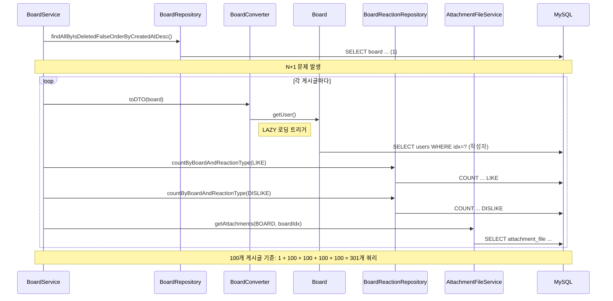

#### After (최적화 후)

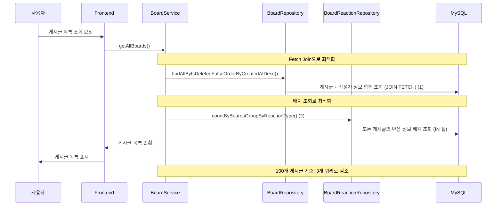

---

### 1.2 Care 도메인 - 펫케어 요청 목록 N+1

**위치**: `CareDomainOptimization.jsx`  
**문제**: ~2400개 쿼리 → 4~5개 쿼리 (99.8% 감소)

#### Before

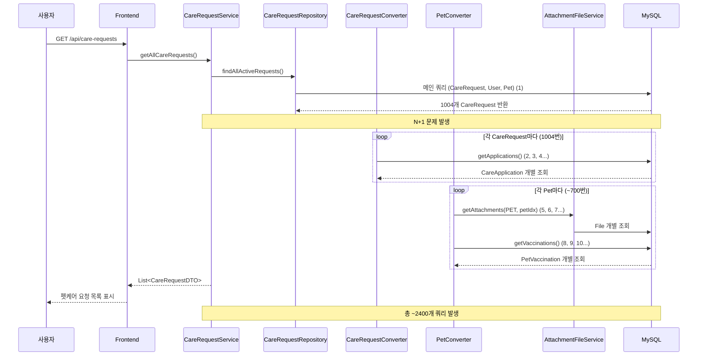

#### After

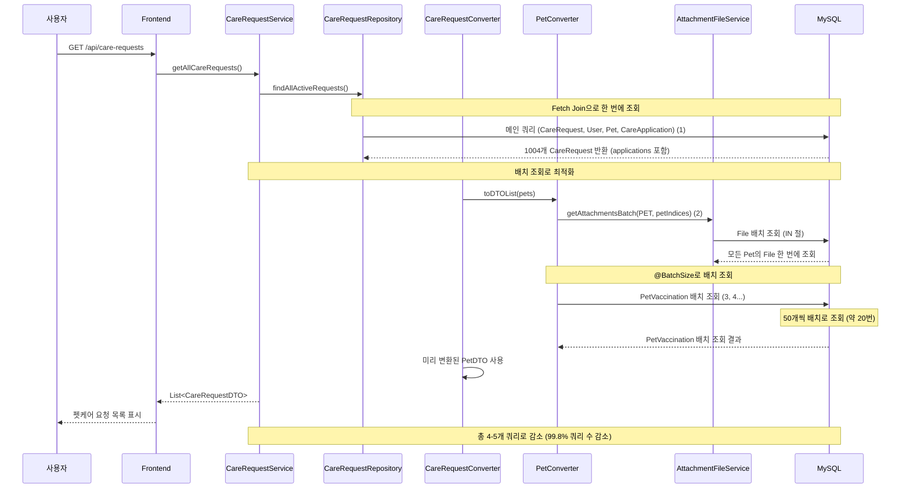

---

### 1.3 Chat 도메인 - 메시지 읽음 처리

**위치**: `ChatDomainOptimization.jsx`  
**문제**: 7,002개 이상 쿼리 → 2~3개 쿼리

#### Before

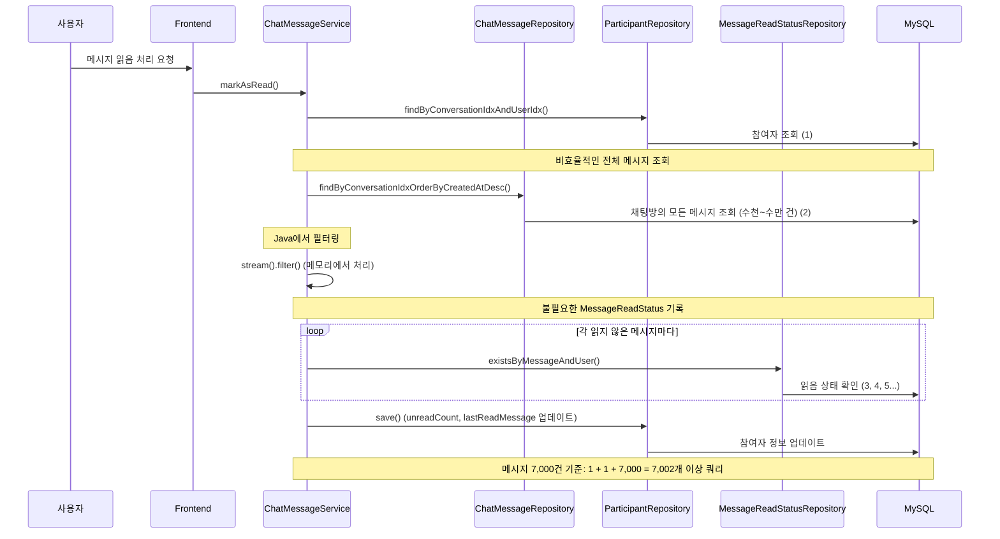

#### After

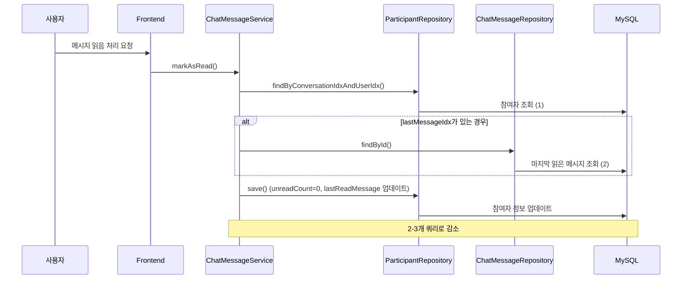

---

### 1.4 Meetup 도메인 - 모임 참가 Race Condition

**위치**: `MeetupDomainOptimization.jsx`  
**문제**: 동시 참가 시 인원 초과 → 원자적 UPDATE로 해결

#### Before (Race Condition)

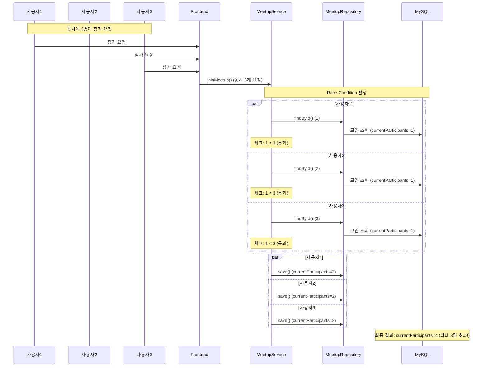

#### After (원자적 UPDATE)

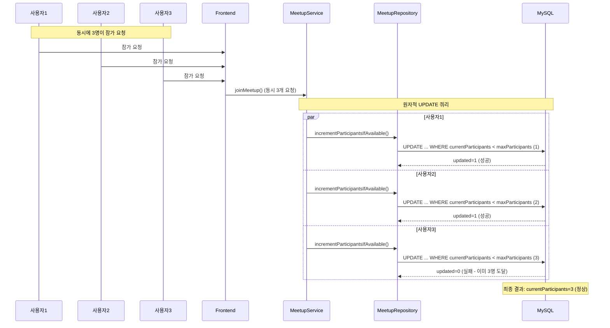

---

### 1.5 User 도메인 - 로그인 후 채팅방 목록 N+1

**위치**: `UserDomainOptimization.jsx`  
**문제**: 21개 쿼리 → 4개 쿼리

#### Before

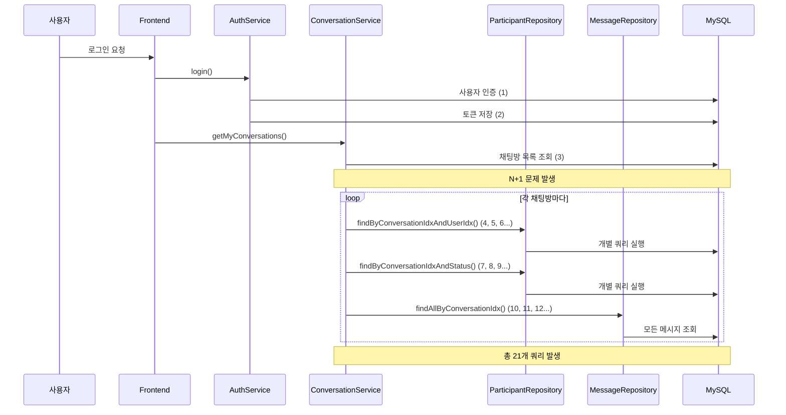

#### After

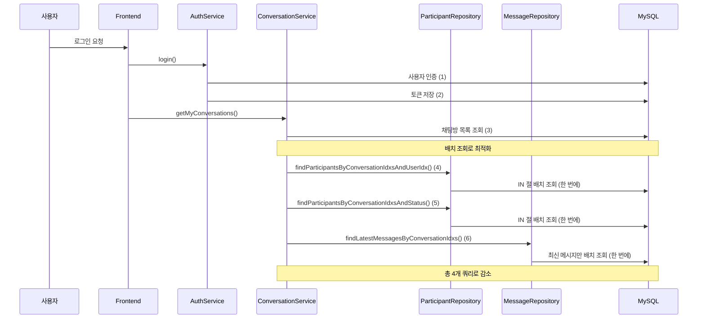

---

### 1.6 MissingPet 도메인 - 실종 제보 목록 N+1

**위치**: `MissingPetDomainOptimization.jsx`  
**문제**: 105개 쿼리 → 3개 쿼리 (97% 감소)

#### Before

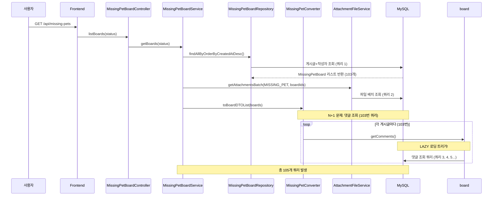

#### After

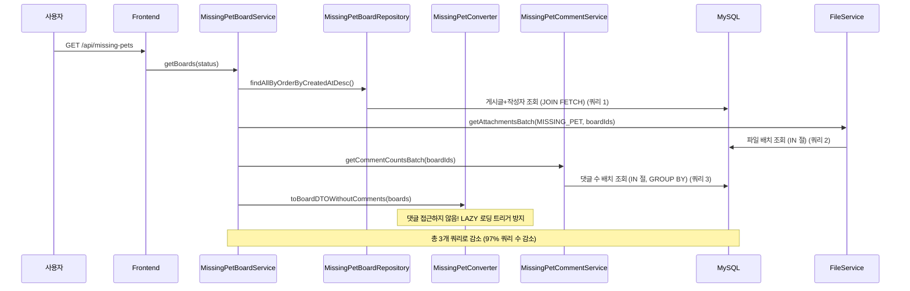

---

## 2. 리팩토링 (Refactoring)

### 2.1 Location - 하이브리드 전략 일관성 개선

**위치**: `docs/refactoring/location/하이브리드-전략-일관성-개선.md`

#### Before (초기 로드 방식에 따라 다른 결과)

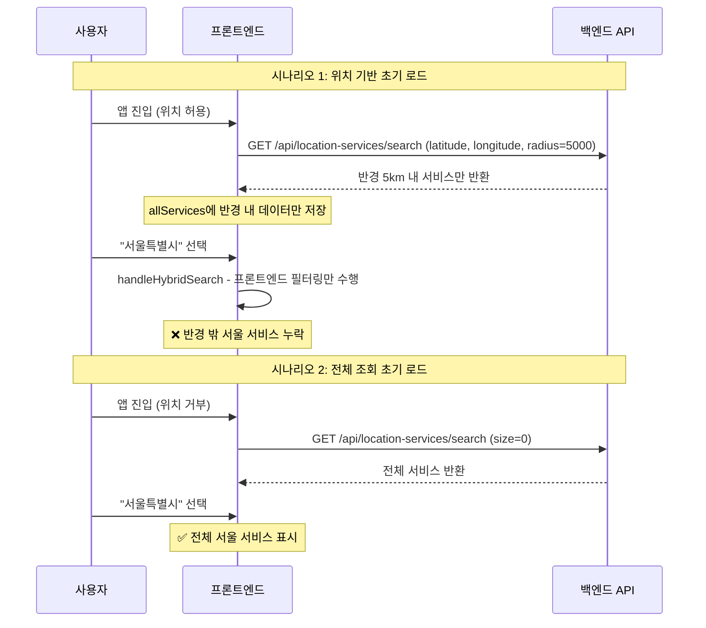

#### After (지역 선택 시 항상 백엔드 재요청)

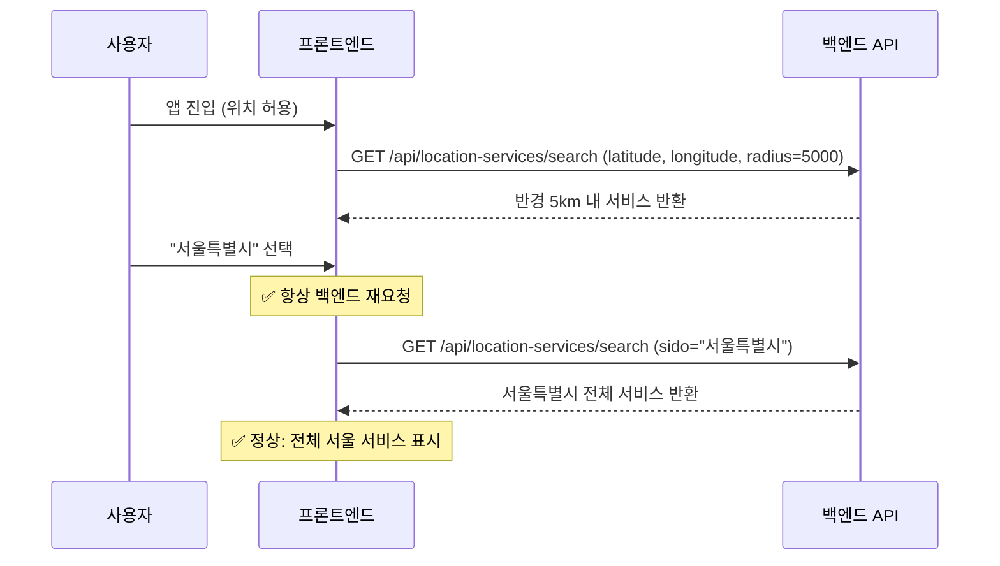

---

### 2.2 Location - 거리 계산 중복 제거

**위치**: `docs/refactoring/location/거리-계산-중복-제거.md`

#### Before (거리 계산 중복 수행)

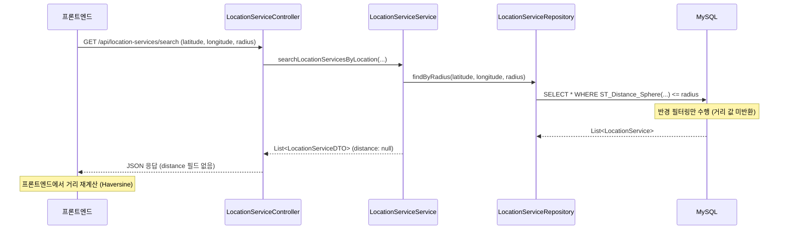

#### After (백엔드에서 거리 정보 포함)

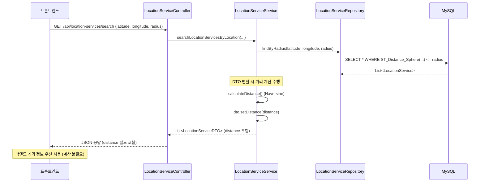

---

### 2.3 Board - Comment 반응 N+1 (CommentService)

**위치**: `docs/refactoring/board/comment-reaction-query/troubleshooting.md`

#### Before (N+1 발생)

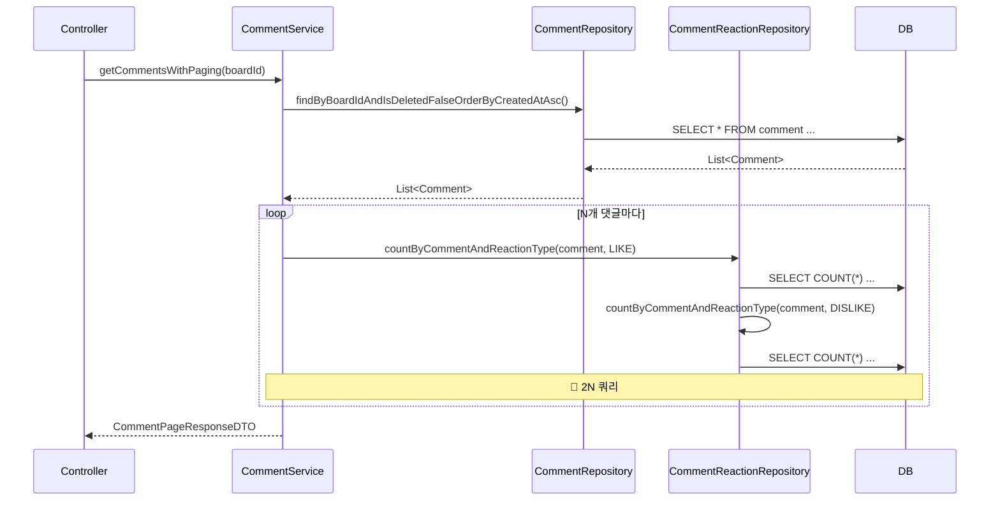

#### After (배치 조회)

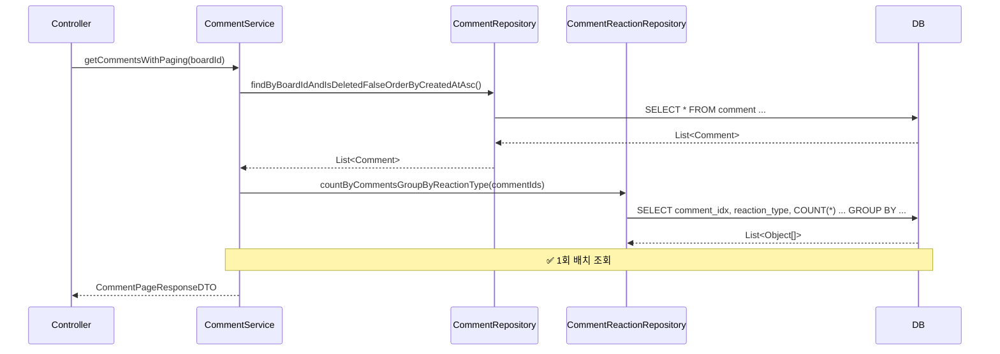

---

### 2.4 User - Auth 로그인/Refresh 중복 조회 제거

**위치**: `docs/refactoring/user/auth-duplicate-query/sequence-diagram.md`

#### login() Before

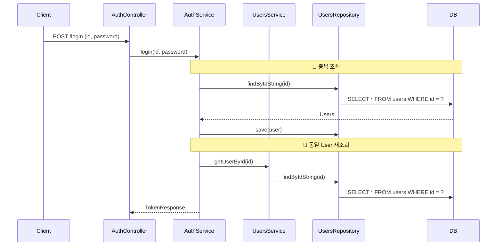

#### login() After

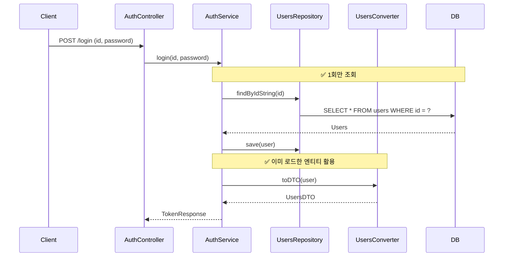

---

### 2.5 User - Admin 삭제 최적화

**위치**: `docs/refactoring/user/admin-delete-optimization/sequence-diagram.md`

#### Before (User + Pet 전체 조회)

```mermaid
sequenceDiagram
    participant Client
    participant AdminUserController
    participant UsersService
    participant UsersRepository
    participant PetRepository
    participant DB

    Client->>AdminUserController: DELETE /api/admin/users/{id}
    AdminUserController->>UsersService: getUser(id)

    Note over UsersService,DB: 🔴 User + Pet 전체 조회 (역할만 필요한데)
    UsersService->>UsersRepository: findById(id)
    UsersRepository->>DB: SELECT * FROM users WHERE idx = ?
    UsersService->>PetRepository: findByUserIdxAndNotDeleted(id)
    PetRepository->>DB: SELECT * FROM pets WHERE user_idx = ?
    UsersService-->>AdminUserController: UsersDTO (전체 프로필)

    AdminUserController->>AdminUserController: role 검증
    AdminUserController->>UsersService: deleteUser(id)
```

#### After (역할만 조회)

```mermaid
sequenceDiagram
    participant Client
    participant AdminUserController
    participant UsersService
    participant UsersRepository
    participant DB

    Client->>AdminUserController: DELETE /api/admin/users/{id}
    AdminUserController->>UsersService: getRoleById(id)

    Note over UsersService,DB: ✅ 역할만 조회 (경량 쿼리)
    UsersService->>UsersRepository: findRoleByIdx(id)
    UsersRepository->>DB: SELECT role FROM users WHERE idx = ?
    DB-->>UsersService: Optional<Role>
    UsersService-->>AdminUserController: Optional<Role>

    AdminUserController->>AdminUserController: role 검증
    AdminUserController->>UsersService: deleteUser(id)
```

---

### 2.6 Meetup - Stream 연산 중복 제거

**위치**: `docs/refactoring/meetup/stream-operation-refactoring.md`

#### Before (중복 Stream 변환)

```mermaid
sequenceDiagram
    participant Client
    participant Service as MeetupService
    participant Repository as MeetupRepository
    participant Converter as MeetupConverter
    participant Stream as Stream API

    Client->>Service: getAllMeetups()
    Service->>Repository: findAllNotDeleted()
    Repository-->>Service: List<Meetup>
    
    Note over Service: Stream 변환 로직 (중복)
    Service->>Stream: stream()
    Stream->>Converter: map(converter::toDTO)
    Stream->>Stream: collect(Collectors.toList())
    Stream-->>Service: List<MeetupDTO>
    
    Service-->>Client: List<MeetupDTO>
    Note over Client,Service: 다른 메서드에서도 동일한 패턴 반복
```

#### After (공통 메서드)

```mermaid
sequenceDiagram
    participant Client
    participant Service as MeetupService
    participant Repository as MeetupRepository
    participant Common as convertToDTOs()

    Client->>Service: getAllMeetups()
    Service->>Repository: findAllNotDeleted()
    Repository-->>Service: List<Meetup>
    
    Note over Service: 공통 메서드 호출
    Service->>Common: convertToDTOs(meetups)
    Common-->>Service: List<MeetupDTO>
    
    Service-->>Client: List<MeetupDTO>
    Note over Client,Service: 다른 메서드에서도 동일한 공통 메서드 사용
```

---

### 2.7 Meetup - 중복 DB 쿼리 제거 (joinMeetup)

**위치**: `docs/refactoring/meetup/duplicate-query-removal.md`

#### Before (findById 2회)

```mermaid
sequenceDiagram
    participant Client
    participant Service as MeetupService
    participant Repository as MeetupRepository
    participant DB as Database

    Client->>Service: joinMeetup(meetupIdx, userId)
    
    Service->>Repository: findById(meetupIdx)
    Repository->>DB: SELECT * FROM meetup WHERE idx = ?
    DB-->>Service: Meetup 객체
    
    Service->>Repository: incrementParticipantsIfAvailable(meetupIdx)
    Repository->>DB: UPDATE meetup SET currentParticipants = ...
    
    Note over Service: 두 번째 조회 (불필요한 중복)
    Service->>Repository: findById(meetupIdx)
    Repository->>DB: SELECT * FROM meetup WHERE idx = ?
    DB-->>Service: Meetup 객체
    
    Service->>Repository: save(MeetupParticipants)
```

#### After (entityManager.refresh)

```mermaid
sequenceDiagram
    participant Client
    participant Service as MeetupService
    participant Repository as MeetupRepository
    participant EM as EntityManager
    participant DB as Database

    Client->>Service: joinMeetup(meetupIdx, userId)
    
    Service->>Repository: findById(meetupIdx)
    Repository->>DB: SELECT * FROM meetup WHERE idx = ?
    DB-->>Service: Meetup 객체 (영속성 컨텍스트에 저장)
    
    Service->>Repository: incrementParticipantsIfAvailable(meetupIdx)
    Repository->>DB: UPDATE meetup SET currentParticipants = ...
    
    Note over Service: 영속성 컨텍스트 새로고침 (중복 쿼리 제거)
    Service->>EM: refresh(meetup)
    EM->>DB: SELECT * FROM meetup WHERE idx = ?
    DB-->>EM: Meetup 엔티티 (업데이트된 상태)
    
    Service->>Repository: save(MeetupParticipants)
```

---

## 3. 트러블슈팅 (Troubleshooting)

### 3.1 Care - 페이징 N+1 (applications)

**위치**: `docs/troubleshooting/care/care-request-paging-n-plus-one.md`

#### N+1 발생 흐름

```mermaid
sequenceDiagram
    participant Client as 클라이언트
    participant Controller as CareRequestController
    participant Service as CareRequestService
    participant Repo as CareRequestRepository
    participant Converter as CareRequestConverter
    participant DB as MySQL

    Client->>Controller: GET /api/care-requests?page=0&size=20
    Controller->>Service: getCareRequestsWithPaging(status, location, page, size)
    
    Service->>Repo: findAllActiveRequestsWithPaging(location, pageable)
    Repo->>DB: SELECT cr, user, pet FROM carerequest ... LIMIT 20
    DB-->>Repo: CareRequest 20건 (applications 미포함)
    Repo-->>Service: Page<CareRequest>
    
    Service->>Converter: toDTOList(requestPage.getContent())
    
    loop CareRequest 1개씩 (20건)
        Converter->>Converter: toDTO(request)
        Converter->>Converter: request.getApplications()
        Note over Converter,DB: applicationCount 계산 시 lazy load 트리거
        Converter->>DB: SELECT * FROM careapplication WHERE care_request_idx=?
        DB-->>Converter: List<CareApplication>
    end
    
    Note over Service,DB: 총 2+N번 DB 왕복
```

#### 해결 후 (@BatchSize)

```mermaid
sequenceDiagram
    participant Client as 클라이언트
    participant Controller as CareRequestController
    participant Service as CareRequestService
    participant Repo as CareRequestRepository
    participant Converter as CareRequestConverter
    participant DB as MySQL

    Client->>Controller: GET /api/care-requests?page=0&size=20
    Controller->>Service: getCareRequestsWithPaging(status, location, page, size)
    
    Service->>Repo: findAllActiveRequestsWithPaging(location, pageable)
    Repo->>DB: SELECT cr, user, pet FROM carerequest ... LIMIT 20
    DB-->>Repo: CareRequest 20건
    Repo-->>Service: Page<CareRequest>
    
    Service->>Converter: toDTOList(requestPage.getContent())
    
    loop CareRequest 1개씩 (20건)
        Converter->>Converter: toDTO(request)
        Converter->>Converter: request.getApplications()
        Note over Converter,DB: @BatchSize: 첫 접근 시 배치 로드
    end
    
    Converter->>DB: SELECT * FROM careapplication WHERE care_request_idx IN (?,?,...,?)
    Note over DB: 20개 idx를 한 번에 IN 절로 조회
    DB-->>Converter: List<CareApplication> (전체)
    
    Note over Service,DB: 총 3번 DB 왕복
```

---

### 3.2 User - SocialUsers N+1 (Admin 목록)

**위치**: `docs/refactoring/user/social-users-query/troubleshooting.md`

```mermaid
sequenceDiagram
    participant AdminController
    participant UsersService
    participant UsersRepository
    participant UsersConverter
    participant DB

    AdminController->>UsersService: getAllUsers()
    UsersService->>UsersRepository: findAll()
    UsersRepository->>DB: SELECT * FROM users
    DB-->>UsersRepository: List<Users>
    UsersRepository-->>UsersService: List<Users>

    UsersService->>UsersConverter: toDTOList(users)

    loop N명의 User마다
        UsersConverter->>UsersConverter: toDTO(user)
        UsersConverter->>DB: getSocialUsers() → Lazy Load
        Note over UsersConverter,DB: 🔴 N+1: User당 1개 쿼리
        DB-->>UsersConverter: List<SocialUser>
    end

    UsersConverter-->>UsersService: List<UsersDTO>
    UsersService-->>AdminController: List<UsersDTO>
```

**쿼리 수**: 1 (Users) + N (SocialUser) = **N+1**

---

## 4. 동시성 제어 (Concurrency)

### 4.1 Care - 거래 확정 동시성 (비관적 락)

**위치**: `CareDomain.jsx`

#### Race Condition (문제 상황)

```mermaid
sequenceDiagram
    participant UserA as 사용자 A
    participant UserB as 제공자 B
    participant Service as ConversationService
    participant DB as MySQL

    Note over UserA,UserB: 동시에 거래 확정 버튼 클릭

    par 동시 요청
        UserA->>Service: confirmCareDeal() (Tx A)
        UserB->>Service: confirmCareDeal() (Tx B)
    end

    Service->>DB: Tx A: 내 상태 '확정' 변경
    Service->>DB: Tx B: 내 상태 '확정' 변경

    Note over Service,DB: 격리 수준으로 인해 상대방의 변경사항 안 보임

    Service->>DB: Tx A: 전체 확정 여부 확인? -> False (B 미확정)
    Service->>DB: Tx B: 전체 확정 여부 확인? -> False (A 미확정)

    Service-->>UserA: 완료 (상태 변경 없음)
    Service-->>UserB: 완료 (상태 변경 없음)

    Note over DB: 결과: 둘 다 확정했으나 상태는 여전히 OPEN (Stuck)
```

#### 비관적 락 적용 후

```mermaid
sequenceDiagram
    participant UserA as 사용자 A
    participant UserB as 제공자 B
    participant Service as ConversationService
    participant DB as MySQL

    Note over UserA,UserB: 동시에 거래 확정 버튼 클릭

    UserA->>Service: confirmCareDeal() (Tx A)
    Service->>DB: SELECT ... FOR UPDATE (Lock 획득)
    
    UserB->>Service: confirmCareDeal() (Tx B)
    Service->>DB: SELECT ... FOR UPDATE (Lock 대기)
    
    Note over Service,DB: Tx A 먼저 수행
    Service->>DB: Tx A: 내 상태 '확정' 변경
    Service->>DB: Tx A: 전체 확정 여부 확인? -> False
    Service->>DB: Tx A: 커밋 & Lock 반납
    
    Note over Service,DB: Tx B 수행 (대기 해제)
    Service->>DB: Tx B: Lock 획득 (최신 데이터 조회)
    Service->>DB: Tx B: 내 상태 '확정' 변경
    Service->>DB: Tx B: 전체 확정 여부 확인? -> True (A 확정 보임)
    
    Service->>DB: Tx B: CareRequest 상태 IN_PROGRESS 변경
    Service-->>UserB: 완료 및 상태 변경 성공
```

---

## 요약 표

| 구분 | 도메인/주제 | Before | After | 개선율 |
|------|-------------|--------|-------|--------|
| **도메인** | Board | 301 쿼리 | 3 쿼리 | 99% |
| | Care | ~2400 쿼리 | 4~5 쿼리 | 99.8% |
| | Chat | 7002+ 쿼리 | 2~3 쿼리 | 99.9%+ |
| | Meetup | Race Condition | 원자적 UPDATE | 100% |
| | User | 21 쿼리 | 4 쿼리 | 81% |
| | MissingPet | 105 쿼리 | 3 쿼리 | 97% |
| **리팩토링** | Location 하이브리드 | 결과 불일치 | 일관성 확보 | - |
| | Location 거리 계산 | 중복 계산 | 백엔드 단일 | - |
| | Board Comment | 1+2N 쿼리 | 3~4 쿼리 | 95%+ |
| | Auth login | 2회 조회 | 1회 조회 | 50% |
| | Admin delete | 2+ 쿼리 | 1 쿼리 | 50%+ |
| | Meetup join | findById 2회 | refresh 1회 | 50% |
| **트러블슈팅** | Care 페이징 | 2+N 쿼리 | 3 쿼리 | N→1 |
| | User SocialUsers | N+1 | @BatchSize | - |
| **동시성** | Care 거래 확정 | Stuck | 비관적 락 | - |

---

*문서 생성일: 2025-03-13*
